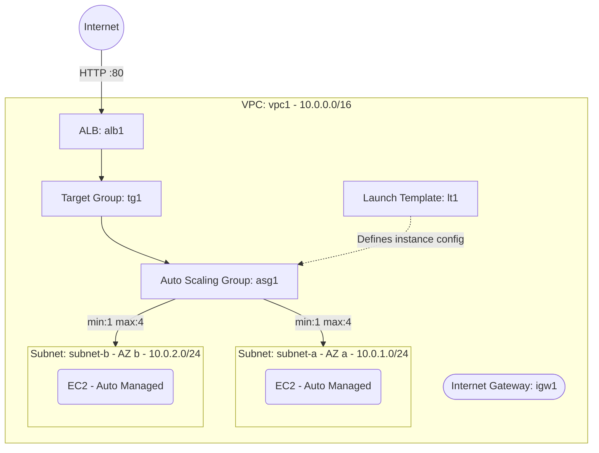

# Deploy an Auto Scaling Group with Launch Template on AWS

This guide demonstrates how to use MechCloud's stateless Infrastructure-as-Code (IaC) to provision an Auto Scaling Group (ASG) with a Launch Template for automatic horizontal scaling on AWS.

In this scenario, we deploy an ASG that automatically manages EC2 instances across two availability zones. The ASG uses a Launch Template to define instance configuration and scales between 1 and 4 instances based on demand. An Application Load Balancer distributes traffic across the instances.

## Scenario Overview
**Use Case:** A production web application that needs to automatically scale out during traffic spikes and scale in during low demand, ensuring high availability and cost optimization.
**Key MechCloud Features Highlighted:**
- Hierarchical resource nesting (VPC $\rightarrow$ Subnet $\rightarrow$ Resources)
- Dynamic macros (`{{CURRENT_REGION}}`, `{{Image|arm64_ubuntu_24_04}}`)
- Cross-resource referencing (`ref:`)
- Auto Scaling Group with Launch Template

### Architecture Diagram



***

## Step 1: Setting up Networking

We create a VPC with two public subnets across availability zones, an Internet Gateway, and route tables.

```yaml
resources:
  - type: aws_ec2_vpc
    name: vpc1
    props:
      cidr_block: "10.0.0.0/16"
    resources:
      - type: aws_ec2_internet_gateway
        name: igw1

      - type: aws_ec2_route_table
        name: public_rt
        resources:
          - type: aws_ec2_route
            name: internet_route
            props:
              destination_cidr_block: "0.0.0.0/0"
              gateway_id: "ref:vpc1/igw1"

      - type: aws_ec2_subnet
        name: subnet-a
        props:
          cidr_block: "10.0.1.0/24"
          availability_zone: "{{CURRENT_REGION}}a"
        resources:
          - type: aws_ec2_route_table_association
            name: rta-a
            props:
              route_table_id: "ref:vpc1/public_rt"

      - type: aws_ec2_subnet
        name: subnet-b
        props:
          cidr_block: "10.0.2.0/24"
          availability_zone: "{{CURRENT_REGION}}b"
        resources:
          - type: aws_ec2_route_table_association
            name: rta-b
            props:
              route_table_id: "ref:vpc1/public_rt"

      - type: aws_ec2_security_group
        name: sg-alb
        props:
          group_name: "mc-alb-sg"
          group_description: "SG for ALB"
          security_group_ingress:
            - ip_protocol: tcp
              from_port: 80
              to_port: 80
              cidr_ip: "0.0.0.0/0"

      - type: aws_ec2_security_group
        name: sg-ec2
        props:
          group_name: "mc-ec2-asg-sg"
          group_description: "SG for ASG EC2 instances"
          security_group_ingress:
            - ip_protocol: tcp
              from_port: 80
              to_port: 80
              source_security_group_id: "ref:vpc1/sg-alb"
```

## Step 2: Creating the Launch Template

The Launch Template defines the instance configuration that the ASG will use when launching new instances.

```yaml
# ... (At root resources level) ...
  - type: aws_ec2_launch_template
    name: lt1
    props:
      launch_template_name: "mc-web-lt"
      image_id: "{{Image|arm64_ubuntu_24_04}}"
      instance_type: "t4g.small"
      security_group_ids:
        - "ref:vpc1/sg-ec2"
```

## Step 3: Creating ALB, Target Group, and Auto Scaling Group

We provision the ALB, target group, and ASG. The ASG is configured to register new instances with the target group automatically.

```yaml
# ... (Continuing inside vpc1 resources block) ...
      - type: aws_elasticloadbalancingv2_target_group
        name: tg1
        props:
          target_type: instance
          protocol: HTTP
          port: 80
          health_check:
            path: "/"
            protocol: HTTP
            interval_seconds: 30
            healthy_threshold_count: 2
            unhealthy_threshold_count: 3

      - type: aws_elasticloadbalancingv2_load_balancer
        name: alb1
        props:
          scheme: internet-facing
          type: application
          subnet_ids:
            - "ref:vpc1/subnet-a"
            - "ref:vpc1/subnet-b"
          security_group_ids:
            - "ref:vpc1/sg-alb"

      - type: aws_elasticloadbalancingv2_listener
        name: listener1
        props:
          load_balancer_arn: "ref:vpc1/alb1"
          protocol: HTTP
          port: 80
          default_actions:
            - type: forward
              target_group_arn: "ref:vpc1/tg1"

# ... (At root resources level) ...
  - type: aws_autoscaling_auto_scaling_group
    name: asg1
    props:
      auto_scaling_group_name: "mc-web-asg"
      min_size: 1
      max_size: 4
      desired_capacity: 2
      launch_template:
        launch_template_id: "ref:lt1"
        version: "$Latest"
      vpc_zone_identifier:
        - "ref:vpc1/subnet-a"
        - "ref:vpc1/subnet-b"
      target_group_arns:
        - "ref:vpc1/tg1"
      health_check_type: ELB
      health_check_grace_period: 300
```

### Complete Unified Template

For your convenience, here is the complete, unified MechCloud template combining all steps:

```yaml
resources:
  - type: aws_ec2_vpc
    name: vpc1
    props:
      cidr_block: "10.0.0.0/16"
    resources:
      - type: aws_ec2_internet_gateway
        name: igw1

      - type: aws_ec2_route_table
        name: public_rt
        resources:
          - type: aws_ec2_route
            name: internet_route
            props:
              destination_cidr_block: "0.0.0.0/0"
              gateway_id: "ref:vpc1/igw1"

      - type: aws_ec2_security_group
        name: sg-alb
        props:
          group_name: "mc-alb-sg"
          group_description: "SG for ALB"
          security_group_ingress:
            - ip_protocol: tcp
              from_port: 80
              to_port: 80
              cidr_ip: "0.0.0.0/0"

      - type: aws_ec2_security_group
        name: sg-ec2
        props:
          group_name: "mc-ec2-asg-sg"
          group_description: "SG for ASG EC2 instances"
          security_group_ingress:
            - ip_protocol: tcp
              from_port: 80
              to_port: 80
              source_security_group_id: "ref:vpc1/sg-alb"

      - type: aws_elasticloadbalancingv2_target_group
        name: tg1
        props:
          target_type: instance
          protocol: HTTP
          port: 80
          health_check:
            path: "/"
            protocol: HTTP
            interval_seconds: 30
            healthy_threshold_count: 2
            unhealthy_threshold_count: 3

      - type: aws_elasticloadbalancingv2_load_balancer
        name: alb1
        props:
          scheme: internet-facing
          type: application
          subnet_ids:
            - "ref:vpc1/subnet-a"
            - "ref:vpc1/subnet-b"
          security_group_ids:
            - "ref:vpc1/sg-alb"

      - type: aws_elasticloadbalancingv2_listener
        name: listener1
        props:
          load_balancer_arn: "ref:vpc1/alb1"
          protocol: HTTP
          port: 80
          default_actions:
            - type: forward
              target_group_arn: "ref:vpc1/tg1"

      - type: aws_ec2_subnet
        name: subnet-a
        props:
          cidr_block: "10.0.1.0/24"
          availability_zone: "{{CURRENT_REGION}}a"
        resources:
          - type: aws_ec2_route_table_association
            name: rta-a
            props:
              route_table_id: "ref:vpc1/public_rt"

      - type: aws_ec2_subnet
        name: subnet-b
        props:
          cidr_block: "10.0.2.0/24"
          availability_zone: "{{CURRENT_REGION}}b"
        resources:
          - type: aws_ec2_route_table_association
            name: rta-b
            props:
              route_table_id: "ref:vpc1/public_rt"

  - type: aws_ec2_launch_template
    name: lt1
    props:
      launch_template_name: "mc-web-lt"
      image_id: "{{Image|arm64_ubuntu_24_04}}"
      instance_type: "t4g.small"
      security_group_ids:
        - "ref:vpc1/sg-ec2"

  - type: aws_autoscaling_auto_scaling_group
    name: asg1
    props:
      auto_scaling_group_name: "mc-web-asg"
      min_size: 1
      max_size: 4
      desired_capacity: 2
      launch_template:
        launch_template_id: "ref:lt1"
        version: "$Latest"
      vpc_zone_identifier:
        - "ref:vpc1/subnet-a"
        - "ref:vpc1/subnet-b"
      target_group_arns:
        - "ref:vpc1/tg1"
      health_check_type: ELB
      health_check_grace_period: 300
```
