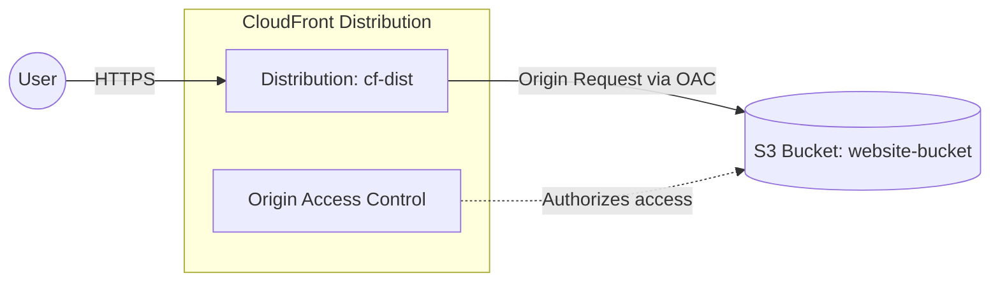

# Deploy a Static Website with S3 and CloudFront CDN on AWS

This guide demonstrates how to use MechCloud's stateless Infrastructure-as-Code (IaC) to provision a static website hosted on S3 and served globally through Amazon CloudFront CDN.

In this scenario, we create an S3 bucket configured for static website hosting and place a CloudFront distribution in front of it. CloudFront caches and serves the website content from edge locations worldwide, providing low latency and high transfer speeds. The S3 bucket is kept private and only accessible through CloudFront using an Origin Access Control (OAC).

## Scenario Overview
**Use Case:** Hosting a static website (e.g., a React, Vue, or plain HTML/CSS/JS site) with global CDN distribution, custom error pages, and HTTPS support, all without managing any servers.
**Key MechCloud Features Highlighted:**
- Cross-resource referencing (`ref:`)
- Non-compute AWS resource provisioning (S3, CloudFront)
- Complex nested resource configurations

### Architecture Diagram



***

## Step 1: Creating the S3 Bucket for Static Website

We provision an S3 bucket configured for static website hosting with an index and error document.

```yaml
resources:
  # 1. S3 Bucket for static website
  - type: aws_s3_bucket
    name: website-bucket
    props:
      bucket_name: "mc-static-website"
      website_configuration:
        index_document:
          suffix: "index.html"
        error_document:
          key: "error.html"
      public_access_block_configuration:
        block_public_acls: true
        block_public_policy: true
        ignore_public_acls: true
        restrict_public_buckets: true
```

## Step 2: Creating CloudFront Origin Access Control

We create an OAC to allow CloudFront to securely access the private S3 bucket without making the bucket public.

```yaml
# ... (Continuing at the root resources level) ...
  # 2. Origin Access Control for secure S3 access
  - type: aws_cloudfront_origin_access_control
    name: oac1
    props:
      name: "mc-website-oac"
      origin_access_control_origin_type: s3
      signing_behavior: always
      signing_protocol: sigv4
```

## Step 3: Creating the CloudFront Distribution

We create a CloudFront distribution that uses the S3 bucket as its origin, with caching policies and HTTPS redirection.

```yaml
# ... (Continuing at the root resources level) ...
  # 3. CloudFront Distribution
  - type: aws_cloudfront_distribution
    name: cf-dist
    props:
      enabled: true
      default_root_object: "index.html"
      origins:
        - id: s3-origin
          domain_name: "ref:website-bucket.regional_domain_name"
          s3_origin_config:
            origin_access_identity: ""
          origin_access_control_id: "ref:oac1"
      default_cache_behavior:
        target_origin_id: s3-origin
        viewer_protocol_policy: redirect-to-https
        allowed_methods:
          - GET
          - HEAD
        cached_methods:
          - GET
          - HEAD
        forwarded_values:
          query_string: false
          cookies:
            forward: none
        min_ttl: 0
        default_ttl: 86400
        max_ttl: 31536000
      custom_error_responses:
        - error_code: 404
          response_code: 200
          response_page_path: "/index.html"
          error_caching_min_ttl: 300
      viewer_certificate:
        cloud_front_default_certificate: true
      restrictions:
        geo_restriction:
          restriction_type: none
```

### Complete Unified Template

For your convenience, here is the complete, unified MechCloud template combining all steps:

```yaml
resources:
  - type: aws_s3_bucket
    name: website-bucket
    props:
      bucket_name: "mc-static-website"
      website_configuration:
        index_document:
          suffix: "index.html"
        error_document:
          key: "error.html"
      public_access_block_configuration:
        block_public_acls: true
        block_public_policy: true
        ignore_public_acls: true
        restrict_public_buckets: true

  - type: aws_cloudfront_origin_access_control
    name: oac1
    props:
      name: "mc-website-oac"
      origin_access_control_origin_type: s3
      signing_behavior: always
      signing_protocol: sigv4

  - type: aws_cloudfront_distribution
    name: cf-dist
    props:
      enabled: true
      default_root_object: "index.html"
      origins:
        - id: s3-origin
          domain_name: "ref:website-bucket.regional_domain_name"
          s3_origin_config:
            origin_access_identity: ""
          origin_access_control_id: "ref:oac1"
      default_cache_behavior:
        target_origin_id: s3-origin
        viewer_protocol_policy: redirect-to-https
        allowed_methods:
          - GET
          - HEAD
        cached_methods:
          - GET
          - HEAD
        forwarded_values:
          query_string: false
          cookies:
            forward: none
        min_ttl: 0
        default_ttl: 86400
        max_ttl: 31536000
      custom_error_responses:
        - error_code: 404
          response_code: 200
          response_page_path: "/index.html"
          error_caching_min_ttl: 300
      viewer_certificate:
        cloud_front_default_certificate: true
      restrictions:
        geo_restriction:
          restriction_type: none
```
