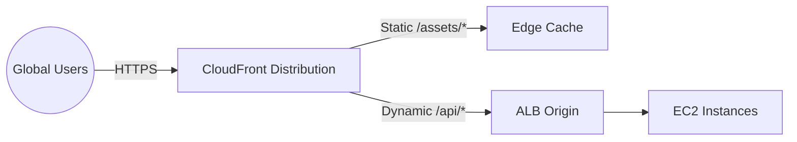

# Deploy CloudFront with ALB Origin for Dynamic Content Acceleration on AWS

This guide demonstrates how to use MechCloud's stateless IaC to provision a CloudFront distribution with an ALB origin for accelerating dynamic web application content globally.

## Scenario Overview
**Use Case:** A dynamic web application that needs global edge caching for static assets while proxying API requests to an ALB origin — combining CDN acceleration with application load balancing for improved user experience worldwide.
**Key MechCloud Features Highlighted:**
- Cross-resource referencing (`ref:`)
- Complex distribution behavior configuration as clean YAML
- Multiple cache behaviors in a single template

### Architecture Diagram



***

### Complete Unified Template

```yaml
resources:
  - type: aws_ec2_vpc
    name: vpc1
    props:
      cidr_block: "10.0.0.0/16"
    resources:
      - type: aws_ec2_internet_gateway
        name: igw1
      - type: aws_ec2_route_table
        name: public_rt
        resources:
          - type: aws_ec2_route
            name: internet_route
            props:
              destination_cidr_block: "0.0.0.0/0"
              gateway_id: "ref:vpc1/igw1"
      - type: aws_ec2_security_group
        name: sg-alb
        props:
          group_name: "mc-cf-alb-sg"
          group_description: "SG for ALB behind CloudFront"
          security_group_ingress:
            - ip_protocol: tcp
              from_port: 80
              to_port: 80
              cidr_ip: "0.0.0.0/0"
      - type: aws_ec2_subnet
        name: subnet-a
        props:
          cidr_block: "10.0.1.0/24"
          availability_zone: "{{CURRENT_REGION}}a"
        resources:
          - type: aws_ec2_route_table_association
            name: rta-a
            props:
              route_table_id: "ref:vpc1/public_rt"
      - type: aws_ec2_subnet
        name: subnet-b
        props:
          cidr_block: "10.0.2.0/24"
          availability_zone: "{{CURRENT_REGION}}b"
        resources:
          - type: aws_ec2_route_table_association
            name: rta-b
            props:
              route_table_id: "ref:vpc1/public_rt"

  - type: aws_elbv2_load_balancer
    name: app-alb
    props:
      type: application
      scheme: internet-facing
      security_groups:
        - "ref:vpc1/sg-alb"
      subnets:
        - "ref:vpc1/subnet-a"
        - "ref:vpc1/subnet-b"

  - type: aws_cloudfront_distribution
    name: cdn1
    props:
      enabled: true
      is_ipv6_enabled: true
      default_root_object: index.html
      price_class: PriceClass_100
      origins:
        - domain_name: "ref:app-alb.dns_name"
          id: alb-origin
          custom_origin_config:
            http_port: 80
            https_port: 443
            origin_protocol_policy: http-only
            origin_ssl_protocols:
              - TLSv1.2
      default_cache_behavior:
        allowed_methods:
          - GET
          - HEAD
          - OPTIONS
          - PUT
          - POST
          - PATCH
          - DELETE
        cached_methods:
          - GET
          - HEAD
        target_origin_id: alb-origin
        viewer_protocol_policy: redirect-to-https
        forwarded_values:
          query_string: true
          headers:
            - Host
            - Origin
          cookies:
            forward: all
        min_ttl: 0
        default_ttl: 0
        max_ttl: 0
      cache_behaviors:
        - path_pattern: "/assets/*"
          target_origin_id: alb-origin
          allowed_methods:
            - GET
            - HEAD
          cached_methods:
            - GET
            - HEAD
          viewer_protocol_policy: redirect-to-https
          forwarded_values:
            query_string: false
            cookies:
              forward: none
          min_ttl: 86400
          default_ttl: 604800
          max_ttl: 2592000
          compress: true
      restrictions:
        geo_restriction:
          restriction_type: none
      viewer_certificate:
        cloudfront_default_certificate: true
```
