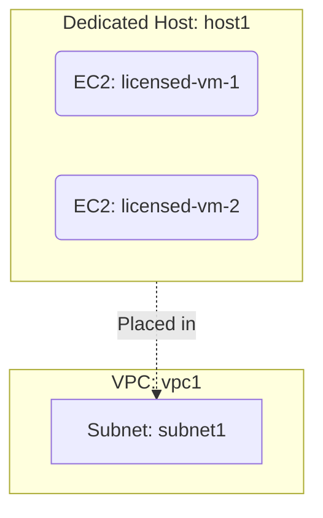

# Deploy EC2 Instances on a Dedicated Host on AWS

This guide demonstrates how to use MechCloud's stateless IaC to provision EC2 instances on a Dedicated Host for licensing compliance and regulatory requirements.

## Scenario Overview
**Use Case:** Running software with per-socket or per-core licensing (e.g., Windows Server, SQL Server, Oracle) on a dedicated physical server — required for BYOL (Bring Your Own License) compliance and workloads that must not share hardware with other tenants.
**Key MechCloud Features Highlighted:**
- Cross-resource referencing (`ref:`)
- Dedicated Host allocation and instance placement
- Licensing compliance through hardware isolation

### Architecture Diagram



***

### Complete Unified Template

```yaml
resources:
  - type: aws_ec2_host
    name: host1
    props:
      instance_type: "c7g.xlarge"
      availability_zone: "{{CURRENT_REGION}}a"
      auto_placement: "on"

  - type: aws_ec2_vpc
    name: vpc1
    props:
      cidr_block: "10.0.0.0/16"
    resources:
      - type: aws_ec2_security_group
        name: sg1
        props:
          group_name: "mc-dedicated-sg"
          group_description: "SG for dedicated host instances"
          security_group_ingress:
            - ip_protocol: tcp
              from_port: 22
              to_port: 22
              cidr_ip: "{{CURRENT_IP}}/32"
      - type: aws_ec2_subnet
        name: subnet1
        props:
          cidr_block: "10.0.1.0/24"
          availability_zone: "{{CURRENT_REGION}}a"
        resources:
          - type: aws_ec2_instance
            name: licensed-vm-1
            props:
              image_id: "{{Image|arm64_ubuntu_24_04}}"
              instance_type: "c7g.xlarge"
              host_id: "ref:host1"
              security_group_ids:
                - "ref:vpc1/sg1"
              tenancy: host
          - type: aws_ec2_instance
            name: licensed-vm-2
            props:
              image_id: "{{Image|arm64_ubuntu_24_04}}"
              instance_type: "c7g.xlarge"
              host_id: "ref:host1"
              security_group_ids:
                - "ref:vpc1/sg1"
              tenancy: host
```
