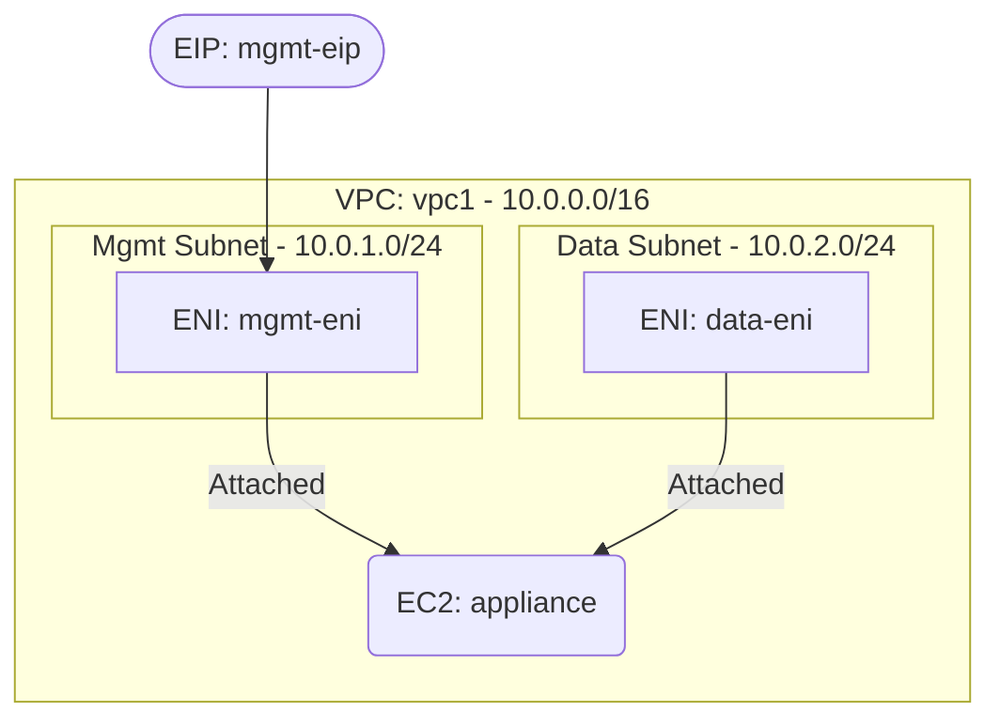

# Deploy an EC2 Instance with Multiple Network Interfaces on AWS

This guide demonstrates how to use MechCloud's stateless IaC to provision an EC2 instance with multiple ENIs for network segmentation and multi-homed configurations.

## Scenario Overview
**Use Case:** A network appliance, firewall, or application requiring separate network interfaces for management and data traffic — enabling traffic isolation, dual-homed configurations, and running services on different subnets from a single instance.
**Key MechCloud Features Highlighted:**
- Cross-resource referencing (`ref:`)
- Multiple ENI attachment to a single instance
- Network segmentation within one template

### Architecture Diagram



***

### Complete Unified Template

```yaml
resources:
  - type: aws_ec2_vpc
    name: vpc1
    props:
      cidr_block: "10.0.0.0/16"
    resources:
      - type: aws_ec2_security_group
        name: sg-mgmt
        props:
          group_name: "mc-mgmt-sg"
          group_description: "SG for management interface"
          security_group_ingress:
            - ip_protocol: tcp
              from_port: 22
              to_port: 22
              cidr_ip: "{{CURRENT_IP}}/32"
      - type: aws_ec2_security_group
        name: sg-data
        props:
          group_name: "mc-data-sg"
          group_description: "SG for data interface"
          security_group_ingress:
            - ip_protocol: -1
              cidr_ip: "10.0.0.0/16"
      - type: aws_ec2_subnet
        name: mgmt-subnet
        props:
          cidr_block: "10.0.1.0/24"
          availability_zone: "{{CURRENT_REGION}}a"
      - type: aws_ec2_subnet
        name: data-subnet
        props:
          cidr_block: "10.0.2.0/24"
          availability_zone: "{{CURRENT_REGION}}a"

  - type: aws_ec2_network_interface
    name: mgmt-eni
    props:
      subnet_id: "ref:vpc1/mgmt-subnet"
      security_groups:
        - "ref:vpc1/sg-mgmt"
      description: "Management interface"

  - type: aws_ec2_network_interface
    name: data-eni
    props:
      subnet_id: "ref:vpc1/data-subnet"
      security_groups:
        - "ref:vpc1/sg-data"
      description: "Data interface"

  - type: aws_ec2_eip
    name: mgmt-eip
    props:
      network_interface_id: "ref:mgmt-eni"

  - type: aws_ec2_instance
    name: appliance
    props:
      image_id: "{{Image|arm64_ubuntu_24_04}}"
      instance_type: "t4g.medium"
      network_interfaces:
        - network_interface_id: "ref:mgmt-eni"
          device_index: 0
        - network_interface_id: "ref:data-eni"
          device_index: 1
```
