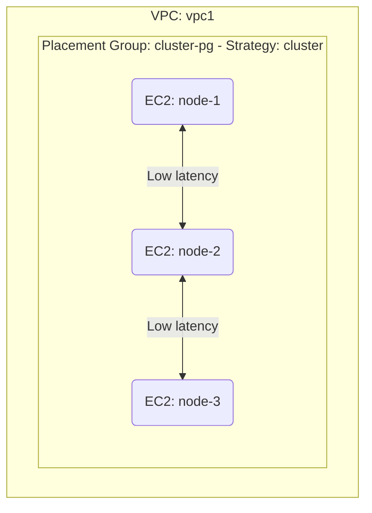

# Deploy EC2 Instances in a Placement Group on AWS

This guide demonstrates how to use MechCloud's stateless IaC to provision EC2 instances in a cluster placement group for low-latency, high-throughput networking.

## Scenario Overview
**Use Case:** HPC workloads, distributed databases, or real-time applications that need the lowest possible network latency between instances — placement groups ensure instances are co-located in the same rack/AZ for 10 Gbps+ inter-instance bandwidth.
**Key MechCloud Features Highlighted:**
- Cross-resource referencing (`ref:`)
- Placement group strategy configuration
- Multiple instances in a single template

### Architecture Diagram



***

### Complete Unified Template

```yaml
resources:
  - type: aws_ec2_placement_group
    name: cluster-pg
    props:
      group_name: "mc-cluster-pg"
      strategy: cluster

  - type: aws_ec2_vpc
    name: vpc1
    props:
      cidr_block: "10.0.0.0/16"
    resources:
      - type: aws_ec2_security_group
        name: sg-cluster
        props:
          group_name: "mc-cluster-sg"
          group_description: "SG for clustered instances"
          security_group_ingress:
            - ip_protocol: -1
              cidr_ip: "10.0.0.0/16"
      - type: aws_ec2_subnet
        name: subnet1
        props:
          cidr_block: "10.0.1.0/24"
          availability_zone: "{{CURRENT_REGION}}a"
        resources:
          - type: aws_ec2_instance
            name: node-1
            props:
              image_id: "{{Image|arm64_ubuntu_24_04}}"
              instance_type: "c7g.xlarge"
              placement:
                group_name: "ref:cluster-pg"
              security_group_ids:
                - "ref:vpc1/sg-cluster"
          - type: aws_ec2_instance
            name: node-2
            props:
              image_id: "{{Image|arm64_ubuntu_24_04}}"
              instance_type: "c7g.xlarge"
              placement:
                group_name: "ref:cluster-pg"
              security_group_ids:
                - "ref:vpc1/sg-cluster"
          - type: aws_ec2_instance
            name: node-3
            props:
              image_id: "{{Image|arm64_ubuntu_24_04}}"
              instance_type: "c7g.xlarge"
              placement:
                group_name: "ref:cluster-pg"
              security_group_ids:
                - "ref:vpc1/sg-cluster"
```
