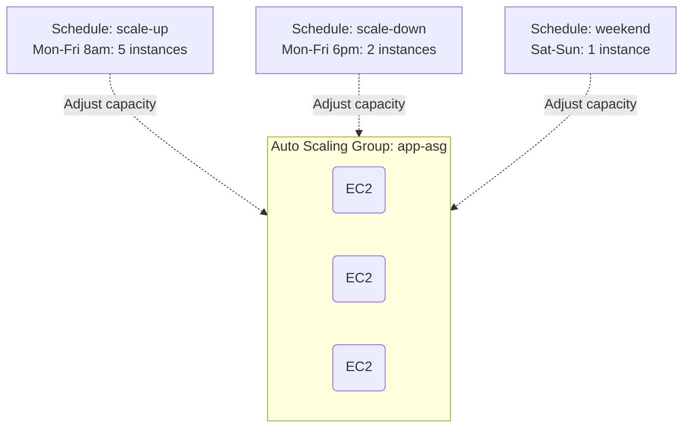

# Deploy EC2 Auto Scaling with Scheduled Scaling Policies on AWS

This guide demonstrates how to use MechCloud's stateless IaC to provision an Auto Scaling Group with time-based scheduled scaling actions for predictable traffic patterns.

## Scenario Overview
**Use Case:** An application with predictable traffic patterns (e.g., business hours vs. nights/weekends) that needs to pre-scale before peak hours and scale down during off-hours — reducing costs by up to 60% compared to always running at peak capacity.
**Key MechCloud Features Highlighted:**
- Cross-resource referencing (`ref:`)
- Scheduled scaling actions as clean YAML
- Time-based capacity management

### Architecture Diagram



***

### Complete Unified Template

```yaml
resources:
  - type: aws_ec2_vpc
    name: vpc1
    props:
      cidr_block: "10.0.0.0/16"
    resources:
      - type: aws_ec2_internet_gateway
        name: igw1
      - type: aws_ec2_route_table
        name: public_rt
        resources:
          - type: aws_ec2_route
            name: internet_route
            props:
              destination_cidr_block: "0.0.0.0/0"
              gateway_id: "ref:vpc1/igw1"
      - type: aws_ec2_security_group
        name: sg1
        props:
          group_name: "mc-sched-scaling-sg"
          group_description: "SG for scheduled scaling"
          security_group_ingress:
            - ip_protocol: tcp
              from_port: 80
              to_port: 80
              cidr_ip: "0.0.0.0/0"
      - type: aws_ec2_subnet
        name: subnet-a
        props:
          cidr_block: "10.0.1.0/24"
          availability_zone: "{{CURRENT_REGION}}a"
          map_public_ip_on_launch: true
        resources:
          - type: aws_ec2_route_table_association
            name: rta-a
            props:
              route_table_id: "ref:vpc1/public_rt"
      - type: aws_ec2_subnet
        name: subnet-b
        props:
          cidr_block: "10.0.2.0/24"
          availability_zone: "{{CURRENT_REGION}}b"
          map_public_ip_on_launch: true
        resources:
          - type: aws_ec2_route_table_association
            name: rta-b
            props:
              route_table_id: "ref:vpc1/public_rt"

  - type: aws_ec2_launch_template
    name: app-lt
    props:
      launch_template_name: "mc-sched-lt"
      image_id: "{{Image|arm64_ubuntu_24_04}}"
      instance_type: "t4g.small"
      security_group_ids:
        - "ref:vpc1/sg1"

  - type: aws_autoscaling_group
    name: app-asg
    props:
      auto_scaling_group_name: "mc-sched-asg"
      launch_template:
        launch_template_id: "ref:app-lt"
        version: "$Latest"
      min_size: 1
      max_size: 10
      desired_capacity: 2
      vpc_zone_identifier:
        - "ref:vpc1/subnet-a"
        - "ref:vpc1/subnet-b"

  - type: aws_autoscaling_scheduled_action
    name: scale-up-weekday
    props:
      auto_scaling_group_name: "ref:app-asg"
      scheduled_action_name: "mc-scale-up-weekday"
      recurrence: "0 8 * * MON-FRI"
      desired_capacity: 5
      min_size: 3
      max_size: 10

  - type: aws_autoscaling_scheduled_action
    name: scale-down-evening
    props:
      auto_scaling_group_name: "ref:app-asg"
      scheduled_action_name: "mc-scale-down-evening"
      recurrence: "0 18 * * MON-FRI"
      desired_capacity: 2
      min_size: 1
      max_size: 10

  - type: aws_autoscaling_scheduled_action
    name: scale-weekend
    props:
      auto_scaling_group_name: "ref:app-asg"
      scheduled_action_name: "mc-scale-weekend"
      recurrence: "0 0 * * SAT"
      desired_capacity: 1
      min_size: 1
      max_size: 5
```
