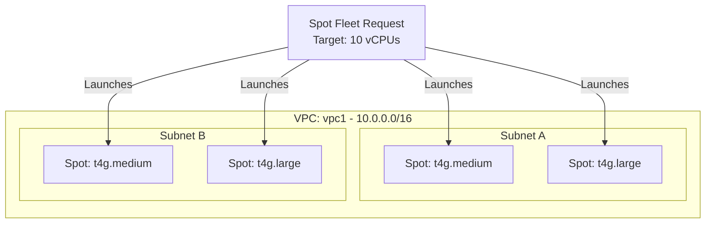

# Deploy an EC2 Spot Fleet for Cost-Optimized Workloads on AWS

This guide demonstrates how to use MechCloud's stateless IaC to provision a Spot Fleet request for running cost-optimized compute workloads at up to 90% discount.

## Scenario Overview
**Use Case:** Batch processing, data analytics, CI/CD build agents, or any fault-tolerant workload that can leverage Spot instances for significant cost savings — with automatic capacity maintenance across instance types and AZs.
**Key MechCloud Features Highlighted:**
- Cross-resource referencing (`ref:`)
- Complex fleet configuration as clean YAML
- Multi-instance type diversification

### Architecture Diagram



***

### Complete Unified Template

```yaml
resources:
  - type: aws_iam_role
    name: fleet-role
    props:
      role_name: "mc-spot-fleet-role"
      assume_role_policy_document:
        Version: "2012-10-17"
        Statement:
          - Effect: Allow
            Principal:
              Service: spotfleet.amazonaws.com
            Action: "sts:AssumeRole"
      managed_policy_arns:
        - "arn:aws:iam::aws:policy/service-role/AmazonEC2SpotFleetTaggingRole"

  - type: aws_ec2_vpc
    name: vpc1
    props:
      cidr_block: "10.0.0.0/16"
    resources:
      - type: aws_ec2_security_group
        name: sg-fleet
        props:
          group_name: "mc-spot-fleet-sg"
          group_description: "SG for Spot Fleet instances"
          security_group_ingress:
            - ip_protocol: tcp
              from_port: 22
              to_port: 22
              cidr_ip: "10.0.0.0/16"
      - type: aws_ec2_subnet
        name: subnet-a
        props:
          cidr_block: "10.0.1.0/24"
          availability_zone: "{{CURRENT_REGION}}a"
      - type: aws_ec2_subnet
        name: subnet-b
        props:
          cidr_block: "10.0.2.0/24"
          availability_zone: "{{CURRENT_REGION}}b"

  - type: aws_ec2_spot_fleet_request
    name: batch-fleet
    props:
      iam_fleet_role: "ref:fleet-role.arn"
      target_capacity: 10
      allocation_strategy: capacityOptimized
      terminate_instances_with_expiration: true
      launch_specifications:
        - image_id: "{{Image|arm64_ubuntu_24_04}}"
          instance_type: "t4g.medium"
          subnet_id: "ref:vpc1/subnet-a"
          security_groups:
            - "ref:vpc1/sg-fleet"
          weighted_capacity: 2
        - image_id: "{{Image|arm64_ubuntu_24_04}}"
          instance_type: "t4g.large"
          subnet_id: "ref:vpc1/subnet-a"
          security_groups:
            - "ref:vpc1/sg-fleet"
          weighted_capacity: 4
        - image_id: "{{Image|arm64_ubuntu_24_04}}"
          instance_type: "t4g.medium"
          subnet_id: "ref:vpc1/subnet-b"
          security_groups:
            - "ref:vpc1/sg-fleet"
          weighted_capacity: 2
        - image_id: "{{Image|arm64_ubuntu_24_04}}"
          instance_type: "t4g.large"
          subnet_id: "ref:vpc1/subnet-b"
          security_groups:
            - "ref:vpc1/sg-fleet"
          weighted_capacity: 4
```
