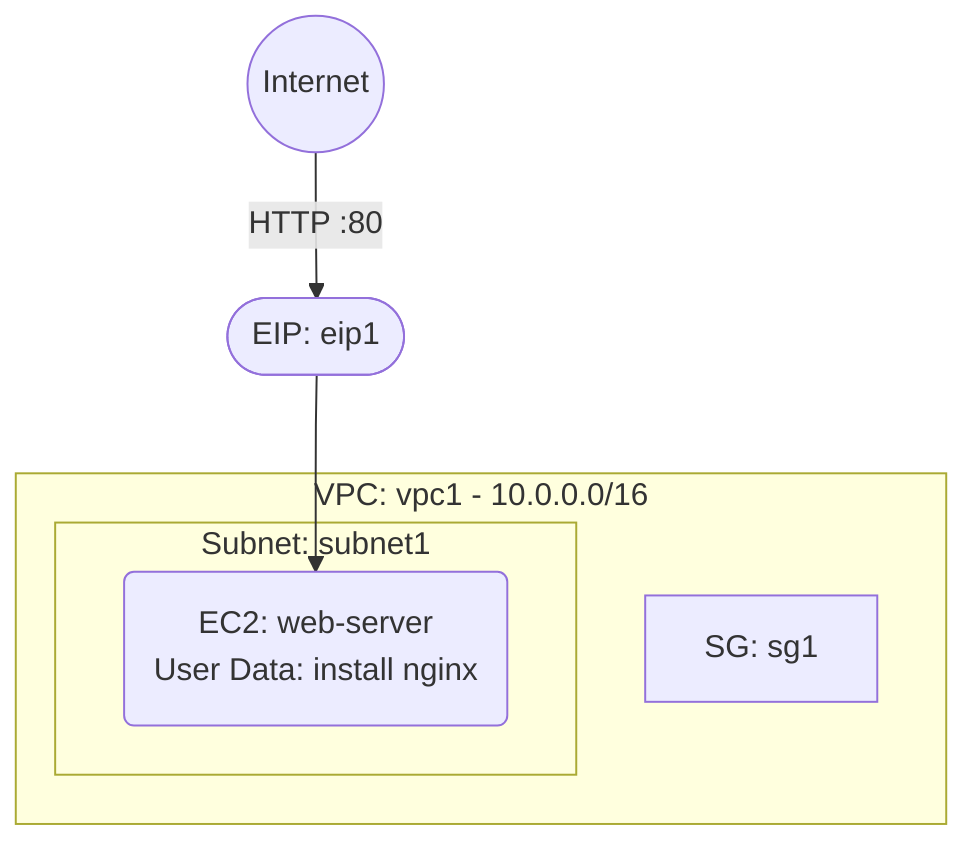

# Deploy an EC2 Instance with User Data Bootstrap on AWS

This guide demonstrates how to use MechCloud's stateless IaC to provision an EC2 instance with a user data script that automatically installs and configures a web server on first boot.

## Scenario Overview
**Use Case:** Automated server provisioning where an EC2 instance bootstraps itself with Nginx, application dependencies, and monitoring agents on launch — eliminating manual configuration steps and enabling repeatable deployments.
**Key MechCloud Features Highlighted:**
- Hierarchical resource nesting (VPC → Subnet → EC2)
- User data as inline YAML (no base64 encoding hassle)
- Dynamic macros (`{{CURRENT_REGION}}`, `{{CURRENT_IP}}`)

### Architecture Diagram



***

### Complete Unified Template

```yaml
resources:
  - type: aws_ec2_vpc
    name: vpc1
    props:
      cidr_block: "10.0.0.0/16"
    resources:
      - type: aws_ec2_internet_gateway
        name: igw1
      - type: aws_ec2_route_table
        name: public_rt
        resources:
          - type: aws_ec2_route
            name: internet_route
            props:
              destination_cidr_block: "0.0.0.0/0"
              gateway_id: "ref:vpc1/igw1"
      - type: aws_ec2_security_group
        name: sg1
        props:
          group_name: "mc-userdata-sg"
          group_description: "SG for bootstrapped EC2"
          security_group_ingress:
            - ip_protocol: tcp
              from_port: 22
              to_port: 22
              cidr_ip: "{{CURRENT_IP}}/32"
            - ip_protocol: tcp
              from_port: 80
              to_port: 80
              cidr_ip: "0.0.0.0/0"
            - ip_protocol: tcp
              from_port: 443
              to_port: 443
              cidr_ip: "0.0.0.0/0"
      - type: aws_ec2_subnet
        name: subnet1
        props:
          cidr_block: "10.0.1.0/24"
          availability_zone: "{{CURRENT_REGION}}a"
        resources:
          - type: aws_ec2_route_table_association
            name: rta1
            props:
              route_table_id: "ref:vpc1/public_rt"
          - type: aws_ec2_instance
            name: web-server
            props:
              image_id: "{{Image|arm64_ubuntu_24_04}}"
              instance_type: "t4g.small"
              security_group_ids:
                - "ref:vpc1/sg1"
              user_data: |
                #!/bin/bash
                apt-get update -y
                apt-get install -y nginx
                systemctl enable nginx
                systemctl start nginx
                echo "<h1>Hello from MechCloud!</h1>" > /var/www/html/index.html

  - type: aws_ec2_eip
    name: eip1
    props:
      instance_id: "ref:vpc1/subnet1/web-server"
```
