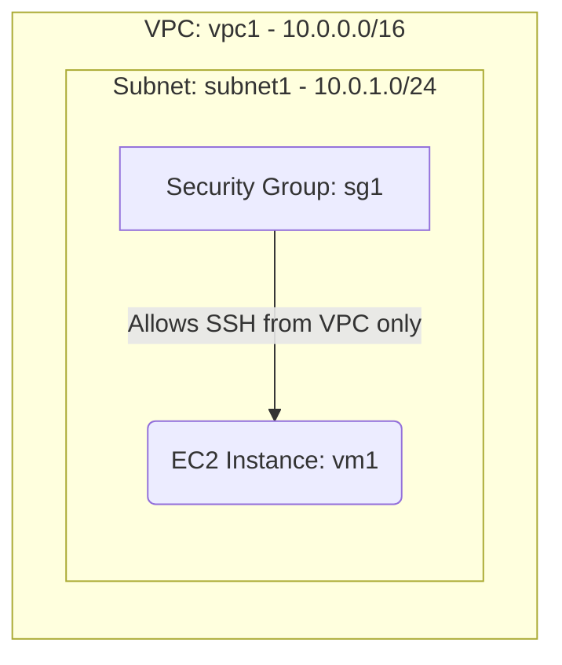

# Deploy a Private EC2 Instance without a Public IP on AWS

This guide demonstrates how to use MechCloud's stateless Infrastructure-as-Code (IaC) to provision a private EC2 instance on AWS that has no direct internet exposure.

In this scenario, we will provision an EC2 instance inside a VPC with only a private IP address. There is no Internet Gateway attached to the VPC, and no Elastic IP is assigned. The Security Group only allows SSH from within the VPC CIDR. This is a common pattern for backend services, databases, or worker nodes that should not be directly reachable from the public internet.

## Scenario Overview
**Use Case:** Deploying an internal backend service, database server, or worker node that should only be accessible from within the VPC or via a VPN/bastion host.
**Key MechCloud Features Highlighted:**
- Hierarchical resource nesting (VPC $\rightarrow$ Subnet $\rightarrow$ EC2)
- Dynamic macros (`{{CURRENT_REGION}}`, `{{Image|arm64_ubuntu_24_04}}`)
- Cross-resource referencing (`ref:`)

### Architecture Diagram



***

## Step 1: Setting up Networking and Security

We create a VPC with a private subnet. No Internet Gateway is attached, keeping the subnet completely private. The Security Group only allows SSH access from within the VPC CIDR range.

```yaml
resources:
  - type: aws_ec2_vpc
    name: vpc1
    props:
      cidr_block: "10.0.0.0/16"
    resources:
      # 1. Define the Private Subnet
      - type: aws_ec2_subnet
        name: subnet1
        props:
          cidr_block: "10.0.1.0/24"
          availability_zone: "{{CURRENT_REGION}}a"

      # 2. Security Group allowing SSH from within VPC only
      - type: aws_ec2_security_group
        name: sg1
        props:
          group_name: "mc-private-sg"
          group_description: "SG for private backend service"
          security_group_ingress:
            - ip_protocol: tcp
              from_port: 22
              to_port: 22
              cidr_ip: "10.0.0.0/16"
```

## Step 2: Provisioning the Private EC2 Instance

We nest the EC2 instance inside the subnet block. No EIP is attached, so the instance only receives a private IP address.

```yaml
# ... (Continuing inside the vpc1/subnet1 resources block) ...
        resources:
          - type: aws_ec2_instance
            name: vm1
            props:
              image_id: "{{Image|arm64_ubuntu_24_04}}"
              instance_type: "t4g.small"
              security_group_ids:
                - "ref:vpc1/sg1"
```

### Complete Unified Template

For your convenience, here is the complete, unified MechCloud template combining all steps:

```yaml
resources:
  - type: aws_ec2_vpc
    name: vpc1
    props:
      cidr_block: "10.0.0.0/16"
    resources:
      - type: aws_ec2_subnet
        name: subnet1
        props:
          cidr_block: "10.0.1.0/24"
          availability_zone: "{{CURRENT_REGION}}a"
        resources:
          - type: aws_ec2_instance
            name: vm1
            props:
              image_id: "{{Image|arm64_ubuntu_24_04}}"
              instance_type: "t4g.small"
              security_group_ids:
                - "ref:vpc1/sg1"

      - type: aws_ec2_security_group
        name: sg1
        props:
          group_name: "mc-private-sg"
          group_description: "SG for private backend service"
          security_group_ingress:
            - ip_protocol: tcp
              from_port: 22
              to_port: 22
              cidr_ip: "10.0.0.0/16"
```
