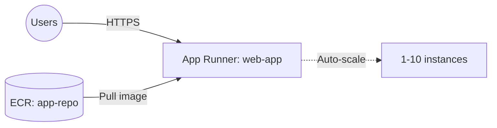

# Deploy an App Runner Service on AWS

This guide demonstrates how to use MechCloud's stateless IaC to provision an AWS App Runner service for running containerized web applications without managing infrastructure.

## Scenario Overview
**Use Case:** A fully managed container platform that automatically builds, deploys, and scales web applications from a container image or source code — simpler than ECS/Fargate for teams that want zero infrastructure management.
**Key MechCloud Features Highlighted:**
- Simple service configuration as clean YAML
- Auto-scaling configuration inline
- No VPC or networking setup required

### Architecture Diagram



***

### Complete Unified Template

```yaml
resources:
  - type: aws_iam_role
    name: apprunner-access-role
    props:
      role_name: "mc-apprunner-access-role"
      assume_role_policy_document:
        Version: "2012-10-17"
        Statement:
          - Effect: Allow
            Principal:
              Service: build.apprunner.amazonaws.com
            Action: "sts:AssumeRole"
      managed_policy_arns:
        - "arn:aws:iam::aws:policy/service-role/AWSAppRunnerServicePolicyForECRAccess"

  - type: aws_iam_role
    name: apprunner-instance-role
    props:
      role_name: "mc-apprunner-instance-role"
      assume_role_policy_document:
        Version: "2012-10-17"
        Statement:
          - Effect: Allow
            Principal:
              Service: tasks.apprunner.amazonaws.com
            Action: "sts:AssumeRole"

  - type: aws_apprunner_auto_scaling_configuration
    name: scaling-config
    props:
      auto_scaling_configuration_name: "mc-scaling"
      max_concurrency: 100
      max_size: 10
      min_size: 1

  - type: aws_apprunner_service
    name: web-app
    props:
      service_name: "mc-web-app"
      source_configuration:
        authentication_configuration:
          access_role_arn: "ref:apprunner-access-role.arn"
        image_repository:
          image_identifier: "public.ecr.aws/nginx/nginx:latest"
          image_repository_type: ECR_PUBLIC
          image_configuration:
            port: "8080"
            runtime_environment_variables:
              ENVIRONMENT: production
      instance_configuration:
        cpu: "1024"
        memory: "2048"
        instance_role_arn: "ref:apprunner-instance-role.arn"
      auto_scaling_configuration_arn: "ref:scaling-config.arn"
      health_check_configuration:
        protocol: HTTP
        path: "/"
        interval: 10
        timeout: 5
        healthy_threshold: 1
        unhealthy_threshold: 5
```
