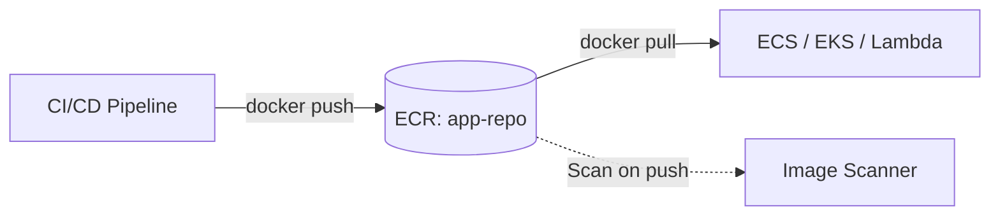

# Deploy an ECR Repository with Lifecycle Policy on AWS

This guide demonstrates how to use MechCloud's stateless IaC to provision an Amazon ECR private repository with lifecycle policies and image scanning on AWS.

## Scenario Overview
**Use Case:** A container image registry for storing Docker images with automated cleanup of old images and vulnerability scanning — essential for any containerized CI/CD pipeline.
**Key MechCloud Features Highlighted:**
- Simple resource provisioning without state management
- Lifecycle policy configuration as nested YAML

### Architecture Diagram



***

### Complete Unified Template

```yaml
resources:
  - type: aws_ecr_repository
    name: app-repo
    props:
      repository_name: "mc-app"
      image_tag_mutability: IMMUTABLE
      image_scanning_configuration:
        scan_on_push: true
      encryption_configuration:
        encryption_type: AES256

  - type: aws_ecr_lifecycle_policy
    name: app-repo-lifecycle
    props:
      repository: "ref:app-repo"
      policy:
        rules:
          - rulePriority: 1
            description: "Keep last 20 images"
            selection:
              tagStatus: any
              countType: imageCountMoreThan
              countNumber: 20
            action:
              type: expire

  - type: aws_ecr_repository
    name: base-images
    props:
      repository_name: "mc-base-images"
      image_tag_mutability: MUTABLE
      image_scanning_configuration:
        scan_on_push: true
      encryption_configuration:
        encryption_type: AES256
```
