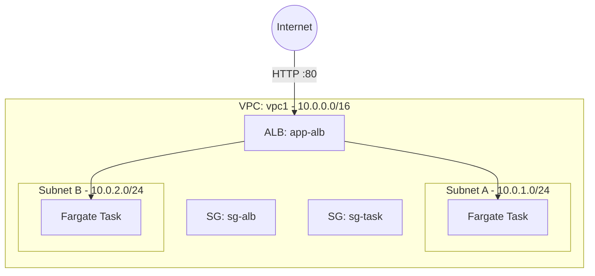

# Deploy an ECS Fargate Service on AWS

This guide demonstrates how to use MechCloud's stateless IaC to provision an ECS Fargate service for serverless container workloads on AWS.

## Scenario Overview
**Use Case:** A containerized web application running on AWS Fargate without managing EC2 instances — ideal for microservices that need automatic scaling and zero server management.
**Key MechCloud Features Highlighted:**
- Hierarchical resource nesting (VPC → Subnet → Service)
- Cross-resource referencing (`ref:`)
- Dynamic macros (`{{CURRENT_REGION}}`)

### Architecture Diagram



***

### Complete Unified Template

```yaml
resources:
  - type: aws_ec2_vpc
    name: vpc1
    props:
      cidr_block: "10.0.0.0/16"
    resources:
      - type: aws_ec2_internet_gateway
        name: igw1
      - type: aws_ec2_route_table
        name: public_rt
        resources:
          - type: aws_ec2_route
            name: internet_route
            props:
              destination_cidr_block: "0.0.0.0/0"
              gateway_id: "ref:vpc1/igw1"
      - type: aws_ec2_security_group
        name: sg-alb
        props:
          group_name: "mc-alb-sg"
          group_description: "SG for ALB"
          security_group_ingress:
            - ip_protocol: tcp
              from_port: 80
              to_port: 80
              cidr_ip: "0.0.0.0/0"
      - type: aws_ec2_security_group
        name: sg-task
        props:
          group_name: "mc-task-sg"
          group_description: "SG for Fargate tasks"
          security_group_ingress:
            - ip_protocol: tcp
              from_port: 8080
              to_port: 8080
              source_security_group_id: "ref:vpc1/sg-alb"
      - type: aws_ec2_subnet
        name: subnet-a
        props:
          cidr_block: "10.0.1.0/24"
          availability_zone: "{{CURRENT_REGION}}a"
          map_public_ip_on_launch: true
        resources:
          - type: aws_ec2_route_table_association
            name: rta-a
            props:
              route_table_id: "ref:vpc1/public_rt"
      - type: aws_ec2_subnet
        name: subnet-b
        props:
          cidr_block: "10.0.2.0/24"
          availability_zone: "{{CURRENT_REGION}}b"
          map_public_ip_on_launch: true
        resources:
          - type: aws_ec2_route_table_association
            name: rta-b
            props:
              route_table_id: "ref:vpc1/public_rt"

  - type: aws_ecs_cluster
    name: app-cluster

  - type: aws_ecs_task_definition
    name: app-task
    props:
      family: mc-app
      network_mode: awsvpc
      requires_compatibilities:
        - FARGATE
      cpu: "256"
      memory: "512"
      container_definitions:
        - name: app
          image: "public.ecr.aws/nginx/nginx:latest"
          port_mappings:
            - container_port: 8080
              protocol: tcp
          essential: true

  - type: aws_elbv2_load_balancer
    name: app-alb
    props:
      type: application
      scheme: internet-facing
      security_groups:
        - "ref:vpc1/sg-alb"
      subnets:
        - "ref:vpc1/subnet-a"
        - "ref:vpc1/subnet-b"

  - type: aws_elbv2_target_group
    name: app-tg
    props:
      port: 8080
      protocol: HTTP
      vpc_id: "ref:vpc1"
      target_type: ip
      health_check:
        path: "/"
        interval: 30

  - type: aws_elbv2_listener
    name: http-listener
    props:
      load_balancer_arn: "ref:app-alb"
      port: 80
      protocol: HTTP
      default_actions:
        - type: forward
          target_group_arn: "ref:app-tg"

  - type: aws_ecs_service
    name: app-service
    props:
      cluster: "ref:app-cluster"
      task_definition: "ref:app-task"
      desired_count: 2
      launch_type: FARGATE
      network_configuration:
        subnets:
          - "ref:vpc1/subnet-a"
          - "ref:vpc1/subnet-b"
        security_groups:
          - "ref:vpc1/sg-task"
        assign_public_ip: true
      load_balancers:
        - target_group_arn: "ref:app-tg"
          container_name: app
          container_port: 8080
```
