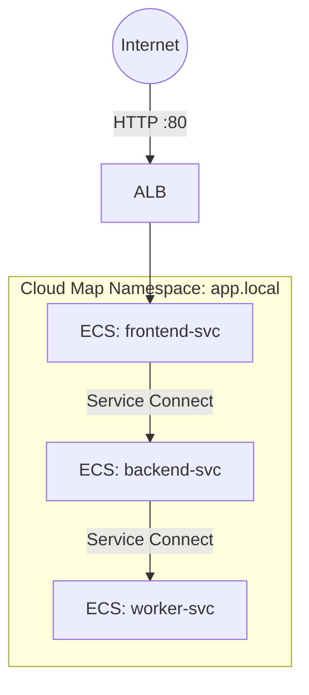

# Deploy ECS Service Connect for Service Mesh on AWS

This guide demonstrates how to use MechCloud's stateless IaC to provision ECS services with Service Connect for built-in service-to-service communication and discovery.

## Scenario Overview
**Use Case:** Microservices architecture where multiple ECS services need to discover and communicate with each other reliably — Service Connect provides built-in service mesh capabilities with automatic load balancing, retries, and observability without a sidecar proxy.
**Key MechCloud Features Highlighted:**
- Cross-resource referencing (`ref:`)
- Service Connect namespace and service configuration
- Multi-service architecture in a single template

### Architecture Diagram



***

### Complete Unified Template

```yaml
resources:
  - type: aws_ec2_vpc
    name: vpc1
    props:
      cidr_block: "10.0.0.0/16"
      enable_dns_support: true
      enable_dns_hostnames: true
    resources:
      - type: aws_ec2_internet_gateway
        name: igw1
      - type: aws_ec2_route_table
        name: public_rt
        resources:
          - type: aws_ec2_route
            name: internet_route
            props:
              destination_cidr_block: "0.0.0.0/0"
              gateway_id: "ref:vpc1/igw1"
      - type: aws_ec2_security_group
        name: sg-svc
        props:
          group_name: "mc-svc-connect-sg"
          group_description: "SG for ECS services"
          security_group_ingress:
            - ip_protocol: tcp
              from_port: 8080
              to_port: 8080
              cidr_ip: "10.0.0.0/16"
            - ip_protocol: tcp
              from_port: 80
              to_port: 80
              cidr_ip: "0.0.0.0/0"
      - type: aws_ec2_subnet
        name: subnet-a
        props:
          cidr_block: "10.0.1.0/24"
          availability_zone: "{{CURRENT_REGION}}a"
          map_public_ip_on_launch: true
        resources:
          - type: aws_ec2_route_table_association
            name: rta-a
            props:
              route_table_id: "ref:vpc1/public_rt"
      - type: aws_ec2_subnet
        name: subnet-b
        props:
          cidr_block: "10.0.2.0/24"
          availability_zone: "{{CURRENT_REGION}}b"
          map_public_ip_on_launch: true
        resources:
          - type: aws_ec2_route_table_association
            name: rta-b
            props:
              route_table_id: "ref:vpc1/public_rt"

  - type: aws_service_discovery_http_namespace
    name: app-namespace
    props:
      name: "app.local"
      description: "Service Connect namespace"

  - type: aws_ecs_cluster
    name: app-cluster
    props:
      service_connect_defaults:
        namespace: "ref:app-namespace.arn"

  - type: aws_ecs_task_definition
    name: frontend-task
    props:
      family: mc-frontend
      network_mode: awsvpc
      requires_compatibilities:
        - FARGATE
      cpu: "256"
      memory: "512"
      container_definitions:
        - name: frontend
          image: "public.ecr.aws/nginx/nginx:latest"
          port_mappings:
            - container_port: 8080
              name: frontend
              protocol: tcp
          essential: true

  - type: aws_ecs_task_definition
    name: backend-task
    props:
      family: mc-backend
      network_mode: awsvpc
      requires_compatibilities:
        - FARGATE
      cpu: "256"
      memory: "512"
      container_definitions:
        - name: backend
          image: "public.ecr.aws/nginx/nginx:latest"
          port_mappings:
            - container_port: 8080
              name: backend
              protocol: tcp
          essential: true

  - type: aws_ecs_service
    name: frontend-svc
    props:
      cluster: "ref:app-cluster"
      task_definition: "ref:frontend-task"
      desired_count: 2
      launch_type: FARGATE
      network_configuration:
        subnets:
          - "ref:vpc1/subnet-a"
          - "ref:vpc1/subnet-b"
        security_groups:
          - "ref:vpc1/sg-svc"
        assign_public_ip: true
      service_connect_configuration:
        enabled: true
        namespace: "ref:app-namespace.arn"
        services:
          - port_name: frontend
            discovery_name: frontend
            client_aliases:
              - port: 8080

  - type: aws_ecs_service
    name: backend-svc
    props:
      cluster: "ref:app-cluster"
      task_definition: "ref:backend-task"
      desired_count: 2
      launch_type: FARGATE
      network_configuration:
        subnets:
          - "ref:vpc1/subnet-a"
          - "ref:vpc1/subnet-b"
        security_groups:
          - "ref:vpc1/sg-svc"
        assign_public_ip: true
      service_connect_configuration:
        enabled: true
        namespace: "ref:app-namespace.arn"
        services:
          - port_name: backend
            discovery_name: backend
            client_aliases:
              - port: 8080
```
