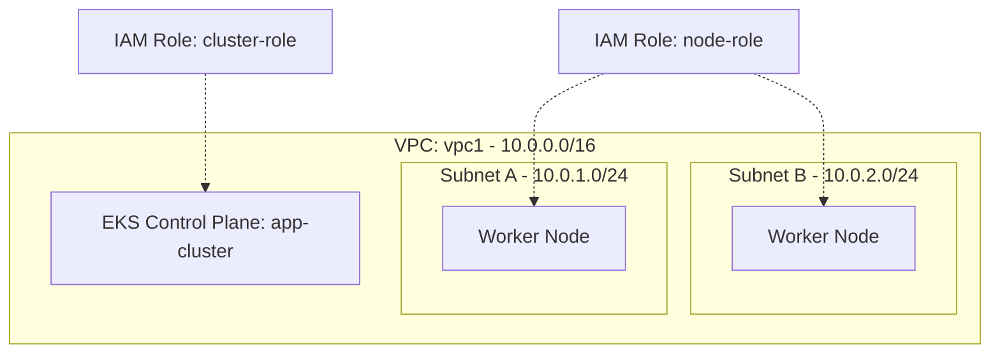

# Deploy an EKS Cluster with Managed Node Group on AWS

This guide demonstrates how to use MechCloud's stateless IaC to provision an Amazon EKS Kubernetes cluster with a managed node group for container orchestration.

## Scenario Overview
**Use Case:** A production-grade Kubernetes cluster for running containerized microservices with automatic node scaling, integrated with AWS networking and IAM — ideal for teams adopting Kubernetes without managing the control plane.
**Key MechCloud Features Highlighted:**
- Cross-resource referencing (`ref:`)
- Complex IAM and networking setup in clean YAML
- No state management for cluster lifecycle

### Architecture Diagram



***

### Complete Unified Template

```yaml
resources:
  - type: aws_iam_role
    name: cluster-role
    props:
      role_name: "mc-eks-cluster-role"
      assume_role_policy_document:
        Version: "2012-10-17"
        Statement:
          - Effect: Allow
            Principal:
              Service: eks.amazonaws.com
            Action: "sts:AssumeRole"
      managed_policy_arns:
        - "arn:aws:iam::aws:policy/AmazonEKSClusterPolicy"

  - type: aws_iam_role
    name: node-role
    props:
      role_name: "mc-eks-node-role"
      assume_role_policy_document:
        Version: "2012-10-17"
        Statement:
          - Effect: Allow
            Principal:
              Service: ec2.amazonaws.com
            Action: "sts:AssumeRole"
      managed_policy_arns:
        - "arn:aws:iam::aws:policy/AmazonEKSWorkerNodePolicy"
        - "arn:aws:iam::aws:policy/AmazonEKS_CNI_Policy"
        - "arn:aws:iam::aws:policy/AmazonEC2ContainerRegistryReadOnly"

  - type: aws_ec2_vpc
    name: vpc1
    props:
      cidr_block: "10.0.0.0/16"
      enable_dns_support: true
      enable_dns_hostnames: true
    resources:
      - type: aws_ec2_internet_gateway
        name: igw1
      - type: aws_ec2_route_table
        name: public_rt
        resources:
          - type: aws_ec2_route
            name: internet_route
            props:
              destination_cidr_block: "0.0.0.0/0"
              gateway_id: "ref:vpc1/igw1"
      - type: aws_ec2_subnet
        name: subnet-a
        props:
          cidr_block: "10.0.1.0/24"
          availability_zone: "{{CURRENT_REGION}}a"
          map_public_ip_on_launch: true
        resources:
          - type: aws_ec2_route_table_association
            name: rta-a
            props:
              route_table_id: "ref:vpc1/public_rt"
      - type: aws_ec2_subnet
        name: subnet-b
        props:
          cidr_block: "10.0.2.0/24"
          availability_zone: "{{CURRENT_REGION}}b"
          map_public_ip_on_launch: true
        resources:
          - type: aws_ec2_route_table_association
            name: rta-b
            props:
              route_table_id: "ref:vpc1/public_rt"

  - type: aws_eks_cluster
    name: app-cluster
    props:
      name: "mc-eks-cluster"
      role_arn: "ref:cluster-role.arn"
      version: "1.29"
      resources_vpc_config:
        subnet_ids:
          - "ref:vpc1/subnet-a"
          - "ref:vpc1/subnet-b"
        endpoint_public_access: true
        endpoint_private_access: true

  - type: aws_eks_node_group
    name: app-nodes
    props:
      cluster_name: "ref:app-cluster"
      node_group_name: "mc-app-nodes"
      node_role_arn: "ref:node-role.arn"
      subnet_ids:
        - "ref:vpc1/subnet-a"
        - "ref:vpc1/subnet-b"
      instance_types:
        - "t4g.medium"
      scaling_config:
        desired_size: 2
        min_size: 1
        max_size: 5
      ami_type: AL2_ARM_64
```
