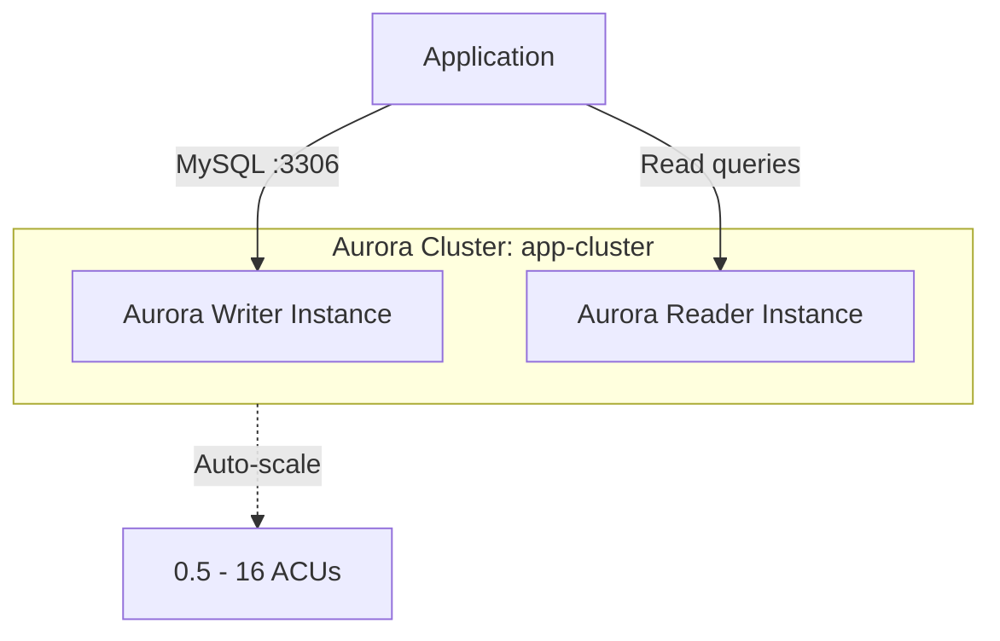

# Deploy an Aurora Serverless v2 Cluster on AWS

This guide demonstrates how to use MechCloud's stateless IaC to provision an Amazon Aurora Serverless v2 MySQL cluster that automatically scales capacity based on demand.

## Scenario Overview
**Use Case:** A database that scales from 0.5 ACUs to 128 ACUs in seconds without manual intervention — ideal for variable workloads, dev/test environments, and applications with unpredictable traffic patterns where you only pay for what you use.
**Key MechCloud Features Highlighted:**
- Cross-resource referencing (`ref:`)
- Cluster and instance configuration as clean YAML
- Serverless scaling configuration inline

### Architecture Diagram



***

### Complete Unified Template

```yaml
resources:
  - type: aws_ec2_vpc
    name: vpc1
    props:
      cidr_block: "10.0.0.0/16"
    resources:
      - type: aws_ec2_security_group
        name: sg-aurora
        props:
          group_name: "mc-aurora-sg"
          group_description: "SG for Aurora cluster"
          security_group_ingress:
            - ip_protocol: tcp
              from_port: 3306
              to_port: 3306
              cidr_ip: "10.0.0.0/16"
      - type: aws_ec2_subnet
        name: db-subnet-a
        props:
          cidr_block: "10.0.10.0/24"
          availability_zone: "{{CURRENT_REGION}}a"
      - type: aws_ec2_subnet
        name: db-subnet-b
        props:
          cidr_block: "10.0.11.0/24"
          availability_zone: "{{CURRENT_REGION}}b"

  - type: aws_rds_db_subnet_group
    name: aurora-subnets
    props:
      db_subnet_group_name: "mc-aurora-subnets"
      db_subnet_group_description: "Subnets for Aurora Serverless"
      subnet_ids:
        - "ref:vpc1/db-subnet-a"
        - "ref:vpc1/db-subnet-b"

  - type: aws_rds_db_cluster
    name: app-cluster
    props:
      db_cluster_identifier: "mc-aurora-cluster"
      engine: aurora-mysql
      engine_version: "8.0.mysql_aurora.3.04.0"
      master_username: "admin"
      master_user_password: "ChangeMe123!"
      db_subnet_group_name: "ref:aurora-subnets"
      vpc_security_group_ids:
        - "ref:vpc1/sg-aurora"
      storage_encrypted: true
      backup_retention_period: 7
      serverlessv2_scaling_configuration:
        min_capacity: 0.5
        max_capacity: 16

  - type: aws_rds_db_instance
    name: writer-instance
    props:
      db_instance_identifier: "mc-aurora-writer"
      db_cluster_identifier: "ref:app-cluster"
      engine: aurora-mysql
      db_instance_class: "db.serverless"

  - type: aws_rds_db_instance
    name: reader-instance
    props:
      db_instance_identifier: "mc-aurora-reader"
      db_cluster_identifier: "ref:app-cluster"
      engine: aurora-mysql
      db_instance_class: "db.serverless"
```
