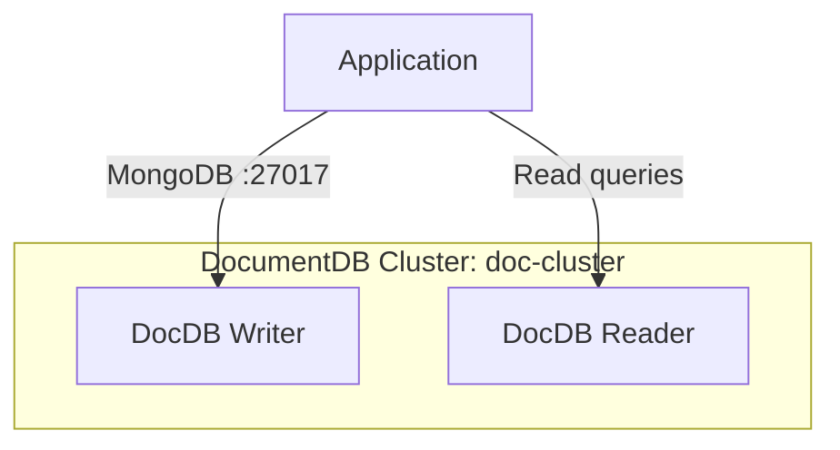

# Deploy an Amazon DocumentDB Cluster on AWS

This guide demonstrates how to use MechCloud's stateless IaC to provision an Amazon DocumentDB (MongoDB-compatible) cluster for document database workloads.

## Scenario Overview
**Use Case:** A fully managed document database for applications using MongoDB APIs — ideal for content management, user profiles, catalogs, and any workload that benefits from flexible JSON document storage with MongoDB compatibility.
**Key MechCloud Features Highlighted:**
- Cross-resource referencing (`ref:`)
- Cluster and instance configuration as clean YAML
- Subnet group and security configuration

### Architecture Diagram



***

### Complete Unified Template

```yaml
resources:
  - type: aws_ec2_vpc
    name: vpc1
    props:
      cidr_block: "10.0.0.0/16"
    resources:
      - type: aws_ec2_security_group
        name: sg-docdb
        props:
          group_name: "mc-docdb-sg"
          group_description: "SG for DocumentDB"
          security_group_ingress:
            - ip_protocol: tcp
              from_port: 27017
              to_port: 27017
              cidr_ip: "10.0.0.0/16"
      - type: aws_ec2_subnet
        name: db-subnet-a
        props:
          cidr_block: "10.0.10.0/24"
          availability_zone: "{{CURRENT_REGION}}a"
      - type: aws_ec2_subnet
        name: db-subnet-b
        props:
          cidr_block: "10.0.11.0/24"
          availability_zone: "{{CURRENT_REGION}}b"

  - type: aws_docdb_subnet_group
    name: docdb-subnets
    props:
      name: "mc-docdb-subnets"
      description: "Subnet group for DocumentDB"
      subnet_ids:
        - "ref:vpc1/db-subnet-a"
        - "ref:vpc1/db-subnet-b"

  - type: aws_docdb_cluster_parameter_group
    name: docdb-params
    props:
      name: "mc-docdb-params"
      family: "docdb5.0"
      description: "Custom parameter group"
      parameters:
        - name: tls
          value: enabled
        - name: audit_logs
          value: enabled

  - type: aws_docdb_cluster
    name: doc-cluster
    props:
      cluster_identifier: "mc-docdb-cluster"
      engine: docdb
      engine_version: "5.0.0"
      master_username: "docadmin"
      master_user_password: "ChangeMe123!"
      db_subnet_group_name: "ref:docdb-subnets"
      vpc_security_group_ids:
        - "ref:vpc1/sg-docdb"
      db_cluster_parameter_group_name: "ref:docdb-params"
      storage_encrypted: true
      backup_retention_period: 7

  - type: aws_docdb_cluster_instance
    name: writer-instance
    props:
      identifier: "mc-docdb-writer"
      cluster_identifier: "ref:doc-cluster"
      instance_class: "db.r6g.large"

  - type: aws_docdb_cluster_instance
    name: reader-instance
    props:
      identifier: "mc-docdb-reader"
      cluster_identifier: "ref:doc-cluster"
      instance_class: "db.r6g.large"
```
