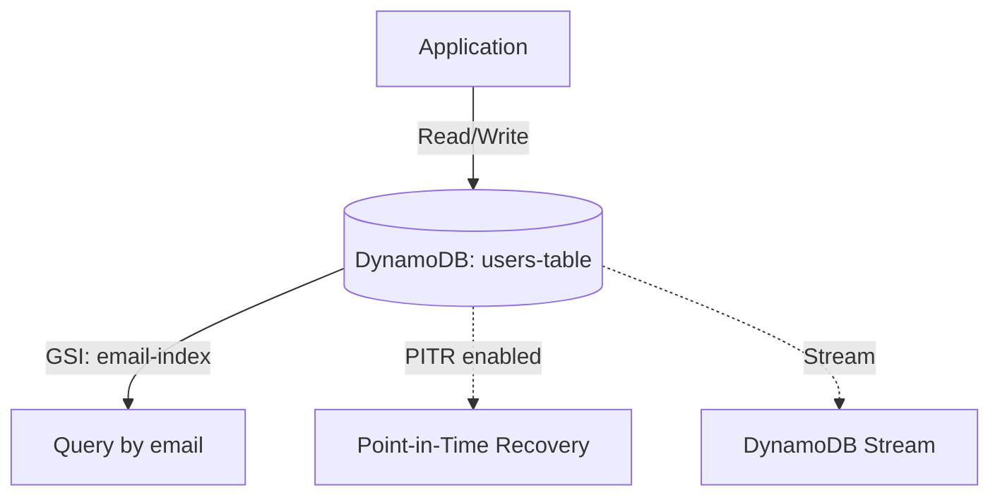

# Deploy a DynamoDB Table with Global Secondary Index on AWS

This guide demonstrates how to use MechCloud's stateless IaC to provision a DynamoDB table with GSI, auto-scaling, and point-in-time recovery on AWS.

## Scenario Overview
**Use Case:** A NoSQL database for applications needing single-digit millisecond performance at any scale — ideal for user profiles, gaming leaderboards, IoT data, and shopping carts.
**Key MechCloud Features Highlighted:**
- Nested attribute and index definitions as clean YAML
- No state management for data resources
- Auto-scaling configuration inline

### Architecture Diagram



***

### Complete Unified Template

```yaml
resources:
  - type: aws_dynamodb_table
    name: users-table
    props:
      table_name: "mc-users"
      billing_mode: PAY_PER_REQUEST
      hash_key: userId
      range_key: createdAt
      attribute_definitions:
        - attribute_name: userId
          attribute_type: S
        - attribute_name: createdAt
          attribute_type: N
        - attribute_name: email
          attribute_type: S
      global_secondary_indexes:
        - index_name: email-index
          hash_key: email
          projection_type: ALL
      point_in_time_recovery:
        enabled: true
      stream_specification:
        stream_enabled: true
        stream_view_type: NEW_AND_OLD_IMAGES
      tags:
        Environment: production
        ManagedBy: mechcloud

  - type: aws_dynamodb_table
    name: sessions-table
    props:
      table_name: "mc-sessions"
      billing_mode: PAY_PER_REQUEST
      hash_key: sessionId
      attribute_definitions:
        - attribute_name: sessionId
          attribute_type: S
      ttl:
        attribute_name: expiresAt
        enabled: true
      point_in_time_recovery:
        enabled: true
      tags:
        Environment: production
        ManagedBy: mechcloud
```
