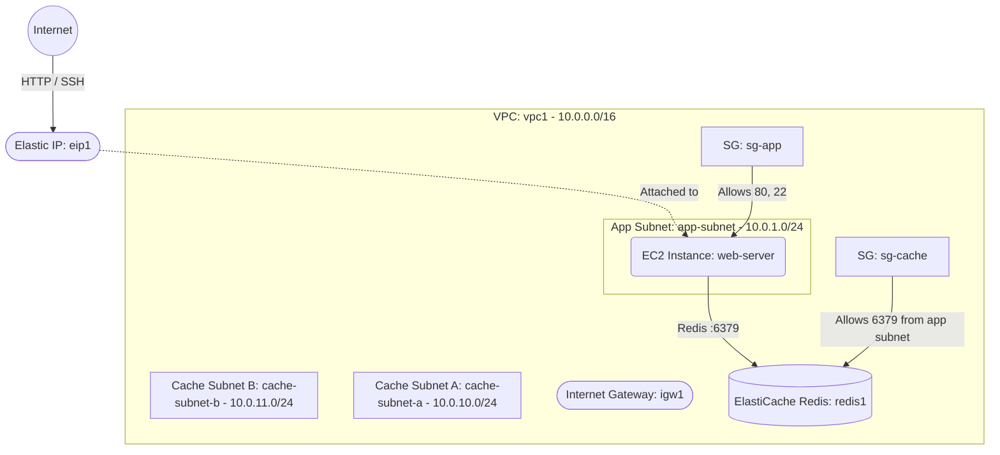

# Deploy an EC2 Instance with ElastiCache Redis on AWS

This guide demonstrates how to use MechCloud's stateless Infrastructure-as-Code (IaC) to provision an EC2 web server connected to an Amazon ElastiCache Redis cluster for in-memory caching on AWS.

In this scenario, we deploy a public-facing EC2 instance and an ElastiCache Redis replication group in private subnets. The Redis cluster provides low-latency caching for session management, leaderboards, or frequently accessed data, while the EC2 instance serves as the application layer.

## Scenario Overview
**Use Case:** A web application that needs sub-millisecond data retrieval for session caching, real-time analytics, or frequently accessed database query results, with Redis accessible only from the application subnet.
**Key MechCloud Features Highlighted:**
- Hierarchical resource nesting (VPC $\rightarrow$ Subnet $\rightarrow$ EC2)
- Dynamic macros (`{{CURRENT_REGION}}`, `{{CURRENT_IP}}`, `{{Image|arm64_ubuntu_24_04}}`)
- Cross-resource referencing (`ref:`)
- ElastiCache Redis with subnet group

### Architecture Diagram



***

## Step 1: Setting up Networking

We create a VPC with a public app subnet and two private cache subnets (required for ElastiCache subnet group).

```yaml
resources:
  - type: aws_ec2_vpc
    name: vpc1
    props:
      cidr_block: "10.0.0.0/16"
    resources:
      - type: aws_ec2_internet_gateway
        name: igw1

      - type: aws_ec2_route_table
        name: public_rt
        resources:
          - type: aws_ec2_route
            name: internet_route
            props:
              destination_cidr_block: "0.0.0.0/0"
              gateway_id: "ref:vpc1/igw1"

      - type: aws_ec2_subnet
        name: app-subnet
        props:
          cidr_block: "10.0.1.0/24"
          availability_zone: "{{CURRENT_REGION}}a"
        resources:
          - type: aws_ec2_route_table_association
            name: rta-app
            props:
              route_table_id: "ref:vpc1/public_rt"

      - type: aws_ec2_subnet
        name: cache-subnet-a
        props:
          cidr_block: "10.0.10.0/24"
          availability_zone: "{{CURRENT_REGION}}a"

      - type: aws_ec2_subnet
        name: cache-subnet-b
        props:
          cidr_block: "10.0.11.0/24"
          availability_zone: "{{CURRENT_REGION}}b"

      - type: aws_ec2_security_group
        name: sg-app
        props:
          group_name: "mc-app-sg"
          group_description: "SG for application server"
          security_group_ingress:
            - ip_protocol: tcp
              from_port: 22
              to_port: 22
              cidr_ip: "{{CURRENT_IP}}/32"
            - ip_protocol: tcp
              from_port: 80
              to_port: 80
              cidr_ip: "0.0.0.0/0"

      - type: aws_ec2_security_group
        name: sg-cache
        props:
          group_name: "mc-cache-sg"
          group_description: "SG for ElastiCache Redis"
          security_group_ingress:
            - ip_protocol: tcp
              from_port: 6379
              to_port: 6379
              cidr_ip: "10.0.1.0/24"
```

## Step 2: Creating the ElastiCache Redis Cluster

We create a cache subnet group and a Redis replication group with automatic failover disabled (single node for simplicity).

```yaml
# ... (At root resources level) ...
  - type: aws_elasticache_cache_subnet_group
    name: cache-subnet-group
    props:
      cache_subnet_group_name: "mc-cache-subnets"
      description: "Subnet group for ElastiCache"
      subnet_ids:
        - "ref:vpc1/cache-subnet-a"
        - "ref:vpc1/cache-subnet-b"

  - type: aws_elasticache_replication_group
    name: redis1
    props:
      replication_group_id: "mc-redis"
      replication_group_description: "Redis cache for web application"
      engine: redis
      engine_version: "7.1"
      cache_node_type: "cache.t4g.micro"
      num_cache_clusters: 1
      cache_subnet_group_name: "ref:cache-subnet-group"
      security_group_ids:
        - "ref:vpc1/sg-cache"
      at_rest_encryption_enabled: true
      transit_encryption_enabled: true
```

## Step 3: Provisioning the Web Server

We deploy an EC2 web server and attach an Elastic IP.

```yaml
# ... (Inside vpc1/app-subnet resources block) ...
        resources:
          - type: aws_ec2_instance
            name: web-server
            props:
              image_id: "{{Image|arm64_ubuntu_24_04}}"
              instance_type: "t4g.small"
              security_group_ids:
                - "ref:vpc1/sg-app"

# ... (At root resources level) ...
  - type: aws_ec2_eip
    name: eip1
    props:
      instance_id: "ref:vpc1/app-subnet/web-server"
```

### Complete Unified Template

For your convenience, here is the complete, unified MechCloud template combining all steps:

```yaml
resources:
  - type: aws_ec2_vpc
    name: vpc1
    props:
      cidr_block: "10.0.0.0/16"
    resources:
      - type: aws_ec2_internet_gateway
        name: igw1

      - type: aws_ec2_route_table
        name: public_rt
        resources:
          - type: aws_ec2_route
            name: internet_route
            props:
              destination_cidr_block: "0.0.0.0/0"
              gateway_id: "ref:vpc1/igw1"

      - type: aws_ec2_security_group
        name: sg-app
        props:
          group_name: "mc-app-sg"
          group_description: "SG for application server"
          security_group_ingress:
            - ip_protocol: tcp
              from_port: 22
              to_port: 22
              cidr_ip: "{{CURRENT_IP}}/32"
            - ip_protocol: tcp
              from_port: 80
              to_port: 80
              cidr_ip: "0.0.0.0/0"

      - type: aws_ec2_security_group
        name: sg-cache
        props:
          group_name: "mc-cache-sg"
          group_description: "SG for ElastiCache Redis"
          security_group_ingress:
            - ip_protocol: tcp
              from_port: 6379
              to_port: 6379
              cidr_ip: "10.0.1.0/24"

      - type: aws_ec2_subnet
        name: app-subnet
        props:
          cidr_block: "10.0.1.0/24"
          availability_zone: "{{CURRENT_REGION}}a"
        resources:
          - type: aws_ec2_route_table_association
            name: rta-app
            props:
              route_table_id: "ref:vpc1/public_rt"

          - type: aws_ec2_instance
            name: web-server
            props:
              image_id: "{{Image|arm64_ubuntu_24_04}}"
              instance_type: "t4g.small"
              security_group_ids:
                - "ref:vpc1/sg-app"

      - type: aws_ec2_subnet
        name: cache-subnet-a
        props:
          cidr_block: "10.0.10.0/24"
          availability_zone: "{{CURRENT_REGION}}a"

      - type: aws_ec2_subnet
        name: cache-subnet-b
        props:
          cidr_block: "10.0.11.0/24"
          availability_zone: "{{CURRENT_REGION}}b"

  - type: aws_elasticache_cache_subnet_group
    name: cache-subnet-group
    props:
      cache_subnet_group_name: "mc-cache-subnets"
      description: "Subnet group for ElastiCache"
      subnet_ids:
        - "ref:vpc1/cache-subnet-a"
        - "ref:vpc1/cache-subnet-b"

  - type: aws_elasticache_replication_group
    name: redis1
    props:
      replication_group_id: "mc-redis"
      replication_group_description: "Redis cache for web application"
      engine: redis
      engine_version: "7.1"
      cache_node_type: "cache.t4g.micro"
      num_cache_clusters: 1
      cache_subnet_group_name: "ref:cache-subnet-group"
      security_group_ids:
        - "ref:vpc1/sg-cache"
      at_rest_encryption_enabled: true
      transit_encryption_enabled: true

  - type: aws_ec2_eip
    name: eip1
    props:
      instance_id: "ref:vpc1/app-subnet/web-server"
```
