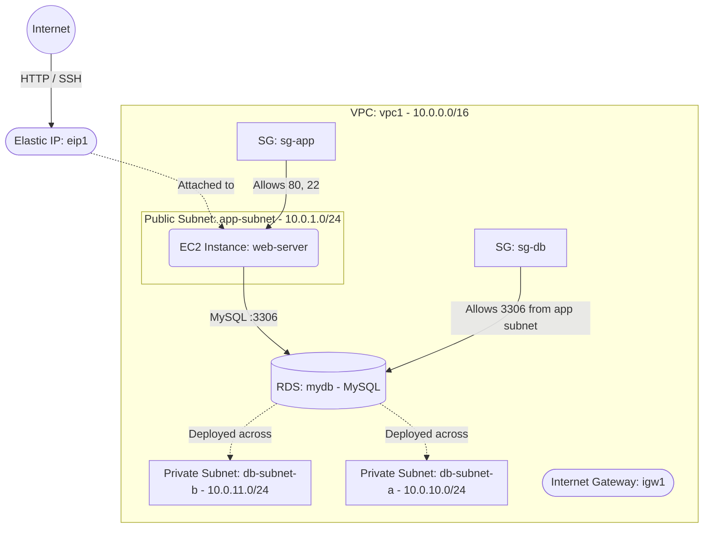

# Deploy an EC2 Web Server with RDS Database on AWS

This guide demonstrates how to use MechCloud's stateless Infrastructure-as-Code (IaC) to provision an EC2 web server in a public subnet connected to an RDS database instance in a private subnet on AWS.

In this scenario, we deploy a classic three-tier web architecture: a public-facing EC2 instance for the application layer and an RDS MySQL database instance in private subnets for the data layer. The database is only accessible from the application subnet, following security best practices.

## Scenario Overview
**Use Case:** A web application that requires a managed relational database backend, with the database isolated in private subnets and the web server publicly accessible.
**Key MechCloud Features Highlighted:**
- Hierarchical resource nesting (VPC $\rightarrow$ Subnet $\rightarrow$ EC2)
- Dynamic macros (`{{CURRENT_REGION}}`, `{{CURRENT_IP}}`, `{{Image|arm64_ubuntu_24_04}}`)
- Cross-resource referencing (`ref:`)
- RDS with DB Subnet Group across multiple AZs

### Architecture Diagram



***

## Step 1: Setting up Networking

We create a VPC with a public subnet for the web server and two private subnets in different AZs for the RDS instance (required for DB Subnet Groups).

```yaml
resources:
  - type: aws_ec2_vpc
    name: vpc1
    props:
      cidr_block: "10.0.0.0/16"
    resources:
      - type: aws_ec2_internet_gateway
        name: igw1

      - type: aws_ec2_route_table
        name: public_rt
        resources:
          - type: aws_ec2_route
            name: internet_route
            props:
              destination_cidr_block: "0.0.0.0/0"
              gateway_id: "ref:vpc1/igw1"

      # Public subnet for web server
      - type: aws_ec2_subnet
        name: app-subnet
        props:
          cidr_block: "10.0.1.0/24"
          availability_zone: "{{CURRENT_REGION}}a"
        resources:
          - type: aws_ec2_route_table_association
            name: rta-app
            props:
              route_table_id: "ref:vpc1/public_rt"

      # Private subnets for RDS (two AZs required)
      - type: aws_ec2_subnet
        name: db-subnet-a
        props:
          cidr_block: "10.0.10.0/24"
          availability_zone: "{{CURRENT_REGION}}a"

      - type: aws_ec2_subnet
        name: db-subnet-b
        props:
          cidr_block: "10.0.11.0/24"
          availability_zone: "{{CURRENT_REGION}}b"
```

## Step 2: Creating Security Groups

The app SG allows HTTP and SSH. The DB SG allows MySQL connections only from the app subnet.

```yaml
# ... (Continuing inside the vpc1 resources block) ...
      - type: aws_ec2_security_group
        name: sg-app
        props:
          group_name: "mc-app-sg"
          group_description: "SG for web application server"
          security_group_ingress:
            - ip_protocol: tcp
              from_port: 22
              to_port: 22
              cidr_ip: "{{CURRENT_IP}}/32"
            - ip_protocol: tcp
              from_port: 80
              to_port: 80
              cidr_ip: "0.0.0.0/0"

      - type: aws_ec2_security_group
        name: sg-db
        props:
          group_name: "mc-db-sg"
          group_description: "SG for RDS database"
          security_group_ingress:
            - ip_protocol: tcp
              from_port: 3306
              to_port: 3306
              cidr_ip: "10.0.1.0/24"
```

## Step 3: Creating the RDS Instance

We create a DB Subnet Group spanning two AZs and deploy a MySQL RDS instance in the private subnets.

```yaml
# ... (At root resources level) ...
  - type: aws_rds_db_subnet_group
    name: db-subnet-group
    props:
      db_subnet_group_name: "mc-db-subnet-group"
      db_subnet_group_description: "Subnet group for RDS"
      subnet_ids:
        - "ref:vpc1/db-subnet-a"
        - "ref:vpc1/db-subnet-b"

  - type: aws_rds_db_instance
    name: mydb
    props:
      db_instance_identifier: "mc-mydb"
      db_instance_class: "db.t4g.micro"
      engine: mysql
      engine_version: "8.0"
      master_username: admin
      master_user_password: P@ssw0rd1234!
      allocated_storage: 20
      storage_type: gp3
      db_subnet_group_name: "ref:db-subnet-group"
      vpc_security_group_ids:
        - "ref:vpc1/sg-db"
      publicly_accessible: false
      multi_az: false
```

## Step 4: Provisioning the Web Server

We deploy an EC2 web server and attach an Elastic IP.

```yaml
# ... (Inside vpc1/app-subnet resources block) ...
        resources:
          - type: aws_ec2_instance
            name: web-server
            props:
              image_id: "{{Image|arm64_ubuntu_24_04}}"
              instance_type: "t4g.small"
              security_group_ids:
                - "ref:vpc1/sg-app"

# ... (At root resources level) ...
  - type: aws_ec2_eip
    name: eip1
    props:
      instance_id: "ref:vpc1/app-subnet/web-server"
```

### Complete Unified Template

For your convenience, here is the complete, unified MechCloud template combining all steps:

```yaml
resources:
  - type: aws_ec2_vpc
    name: vpc1
    props:
      cidr_block: "10.0.0.0/16"
    resources:
      - type: aws_ec2_internet_gateway
        name: igw1

      - type: aws_ec2_route_table
        name: public_rt
        resources:
          - type: aws_ec2_route
            name: internet_route
            props:
              destination_cidr_block: "0.0.0.0/0"
              gateway_id: "ref:vpc1/igw1"

      - type: aws_ec2_security_group
        name: sg-app
        props:
          group_name: "mc-app-sg"
          group_description: "SG for web application server"
          security_group_ingress:
            - ip_protocol: tcp
              from_port: 22
              to_port: 22
              cidr_ip: "{{CURRENT_IP}}/32"
            - ip_protocol: tcp
              from_port: 80
              to_port: 80
              cidr_ip: "0.0.0.0/0"

      - type: aws_ec2_security_group
        name: sg-db
        props:
          group_name: "mc-db-sg"
          group_description: "SG for RDS database"
          security_group_ingress:
            - ip_protocol: tcp
              from_port: 3306
              to_port: 3306
              cidr_ip: "10.0.1.0/24"

      - type: aws_ec2_subnet
        name: app-subnet
        props:
          cidr_block: "10.0.1.0/24"
          availability_zone: "{{CURRENT_REGION}}a"
        resources:
          - type: aws_ec2_route_table_association
            name: rta-app
            props:
              route_table_id: "ref:vpc1/public_rt"

          - type: aws_ec2_instance
            name: web-server
            props:
              image_id: "{{Image|arm64_ubuntu_24_04}}"
              instance_type: "t4g.small"
              security_group_ids:
                - "ref:vpc1/sg-app"

      - type: aws_ec2_subnet
        name: db-subnet-a
        props:
          cidr_block: "10.0.10.0/24"
          availability_zone: "{{CURRENT_REGION}}a"

      - type: aws_ec2_subnet
        name: db-subnet-b
        props:
          cidr_block: "10.0.11.0/24"
          availability_zone: "{{CURRENT_REGION}}b"

  - type: aws_rds_db_subnet_group
    name: db-subnet-group
    props:
      db_subnet_group_name: "mc-db-subnet-group"
      db_subnet_group_description: "Subnet group for RDS"
      subnet_ids:
        - "ref:vpc1/db-subnet-a"
        - "ref:vpc1/db-subnet-b"

  - type: aws_rds_db_instance
    name: mydb
    props:
      db_instance_identifier: "mc-mydb"
      db_instance_class: "db.t4g.micro"
      engine: mysql
      engine_version: "8.0"
      master_username: admin
      master_user_password: P@ssw0rd1234!
      allocated_storage: 20
      storage_type: gp3
      db_subnet_group_name: "ref:db-subnet-group"
      vpc_security_group_ids:
        - "ref:vpc1/sg-db"
      publicly_accessible: false
      multi_az: false

  - type: aws_ec2_eip
    name: eip1
    props:
      instance_id: "ref:vpc1/app-subnet/web-server"
```
