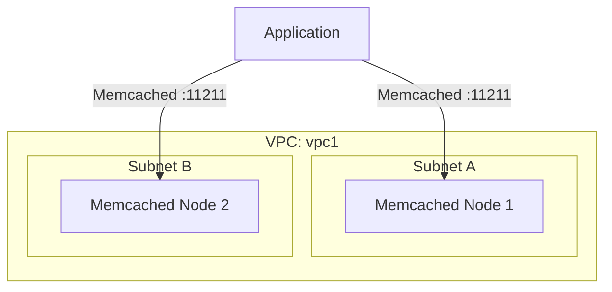

# Deploy an ElastiCache Memcached Cluster on AWS

This guide demonstrates how to use MechCloud's stateless IaC to provision an ElastiCache Memcached cluster for simple, high-performance object caching.

## Scenario Overview
**Use Case:** A distributed caching layer for web applications that need simple key-value caching without the persistence or data structures of Redis — ideal for page fragment caching, session stores, and database query result caching at scale.
**Key MechCloud Features Highlighted:**
- Cross-resource referencing (`ref:`)
- Multi-node cluster configuration
- Subnet group across AZs

### Architecture Diagram



***

### Complete Unified Template

```yaml
resources:
  - type: aws_ec2_vpc
    name: vpc1
    props:
      cidr_block: "10.0.0.0/16"
    resources:
      - type: aws_ec2_security_group
        name: sg-cache
        props:
          group_name: "mc-memcached-sg"
          group_description: "SG for Memcached cluster"
          security_group_ingress:
            - ip_protocol: tcp
              from_port: 11211
              to_port: 11211
              cidr_ip: "10.0.0.0/16"
      - type: aws_ec2_subnet
        name: cache-subnet-a
        props:
          cidr_block: "10.0.10.0/24"
          availability_zone: "{{CURRENT_REGION}}a"
      - type: aws_ec2_subnet
        name: cache-subnet-b
        props:
          cidr_block: "10.0.11.0/24"
          availability_zone: "{{CURRENT_REGION}}b"

  - type: aws_elasticache_cache_subnet_group
    name: cache-subnets
    props:
      cache_subnet_group_name: "mc-memcached-subnets"
      description: "Subnet group for Memcached"
      subnet_ids:
        - "ref:vpc1/cache-subnet-a"
        - "ref:vpc1/cache-subnet-b"

  - type: aws_elasticache_cache_cluster
    name: memcached1
    props:
      cluster_id: "mc-memcached"
      engine: memcached
      engine_version: "1.6.22"
      node_type: "cache.t4g.micro"
      num_cache_nodes: 2
      az_mode: cross-az
      cache_subnet_group_name: "ref:cache-subnets"
      security_group_ids:
        - "ref:vpc1/sg-cache"
```
