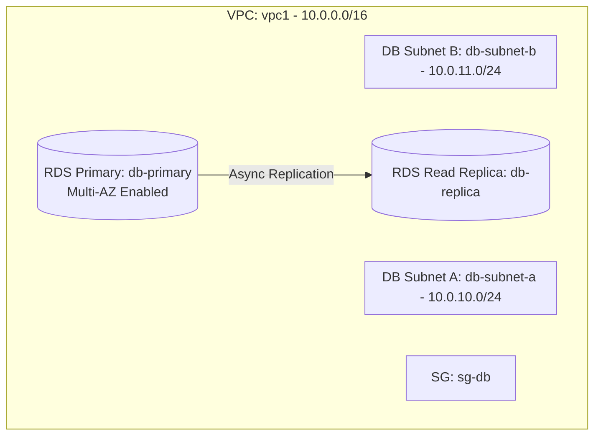

# Deploy a Multi-AZ RDS Instance with Read Replica on AWS

This guide demonstrates how to use MechCloud's stateless Infrastructure-as-Code (IaC) to provision a Multi-AZ Amazon RDS MySQL instance with a read replica for high availability and read scaling on AWS.

In this scenario, we deploy an RDS MySQL primary instance with Multi-AZ enabled for automatic failover, along with a read replica for offloading read traffic. Both are placed in private subnets with no public accessibility, following security best practices.

## Scenario Overview
**Use Case:** A production database that requires high availability with automatic failover and the ability to scale read operations using a read replica — ideal for web applications with read-heavy workloads.
**Key MechCloud Features Highlighted:**
- Hierarchical resource nesting (VPC → Subnet)
- Dynamic macros (`{{CURRENT_REGION}}`)
- Cross-resource referencing (`ref:`)
- Multi-AZ RDS with read replica configuration

### Architecture Diagram



***

### Complete Unified Template

```yaml
resources:
  - type: aws_ec2_vpc
    name: vpc1
    props:
      cidr_block: "10.0.0.0/16"
    resources:
      - type: aws_ec2_security_group
        name: sg-db
        props:
          group_name: "mc-db-sg"
          group_description: "SG for RDS instances"
          security_group_ingress:
            - ip_protocol: tcp
              from_port: 3306
              to_port: 3306
              cidr_ip: "10.0.0.0/16"

      - type: aws_ec2_subnet
        name: db-subnet-a
        props:
          cidr_block: "10.0.10.0/24"
          availability_zone: "{{CURRENT_REGION}}a"

      - type: aws_ec2_subnet
        name: db-subnet-b
        props:
          cidr_block: "10.0.11.0/24"
          availability_zone: "{{CURRENT_REGION}}b"

  - type: aws_rds_db_subnet_group
    name: db-subnet-group
    props:
      db_subnet_group_name: "mc-db-subnets"
      db_subnet_group_description: "Subnet group for RDS"
      subnet_ids:
        - "ref:vpc1/db-subnet-a"
        - "ref:vpc1/db-subnet-b"

  - type: aws_rds_db_instance
    name: db-primary
    props:
      db_instance_identifier: "mc-db-primary"
      engine: mysql
      engine_version: "8.0"
      db_instance_class: "db.t4g.medium"
      allocated_storage: 50
      storage_type: gp3
      master_username: "admin"
      master_user_password: "ChangeMe123!"
      db_subnet_group_name: "ref:db-subnet-group"
      vpc_security_group_ids:
        - "ref:vpc1/sg-db"
      multi_az: true
      storage_encrypted: true
      publicly_accessible: false
      backup_retention_period: 7

  - type: aws_rds_db_instance
    name: db-replica
    props:
      db_instance_identifier: "mc-db-replica"
      source_db_instance_identifier: "ref:db-primary"
      db_instance_class: "db.t4g.medium"
      publicly_accessible: false
      storage_encrypted: true
```
