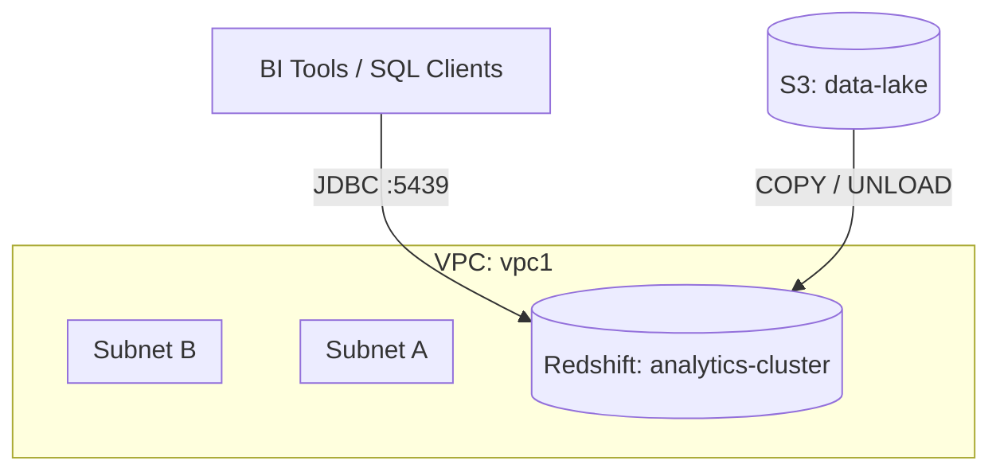

# Deploy an Amazon Redshift Cluster for Data Warehousing on AWS

This guide demonstrates how to use MechCloud's stateless IaC to provision an Amazon Redshift cluster for scalable data warehousing and analytics.

## Scenario Overview
**Use Case:** A data warehouse for running complex analytical queries across petabytes of structured data — ideal for business intelligence, reporting dashboards, and data lake analytics using standard SQL.
**Key MechCloud Features Highlighted:**
- Cross-resource referencing (`ref:`)
- Cluster configuration with parameter groups
- Subnet group across AZs

### Architecture Diagram



***

### Complete Unified Template

```yaml
resources:
  - type: aws_ec2_vpc
    name: vpc1
    props:
      cidr_block: "10.0.0.0/16"
    resources:
      - type: aws_ec2_security_group
        name: sg-redshift
        props:
          group_name: "mc-redshift-sg"
          group_description: "SG for Redshift cluster"
          security_group_ingress:
            - ip_protocol: tcp
              from_port: 5439
              to_port: 5439
              cidr_ip: "10.0.0.0/16"
      - type: aws_ec2_subnet
        name: rs-subnet-a
        props:
          cidr_block: "10.0.10.0/24"
          availability_zone: "{{CURRENT_REGION}}a"
      - type: aws_ec2_subnet
        name: rs-subnet-b
        props:
          cidr_block: "10.0.11.0/24"
          availability_zone: "{{CURRENT_REGION}}b"

  - type: aws_redshift_cluster_subnet_group
    name: rs-subnet-group
    props:
      cluster_subnet_group_name: "mc-rs-subnets"
      description: "Subnet group for Redshift"
      subnet_ids:
        - "ref:vpc1/rs-subnet-a"
        - "ref:vpc1/rs-subnet-b"

  - type: aws_redshift_cluster_parameter_group
    name: rs-params
    props:
      parameter_group_name: "mc-rs-params"
      parameter_group_family: "redshift-1.0"
      description: "Custom parameter group"
      parameters:
        - parameter_name: enable_user_activity_logging
          parameter_value: "true"
        - parameter_name: require_ssl
          parameter_value: "true"

  - type: aws_redshift_cluster
    name: analytics-cluster
    props:
      cluster_identifier: "mc-analytics"
      node_type: "ra3.xlplus"
      number_of_nodes: 2
      master_username: "admin"
      master_user_password: "ChangeMe123!"
      cluster_subnet_group_name: "ref:rs-subnet-group"
      vpc_security_group_ids:
        - "ref:vpc1/sg-redshift"
      cluster_parameter_group_name: "ref:rs-params"
      encrypted: true
      publicly_accessible: false
      automated_snapshot_retention_period: 7

  - type: aws_s3_bucket
    name: data-lake
    props:
      bucket_name: "mc-redshift-data-lake"

  - type: aws_iam_role
    name: redshift-s3-role
    props:
      role_name: "mc-redshift-s3-role"
      assume_role_policy_document:
        Version: "2012-10-17"
        Statement:
          - Effect: Allow
            Principal:
              Service: redshift.amazonaws.com
            Action: "sts:AssumeRole"
      managed_policy_arns:
        - "arn:aws:iam::aws:policy/AmazonS3ReadOnlyAccess"
```
