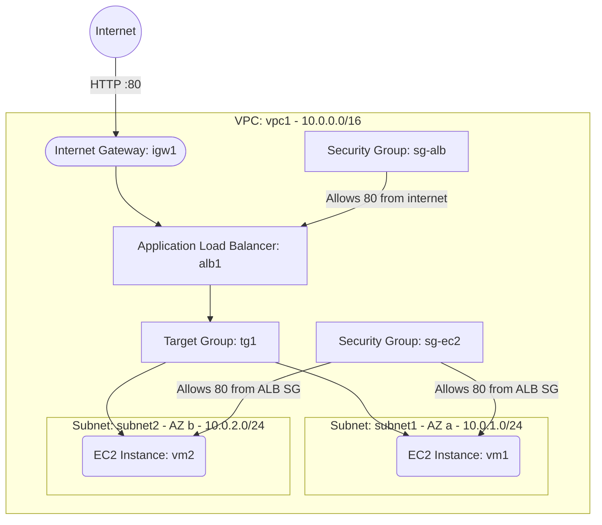

# Deploy EC2 Instances behind an Application Load Balancer on AWS

This guide demonstrates how to use MechCloud's stateless Infrastructure-as-Code (IaC) to provision EC2 instances behind an AWS Application Load Balancer (ALB) for high availability and traffic distribution.

In this scenario, we provision two EC2 instances across two availability zones inside a VPC with public subnets. An ALB distributes incoming HTTP traffic across the instances using a target group with health checks.

## Scenario Overview
**Use Case:** Hosting a highly available web application where HTTP traffic is distributed across multiple EC2 instances in different availability zones, with automatic health checking and failover.
**Key MechCloud Features Highlighted:**
- Hierarchical resource nesting (VPC $\rightarrow$ Subnet $\rightarrow$ EC2)
- Dynamic macros (`{{CURRENT_REGION}}`, `{{Image|arm64_ubuntu_24_04}}`)
- Cross-resource referencing (`ref:`)
- Multi-AZ deployment pattern

### Architecture Diagram



***

## Step 1: Setting up Networking

We create a VPC with two public subnets in different availability zones, an Internet Gateway, and route tables for internet access.

```yaml
resources:
  - type: aws_ec2_vpc
    name: vpc1
    props:
      cidr_block: "10.0.0.0/16"
    resources:
      # 1. Internet Gateway
      - type: aws_ec2_internet_gateway
        name: igw1

      # 2. Route Table for public subnets
      - type: aws_ec2_route_table
        name: public_rt
        resources:
          - type: aws_ec2_route
            name: internet_route
            props:
              destination_cidr_block: "0.0.0.0/0"
              gateway_id: "ref:vpc1/igw1"

      # 3. Subnet in AZ-a
      - type: aws_ec2_subnet
        name: subnet1
        props:
          cidr_block: "10.0.1.0/24"
          availability_zone: "{{CURRENT_REGION}}a"
        resources:
          - type: aws_ec2_route_table_association
            name: rta1
            props:
              route_table_id: "ref:vpc1/public_rt"

      # 4. Subnet in AZ-b
      - type: aws_ec2_subnet
        name: subnet2
        props:
          cidr_block: "10.0.2.0/24"
          availability_zone: "{{CURRENT_REGION}}b"
        resources:
          - type: aws_ec2_route_table_association
            name: rta2
            props:
              route_table_id: "ref:vpc1/public_rt"
```

## Step 2: Creating Security Groups

We create two security groups: one for the ALB allowing HTTP from the internet, and one for the EC2 instances allowing HTTP only from the ALB security group.

```yaml
# ... (Continuing inside the vpc1 resources block) ...
      # 5. Security Group for ALB
      - type: aws_ec2_security_group
        name: sg-alb
        props:
          group_name: "mc-alb-sg"
          group_description: "SG for Application Load Balancer"
          security_group_ingress:
            - ip_protocol: tcp
              from_port: 80
              to_port: 80
              cidr_ip: "0.0.0.0/0"

      # 6. Security Group for EC2 instances
      - type: aws_ec2_security_group
        name: sg-ec2
        props:
          group_name: "mc-ec2-sg"
          group_description: "SG for backend EC2 instances"
          security_group_ingress:
            - ip_protocol: tcp
              from_port: 80
              to_port: 80
              source_security_group_id: "ref:vpc1/sg-alb"
```

## Step 3: Creating the ALB, Target Group, and Listener

We provision an ALB across both subnets, a target group with health checks, and a listener to route HTTP traffic.

```yaml
# ... (Continuing inside the vpc1 resources block) ...
      # 7. Target Group
      - type: aws_elasticloadbalancingv2_target_group
        name: tg1
        props:
          target_type: instance
          protocol: HTTP
          port: 80
          health_check:
            path: "/"
            protocol: HTTP
            interval_seconds: 30
            timeout_seconds: 5
            healthy_threshold_count: 2
            unhealthy_threshold_count: 3

      # 8. Application Load Balancer
      - type: aws_elasticloadbalancingv2_load_balancer
        name: alb1
        props:
          scheme: internet-facing
          type: application
          subnet_ids:
            - "ref:vpc1/subnet1"
            - "ref:vpc1/subnet2"
          security_group_ids:
            - "ref:vpc1/sg-alb"

      # 9. Listener
      - type: aws_elasticloadbalancingv2_listener
        name: listener1
        props:
          load_balancer_arn: "ref:vpc1/alb1"
          protocol: HTTP
          port: 80
          default_actions:
            - type: forward
              target_group_arn: "ref:vpc1/tg1"
```

## Step 4: Provisioning EC2 Instances and Registering with Target Group

We deploy two EC2 instances in separate AZs and register them with the target group.

```yaml
# ... (Continuing inside the vpc1/subnet1 and vpc1/subnet2 resources blocks) ...
        # Inside subnet1
        resources:
          - type: aws_ec2_instance
            name: vm1
            props:
              image_id: "{{Image|arm64_ubuntu_24_04}}"
              instance_type: "t4g.small"
              security_group_ids:
                - "ref:vpc1/sg-ec2"

        # Inside subnet2
        resources:
          - type: aws_ec2_instance
            name: vm2
            props:
              image_id: "{{Image|arm64_ubuntu_24_04}}"
              instance_type: "t4g.small"
              security_group_ids:
                - "ref:vpc1/sg-ec2"

# ... (At root resources level) ...
  # 10. Register instances with target group
  - type: aws_elasticloadbalancingv2_target_group_attachment
    name: tg-attach1
    props:
      target_group_arn: "ref:vpc1/tg1"
      target_id: "ref:vpc1/subnet1/vm1"
      port: 80

  - type: aws_elasticloadbalancingv2_target_group_attachment
    name: tg-attach2
    props:
      target_group_arn: "ref:vpc1/tg1"
      target_id: "ref:vpc1/subnet2/vm2"
      port: 80
```

### Complete Unified Template

For your convenience, here is the complete, unified MechCloud template combining all steps:

```yaml
resources:
  - type: aws_ec2_vpc
    name: vpc1
    props:
      cidr_block: "10.0.0.0/16"
    resources:
      - type: aws_ec2_internet_gateway
        name: igw1

      - type: aws_ec2_route_table
        name: public_rt
        resources:
          - type: aws_ec2_route
            name: internet_route
            props:
              destination_cidr_block: "0.0.0.0/0"
              gateway_id: "ref:vpc1/igw1"

      - type: aws_ec2_security_group
        name: sg-alb
        props:
          group_name: "mc-alb-sg"
          group_description: "SG for Application Load Balancer"
          security_group_ingress:
            - ip_protocol: tcp
              from_port: 80
              to_port: 80
              cidr_ip: "0.0.0.0/0"

      - type: aws_ec2_security_group
        name: sg-ec2
        props:
          group_name: "mc-ec2-sg"
          group_description: "SG for backend EC2 instances"
          security_group_ingress:
            - ip_protocol: tcp
              from_port: 80
              to_port: 80
              source_security_group_id: "ref:vpc1/sg-alb"

      - type: aws_elasticloadbalancingv2_target_group
        name: tg1
        props:
          target_type: instance
          protocol: HTTP
          port: 80
          health_check:
            path: "/"
            protocol: HTTP
            interval_seconds: 30
            timeout_seconds: 5
            healthy_threshold_count: 2
            unhealthy_threshold_count: 3

      - type: aws_elasticloadbalancingv2_load_balancer
        name: alb1
        props:
          scheme: internet-facing
          type: application
          subnet_ids:
            - "ref:vpc1/subnet1"
            - "ref:vpc1/subnet2"
          security_group_ids:
            - "ref:vpc1/sg-alb"

      - type: aws_elasticloadbalancingv2_listener
        name: listener1
        props:
          load_balancer_arn: "ref:vpc1/alb1"
          protocol: HTTP
          port: 80
          default_actions:
            - type: forward
              target_group_arn: "ref:vpc1/tg1"

      - type: aws_ec2_subnet
        name: subnet1
        props:
          cidr_block: "10.0.1.0/24"
          availability_zone: "{{CURRENT_REGION}}a"
        resources:
          - type: aws_ec2_route_table_association
            name: rta1
            props:
              route_table_id: "ref:vpc1/public_rt"

          - type: aws_ec2_instance
            name: vm1
            props:
              image_id: "{{Image|arm64_ubuntu_24_04}}"
              instance_type: "t4g.small"
              security_group_ids:
                - "ref:vpc1/sg-ec2"

      - type: aws_ec2_subnet
        name: subnet2
        props:
          cidr_block: "10.0.2.0/24"
          availability_zone: "{{CURRENT_REGION}}b"
        resources:
          - type: aws_ec2_route_table_association
            name: rta2
            props:
              route_table_id: "ref:vpc1/public_rt"

          - type: aws_ec2_instance
            name: vm2
            props:
              image_id: "{{Image|arm64_ubuntu_24_04}}"
              instance_type: "t4g.small"
              security_group_ids:
                - "ref:vpc1/sg-ec2"

  - type: aws_elasticloadbalancingv2_target_group_attachment
    name: tg-attach1
    props:
      target_group_arn: "ref:vpc1/tg1"
      target_id: "ref:vpc1/subnet1/vm1"
      port: 80

  - type: aws_elasticloadbalancingv2_target_group_attachment
    name: tg-attach2
    props:
      target_group_arn: "ref:vpc1/tg1"
      target_id: "ref:vpc1/subnet2/vm2"
      port: 80
```
