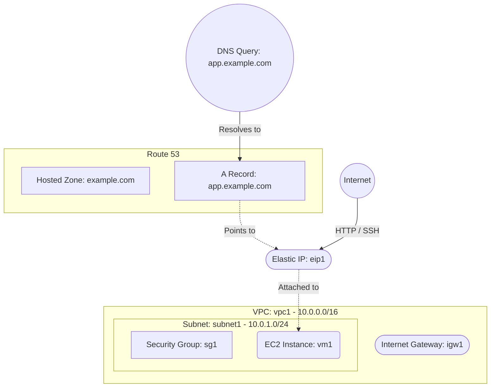

# Deploy an EC2 Instance with Route 53 DNS on AWS

This guide demonstrates how to use MechCloud's stateless Infrastructure-as-Code (IaC) to provision an EC2 instance with an Amazon Route 53 DNS hosted zone and A record pointing to the instance's Elastic IP.

In this scenario, we deploy a public-facing EC2 instance and configure a Route 53 hosted zone with an A record to provide a human-readable domain name for the application. This pattern is commonly used when you want to manage DNS records for your domain directly within AWS.

## Scenario Overview
**Use Case:** Hosting a web application or API with a custom domain name managed via Route 53, where DNS A records point directly to the instance's Elastic IP address.
**Key MechCloud Features Highlighted:**
- Hierarchical resource nesting (VPC $\rightarrow$ Subnet $\rightarrow$ EC2)
- Dynamic macros (`{{CURRENT_REGION}}`, `{{CURRENT_IP}}`, `{{Image|arm64_ubuntu_24_04}}`)
- Cross-resource referencing (`ref:`)
- Route 53 DNS zone and record set provisioning

### Architecture Diagram



***

## Step 1: Setting up Networking

We create a VPC with a public subnet, Internet Gateway, route table, and security group.

```yaml
resources:
  - type: aws_ec2_vpc
    name: vpc1
    props:
      cidr_block: "10.0.0.0/16"
    resources:
      - type: aws_ec2_internet_gateway
        name: igw1

      - type: aws_ec2_route_table
        name: public_rt
        resources:
          - type: aws_ec2_route
            name: internet_route
            props:
              destination_cidr_block: "0.0.0.0/0"
              gateway_id: "ref:vpc1/igw1"

      - type: aws_ec2_subnet
        name: subnet1
        props:
          cidr_block: "10.0.1.0/24"
          availability_zone: "{{CURRENT_REGION}}a"
        resources:
          - type: aws_ec2_route_table_association
            name: rta1
            props:
              route_table_id: "ref:vpc1/public_rt"

      - type: aws_ec2_security_group
        name: sg1
        props:
          group_name: "mc-dns-sg"
          group_description: "SG for web server with DNS"
          security_group_ingress:
            - ip_protocol: tcp
              from_port: 22
              to_port: 22
              cidr_ip: "{{CURRENT_IP}}/32"
            - ip_protocol: tcp
              from_port: 80
              to_port: 80
              cidr_ip: "0.0.0.0/0"
```

## Step 2: Provisioning EC2 and Elastic IP

We deploy an EC2 instance and attach an Elastic IP for a stable public address.

```yaml
# ... (Inside vpc1/subnet1 resources block) ...
        resources:
          - type: aws_ec2_instance
            name: vm1
            props:
              image_id: "{{Image|arm64_ubuntu_24_04}}"
              instance_type: "t4g.small"
              security_group_ids:
                - "ref:vpc1/sg1"

# ... (At root resources level) ...
  - type: aws_ec2_eip
    name: eip1
    props:
      instance_id: "ref:vpc1/subnet1/vm1"
```

## Step 3: Creating Route 53 Hosted Zone and A Record

We provision a Route 53 hosted zone for the domain and create an A record that maps a subdomain to the Elastic IP.

```yaml
# ... (At root resources level) ...
  # Route 53 Hosted Zone
  - type: aws_route53_hosted_zone
    name: dns-zone
    props:
      name: "example.com"

  # A Record pointing to the EIP
  - type: aws_route53_record_set
    name: app-record
    props:
      hosted_zone_id: "ref:dns-zone"
      name: "app.example.com"
      type: A
      ttl: 300
      resource_records:
        - "ref:eip1.public_ip"
```

### Complete Unified Template

For your convenience, here is the complete, unified MechCloud template combining all steps:

```yaml
resources:
  - type: aws_ec2_vpc
    name: vpc1
    props:
      cidr_block: "10.0.0.0/16"
    resources:
      - type: aws_ec2_internet_gateway
        name: igw1

      - type: aws_ec2_route_table
        name: public_rt
        resources:
          - type: aws_ec2_route
            name: internet_route
            props:
              destination_cidr_block: "0.0.0.0/0"
              gateway_id: "ref:vpc1/igw1"

      - type: aws_ec2_security_group
        name: sg1
        props:
          group_name: "mc-dns-sg"
          group_description: "SG for web server with DNS"
          security_group_ingress:
            - ip_protocol: tcp
              from_port: 22
              to_port: 22
              cidr_ip: "{{CURRENT_IP}}/32"
            - ip_protocol: tcp
              from_port: 80
              to_port: 80
              cidr_ip: "0.0.0.0/0"

      - type: aws_ec2_subnet
        name: subnet1
        props:
          cidr_block: "10.0.1.0/24"
          availability_zone: "{{CURRENT_REGION}}a"
        resources:
          - type: aws_ec2_route_table_association
            name: rta1
            props:
              route_table_id: "ref:vpc1/public_rt"

          - type: aws_ec2_instance
            name: vm1
            props:
              image_id: "{{Image|arm64_ubuntu_24_04}}"
              instance_type: "t4g.small"
              security_group_ids:
                - "ref:vpc1/sg1"

  - type: aws_ec2_eip
    name: eip1
    props:
      instance_id: "ref:vpc1/subnet1/vm1"

  - type: aws_route53_hosted_zone
    name: dns-zone
    props:
      name: "example.com"

  - type: aws_route53_record_set
    name: app-record
    props:
      hosted_zone_id: "ref:dns-zone"
      name: "app.example.com"
      type: A
      ttl: 300
      resource_records:
        - "ref:eip1.public_ip"
```
