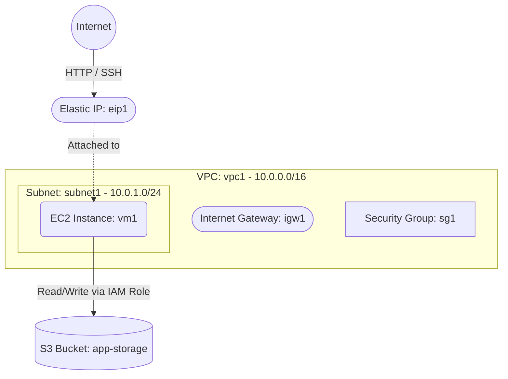

# Deploy an EC2 Instance with S3 Bucket Storage on AWS

This guide demonstrates how to use MechCloud's stateless Infrastructure-as-Code (IaC) to provision an EC2 instance alongside an S3 bucket for object storage on AWS.

In this scenario, we deploy a public-facing EC2 instance and an S3 bucket with multiple folders for application data, backups, and logs. The EC2 instance can interact with the S3 bucket via IAM roles and instance profiles for secure, credential-free access.

## Scenario Overview
**Use Case:** A web application server that stores uploaded files, generates backups, or writes logs to S3 object storage without embedding AWS credentials in the application.
**Key MechCloud Features Highlighted:**
- Hierarchical resource nesting (VPC $\rightarrow$ Subnet $\rightarrow$ EC2)
- Dynamic macros (`{{CURRENT_REGION}}`, `{{CURRENT_IP}}`, `{{Image|arm64_ubuntu_24_04}}`)
- Cross-resource referencing (`ref:`)
- Non-compute AWS resource provisioning (S3, IAM)

### Architecture Diagram



***

## Step 1: Setting up Networking

We create a VPC with a public subnet, Internet Gateway, route table, and security group.

```yaml
resources:
  - type: aws_ec2_vpc
    name: vpc1
    props:
      cidr_block: "10.0.0.0/16"
    resources:
      - type: aws_ec2_internet_gateway
        name: igw1

      - type: aws_ec2_route_table
        name: public_rt
        resources:
          - type: aws_ec2_route
            name: internet_route
            props:
              destination_cidr_block: "0.0.0.0/0"
              gateway_id: "ref:vpc1/igw1"

      - type: aws_ec2_subnet
        name: subnet1
        props:
          cidr_block: "10.0.1.0/24"
          availability_zone: "{{CURRENT_REGION}}a"
        resources:
          - type: aws_ec2_route_table_association
            name: rta1
            props:
              route_table_id: "ref:vpc1/public_rt"

      - type: aws_ec2_security_group
        name: sg1
        props:
          group_name: "mc-app-sg"
          group_description: "SG for application server"
          security_group_ingress:
            - ip_protocol: tcp
              from_port: 22
              to_port: 22
              cidr_ip: "{{CURRENT_IP}}/32"
            - ip_protocol: tcp
              from_port: 80
              to_port: 80
              cidr_ip: "0.0.0.0/0"
```

## Step 2: Creating the S3 Bucket

We provision an S3 bucket with versioning enabled and server-side encryption for secure storage.

```yaml
# ... (At root resources level) ...
  - type: aws_s3_bucket
    name: app-storage
    props:
      bucket_name: "mc-app-storage"
      versioning_configuration:
        status: Enabled
      server_side_encryption_configuration:
        rules:
          - apply_server_side_encryption_by_default:
              sse_algorithm: AES256
      public_access_block_configuration:
        block_public_acls: true
        block_public_policy: true
        ignore_public_acls: true
        restrict_public_buckets: true
```

## Step 3: Provisioning the EC2 Instance with EIP

We deploy an EC2 instance in the public subnet and attach an Elastic IP for a stable public address.

```yaml
# ... (Inside vpc1/subnet1 resources block) ...
        resources:
          - type: aws_ec2_instance
            name: vm1
            props:
              image_id: "{{Image|arm64_ubuntu_24_04}}"
              instance_type: "t4g.small"
              security_group_ids:
                - "ref:vpc1/sg1"

# ... (At root resources level) ...
  - type: aws_ec2_eip
    name: eip1
    props:
      instance_id: "ref:vpc1/subnet1/vm1"
```

### Complete Unified Template

For your convenience, here is the complete, unified MechCloud template combining all steps:

```yaml
resources:
  - type: aws_ec2_vpc
    name: vpc1
    props:
      cidr_block: "10.0.0.0/16"
    resources:
      - type: aws_ec2_internet_gateway
        name: igw1

      - type: aws_ec2_route_table
        name: public_rt
        resources:
          - type: aws_ec2_route
            name: internet_route
            props:
              destination_cidr_block: "0.0.0.0/0"
              gateway_id: "ref:vpc1/igw1"

      - type: aws_ec2_security_group
        name: sg1
        props:
          group_name: "mc-app-sg"
          group_description: "SG for application server"
          security_group_ingress:
            - ip_protocol: tcp
              from_port: 22
              to_port: 22
              cidr_ip: "{{CURRENT_IP}}/32"
            - ip_protocol: tcp
              from_port: 80
              to_port: 80
              cidr_ip: "0.0.0.0/0"

      - type: aws_ec2_subnet
        name: subnet1
        props:
          cidr_block: "10.0.1.0/24"
          availability_zone: "{{CURRENT_REGION}}a"
        resources:
          - type: aws_ec2_route_table_association
            name: rta1
            props:
              route_table_id: "ref:vpc1/public_rt"

          - type: aws_ec2_instance
            name: vm1
            props:
              image_id: "{{Image|arm64_ubuntu_24_04}}"
              instance_type: "t4g.small"
              security_group_ids:
                - "ref:vpc1/sg1"

  - type: aws_s3_bucket
    name: app-storage
    props:
      bucket_name: "mc-app-storage"
      versioning_configuration:
        status: Enabled
      server_side_encryption_configuration:
        rules:
          - apply_server_side_encryption_by_default:
              sse_algorithm: AES256
      public_access_block_configuration:
        block_public_acls: true
        block_public_policy: true
        ignore_public_acls: true
        restrict_public_buckets: true

  - type: aws_ec2_eip
    name: eip1
    props:
      instance_id: "ref:vpc1/subnet1/vm1"
```
