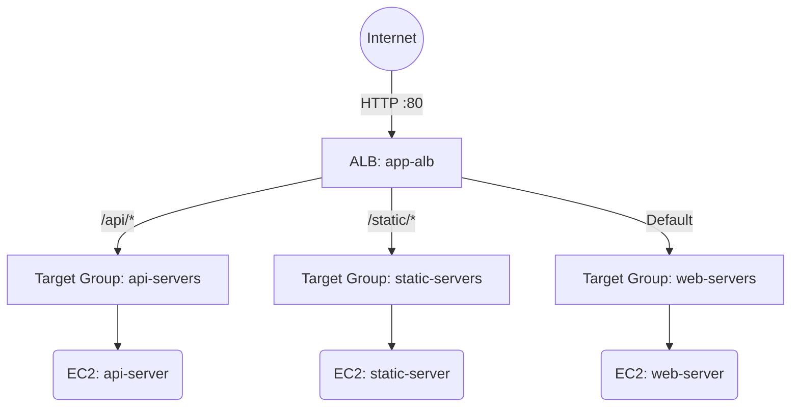

# Deploy ALB with Path-Based Routing on AWS

This guide demonstrates how to use MechCloud's stateless IaC to provision an ALB with path-based routing rules to direct traffic to different target groups based on URL paths.

## Scenario Overview
**Use Case:** A microservices architecture where a single ALB routes `/api/*` traffic to backend API servers and `/static/*` to a static content server — eliminating the need for multiple load balancers and simplifying DNS management.
**Key MechCloud Features Highlighted:**
- Cross-resource referencing (`ref:`)
- Multiple listener rules with path patterns
- Multiple target groups in a single template

### Architecture Diagram



***

### Complete Unified Template

```yaml
resources:
  - type: aws_ec2_vpc
    name: vpc1
    props:
      cidr_block: "10.0.0.0/16"
    resources:
      - type: aws_ec2_internet_gateway
        name: igw1
      - type: aws_ec2_route_table
        name: public_rt
        resources:
          - type: aws_ec2_route
            name: internet_route
            props:
              destination_cidr_block: "0.0.0.0/0"
              gateway_id: "ref:vpc1/igw1"
      - type: aws_ec2_security_group
        name: sg1
        props:
          group_name: "mc-path-routing-sg"
          group_description: "SG for path-based routing"
          security_group_ingress:
            - ip_protocol: tcp
              from_port: 80
              to_port: 80
              cidr_ip: "0.0.0.0/0"
      - type: aws_ec2_subnet
        name: subnet-a
        props:
          cidr_block: "10.0.1.0/24"
          availability_zone: "{{CURRENT_REGION}}a"
        resources:
          - type: aws_ec2_route_table_association
            name: rta-a
            props:
              route_table_id: "ref:vpc1/public_rt"
          - type: aws_ec2_instance
            name: web-server
            props:
              image_id: "{{Image|arm64_ubuntu_24_04}}"
              instance_type: "t4g.small"
              security_group_ids:
                - "ref:vpc1/sg1"
          - type: aws_ec2_instance
            name: api-server
            props:
              image_id: "{{Image|arm64_ubuntu_24_04}}"
              instance_type: "t4g.small"
              security_group_ids:
                - "ref:vpc1/sg1"
          - type: aws_ec2_instance
            name: static-server
            props:
              image_id: "{{Image|arm64_ubuntu_24_04}}"
              instance_type: "t4g.small"
              security_group_ids:
                - "ref:vpc1/sg1"
      - type: aws_ec2_subnet
        name: subnet-b
        props:
          cidr_block: "10.0.2.0/24"
          availability_zone: "{{CURRENT_REGION}}b"
        resources:
          - type: aws_ec2_route_table_association
            name: rta-b
            props:
              route_table_id: "ref:vpc1/public_rt"

  - type: aws_elbv2_load_balancer
    name: app-alb
    props:
      type: application
      scheme: internet-facing
      security_groups:
        - "ref:vpc1/sg1"
      subnets:
        - "ref:vpc1/subnet-a"
        - "ref:vpc1/subnet-b"

  - type: aws_elbv2_target_group
    name: web-tg
    props:
      name: "mc-web-tg"
      port: 80
      protocol: HTTP
      vpc_id: "ref:vpc1"
      health_check:
        path: "/"

  - type: aws_elbv2_target_group
    name: api-tg
    props:
      name: "mc-api-tg"
      port: 80
      protocol: HTTP
      vpc_id: "ref:vpc1"
      health_check:
        path: "/api/health"

  - type: aws_elbv2_target_group
    name: static-tg
    props:
      name: "mc-static-tg"
      port: 80
      protocol: HTTP
      vpc_id: "ref:vpc1"
      health_check:
        path: "/static/health"

  - type: aws_elbv2_listener
    name: http-listener
    props:
      load_balancer_arn: "ref:app-alb"
      port: 80
      protocol: HTTP
      default_actions:
        - type: forward
          target_group_arn: "ref:web-tg"

  - type: aws_elbv2_listener_rule
    name: api-rule
    props:
      listener_arn: "ref:http-listener"
      priority: 10
      conditions:
        - path_pattern:
            values:
              - "/api/*"
      actions:
        - type: forward
          target_group_arn: "ref:api-tg"

  - type: aws_elbv2_listener_rule
    name: static-rule
    props:
      listener_arn: "ref:http-listener"
      priority: 20
      conditions:
        - path_pattern:
            values:
              - "/static/*"
      actions:
        - type: forward
          target_group_arn: "ref:static-tg"
```
