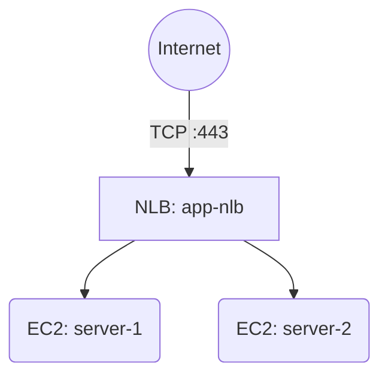

# Deploy a Network Load Balancer with EC2 Instances on AWS

This guide demonstrates how to use MechCloud's stateless IaC to provision a Network Load Balancer (NLB) for ultra-low-latency TCP/UDP load balancing across EC2 instances.

## Scenario Overview
**Use Case:** Applications requiring extreme performance and static IP addresses — such as gaming servers, IoT backends, financial trading platforms, or any TCP/UDP workload needing millions of requests per second with single-digit millisecond latencies.
**Key MechCloud Features Highlighted:**
- Cross-resource referencing (`ref:`)
- NLB with target group and health checks
- Multi-AZ deployment

### Architecture Diagram



***

### Complete Unified Template

```yaml
resources:
  - type: aws_ec2_vpc
    name: vpc1
    props:
      cidr_block: "10.0.0.0/16"
    resources:
      - type: aws_ec2_internet_gateway
        name: igw1
      - type: aws_ec2_route_table
        name: public_rt
        resources:
          - type: aws_ec2_route
            name: internet_route
            props:
              destination_cidr_block: "0.0.0.0/0"
              gateway_id: "ref:vpc1/igw1"
      - type: aws_ec2_security_group
        name: sg1
        props:
          group_name: "mc-nlb-sg"
          group_description: "SG for NLB targets"
          security_group_ingress:
            - ip_protocol: tcp
              from_port: 443
              to_port: 443
              cidr_ip: "0.0.0.0/0"
      - type: aws_ec2_subnet
        name: subnet-a
        props:
          cidr_block: "10.0.1.0/24"
          availability_zone: "{{CURRENT_REGION}}a"
        resources:
          - type: aws_ec2_route_table_association
            name: rta-a
            props:
              route_table_id: "ref:vpc1/public_rt"
          - type: aws_ec2_instance
            name: server-1
            props:
              image_id: "{{Image|arm64_ubuntu_24_04}}"
              instance_type: "t4g.small"
              security_group_ids:
                - "ref:vpc1/sg1"
      - type: aws_ec2_subnet
        name: subnet-b
        props:
          cidr_block: "10.0.2.0/24"
          availability_zone: "{{CURRENT_REGION}}b"
        resources:
          - type: aws_ec2_route_table_association
            name: rta-b
            props:
              route_table_id: "ref:vpc1/public_rt"
          - type: aws_ec2_instance
            name: server-2
            props:
              image_id: "{{Image|arm64_ubuntu_24_04}}"
              instance_type: "t4g.small"
              security_group_ids:
                - "ref:vpc1/sg1"

  - type: aws_elbv2_load_balancer
    name: app-nlb
    props:
      type: network
      scheme: internet-facing
      subnets:
        - "ref:vpc1/subnet-a"
        - "ref:vpc1/subnet-b"

  - type: aws_elbv2_target_group
    name: tcp-tg
    props:
      port: 443
      protocol: TCP
      vpc_id: "ref:vpc1"
      target_type: instance
      health_check:
        protocol: TCP
        interval: 10
        healthy_threshold: 3

  - type: aws_elbv2_listener
    name: tcp-listener
    props:
      load_balancer_arn: "ref:app-nlb"
      port: 443
      protocol: TCP
      default_actions:
        - type: forward
          target_group_arn: "ref:tcp-tg"

  - type: aws_elbv2_target_group_attachment
    name: attach-1
    props:
      target_group_arn: "ref:tcp-tg"
      target_id: "ref:vpc1/subnet-a/server-1"
      port: 443

  - type: aws_elbv2_target_group_attachment
    name: attach-2
    props:
      target_group_arn: "ref:tcp-tg"
      target_id: "ref:vpc1/subnet-b/server-2"
      port: 443
```
