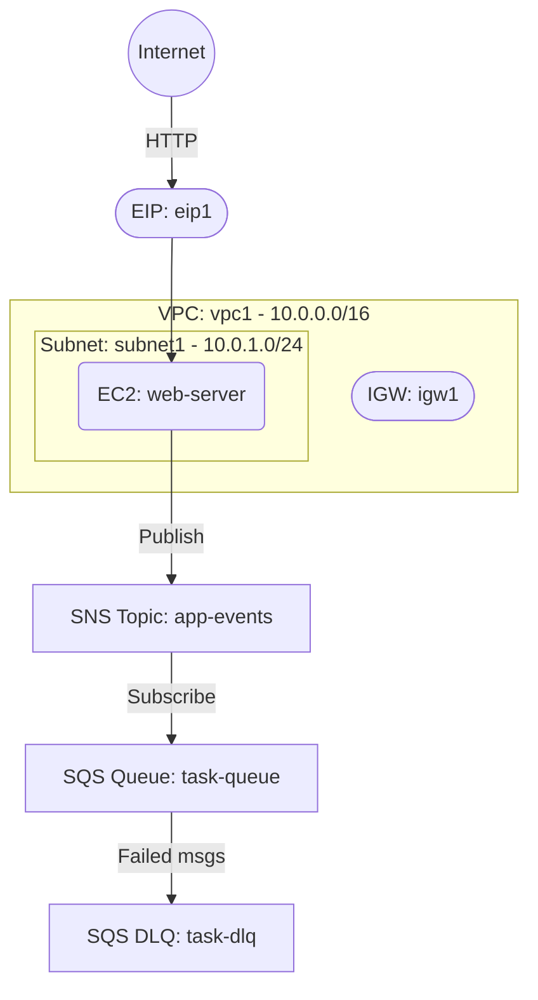

# Deploy an EC2 Instance with SQS Queue and SNS Topic on AWS

This guide demonstrates how to use MechCloud's stateless Infrastructure-as-Code (IaC) to provision an EC2 instance with Amazon SQS and SNS for asynchronous messaging and event notifications on AWS.

In this scenario, we deploy an EC2 web server alongside an SQS queue for background job processing and an SNS topic for event notifications. The SNS topic is subscribed to the SQS queue so that published messages are automatically delivered for processing.

## Scenario Overview
**Use Case:** A web application that offloads long-running tasks to a background worker via SQS, with SNS providing fan-out notification capabilities for event-driven architectures.
**Key MechCloud Features Highlighted:**
- Hierarchical resource nesting (VPC → Subnet → EC2)
- Dynamic macros (`{{CURRENT_REGION}}`, `{{CURRENT_IP}}`, `{{Image|arm64_ubuntu_24_04}}`)
- Cross-resource referencing (`ref:`)
- Non-compute AWS resource provisioning (SQS, SNS)

### Architecture Diagram



***

### Complete Unified Template

```yaml
resources:
  - type: aws_ec2_vpc
    name: vpc1
    props:
      cidr_block: "10.0.0.0/16"
    resources:
      - type: aws_ec2_internet_gateway
        name: igw1
      - type: aws_ec2_route_table
        name: public_rt
        resources:
          - type: aws_ec2_route
            name: internet_route
            props:
              destination_cidr_block: "0.0.0.0/0"
              gateway_id: "ref:vpc1/igw1"
      - type: aws_ec2_security_group
        name: sg1
        props:
          group_name: "mc-msg-sg"
          group_description: "SG for web server with messaging"
          security_group_ingress:
            - ip_protocol: tcp
              from_port: 22
              to_port: 22
              cidr_ip: "{{CURRENT_IP}}/32"
            - ip_protocol: tcp
              from_port: 80
              to_port: 80
              cidr_ip: "0.0.0.0/0"
      - type: aws_ec2_subnet
        name: subnet1
        props:
          cidr_block: "10.0.1.0/24"
          availability_zone: "{{CURRENT_REGION}}a"
        resources:
          - type: aws_ec2_route_table_association
            name: rta1
            props:
              route_table_id: "ref:vpc1/public_rt"
          - type: aws_ec2_instance
            name: web-server
            props:
              image_id: "{{Image|arm64_ubuntu_24_04}}"
              instance_type: "t4g.small"
              security_group_ids:
                - "ref:vpc1/sg1"

  - type: aws_sqs_queue
    name: task-dlq
    props:
      queue_name: "mc-task-dlq"
      message_retention_period: 1209600

  - type: aws_sqs_queue
    name: task-queue
    props:
      queue_name: "mc-task-queue"
      visibility_timeout: 300
      message_retention_period: 345600
      redrive_policy:
        dead_letter_target_arn: "ref:task-dlq.arn"
        max_receive_count: 3

  - type: aws_sns_topic
    name: app-events
    props:
      topic_name: "mc-app-events"

  - type: aws_sns_subscription
    name: sqs-subscription
    props:
      topic_arn: "ref:app-events"
      protocol: sqs
      endpoint: "ref:task-queue.arn"

  - type: aws_ec2_eip
    name: eip1
    props:
      instance_id: "ref:vpc1/subnet1/web-server"
```
