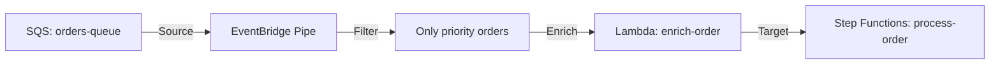

# Deploy EventBridge Pipes for Event-Driven Integration on AWS

This guide demonstrates how to use MechCloud's stateless IaC to provision EventBridge Pipes for point-to-point integration between an SQS source and a Step Functions target with filtering and enrichment.

## Scenario Overview
**Use Case:** Connecting event sources to targets with built-in filtering, enrichment, and transformation — replacing custom Lambda glue code with a managed integration service for cleaner event-driven architectures.
**Key MechCloud Features Highlighted:**
- Cross-resource referencing (`ref:`)
- Pipe configuration with filter, enrichment, and target
- Complex event patterns as clean YAML

### Architecture Diagram



***

### Complete Unified Template

```yaml
resources:
  - type: aws_iam_role
    name: pipe-role
    props:
      role_name: "mc-pipe-role"
      assume_role_policy_document:
        Version: "2012-10-17"
        Statement:
          - Effect: Allow
            Principal:
              Service: pipes.amazonaws.com
            Action: "sts:AssumeRole"
      managed_policy_arns:
        - "arn:aws:iam::aws:policy/AmazonSQSFullAccess"
        - "arn:aws:iam::aws:policy/AWSLambda_FullAccess"
        - "arn:aws:iam::aws:policy/AWSStepFunctionsFullAccess"

  - type: aws_iam_role
    name: lambda-role
    props:
      role_name: "mc-pipe-enrichment-role"
      assume_role_policy_document:
        Version: "2012-10-17"
        Statement:
          - Effect: Allow
            Principal:
              Service: lambda.amazonaws.com
            Action: "sts:AssumeRole"
      managed_policy_arns:
        - "arn:aws:iam::aws:policy/service-role/AWSLambdaBasicExecutionRole"

  - type: aws_iam_role
    name: sfn-role
    props:
      role_name: "mc-pipe-sfn-role"
      assume_role_policy_document:
        Version: "2012-10-17"
        Statement:
          - Effect: Allow
            Principal:
              Service: states.amazonaws.com
            Action: "sts:AssumeRole"

  - type: aws_sqs_queue
    name: orders-queue
    props:
      queue_name: "mc-orders-queue"
      visibility_timeout: 300

  - type: aws_lambda_function
    name: enrich-order
    props:
      function_name: "mc-enrich-order"
      runtime: python3.12
      handler: index.handler
      role: "ref:lambda-role.arn"
      timeout: 30
      code:
        zip_file: |
          def handler(event, context):
              for record in event:
                  record['enriched'] = True
                  record['priority_level'] = 'high'
              return event

  - type: aws_sfn_state_machine
    name: process-order
    props:
      name: "mc-process-order"
      role_arn: "ref:sfn-role.arn"
      definition:
        Comment: "Process enriched order"
        StartAt: ProcessOrder
        States:
          ProcessOrder:
            Type: Pass
            End: true

  - type: aws_pipes_pipe
    name: order-pipe
    props:
      name: "mc-order-pipe"
      role_arn: "ref:pipe-role.arn"
      source: "ref:orders-queue.arn"
      source_parameters:
        sqs_queue_parameters:
          batch_size: 1
        filter_criteria:
          filters:
            - pattern: '{"body":{"priority":["high"]}}'
      enrichment: "ref:enrich-order.arn"
      target: "ref:process-order.arn"
      target_parameters:
        step_function_state_machine_parameters:
          invocation_type: FIRE_AND_FORGET
```
