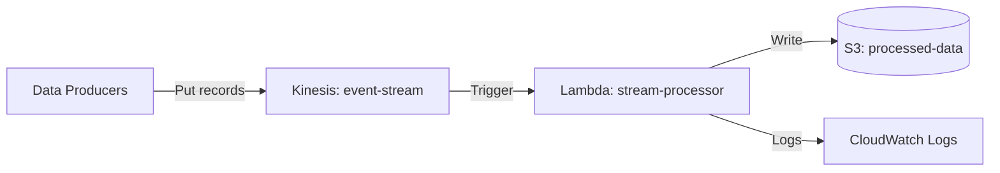

# Deploy a Kinesis Data Stream with Lambda Consumer on AWS

This guide demonstrates how to use MechCloud's stateless IaC to provision a Kinesis Data Stream with a Lambda consumer for real-time data streaming and processing.

## Scenario Overview
**Use Case:** Real-time data ingestion and processing for clickstream analytics, IoT telemetry, log aggregation, or event sourcing — Kinesis handles millions of records per second while Lambda processes them in near real-time.
**Key MechCloud Features Highlighted:**
- Cross-resource referencing (`ref:`)
- Stream and consumer configuration as clean YAML
- Event source mapping between Kinesis and Lambda

### Architecture Diagram



***

### Complete Unified Template

```yaml
resources:
  - type: aws_iam_role
    name: lambda-role
    props:
      role_name: "mc-kinesis-lambda-role"
      assume_role_policy_document:
        Version: "2012-10-17"
        Statement:
          - Effect: Allow
            Principal:
              Service: lambda.amazonaws.com
            Action: "sts:AssumeRole"
      managed_policy_arns:
        - "arn:aws:iam::aws:policy/service-role/AWSLambdaBasicExecutionRole"
        - "arn:aws:iam::aws:policy/service-role/AWSLambdaKinesisExecutionRole"

  - type: aws_kinesis_stream
    name: event-stream
    props:
      name: "mc-event-stream"
      shard_count: 2
      retention_period: 24
      stream_mode_details:
        stream_mode: PROVISIONED
      encryption_type: KMS
      kms_key_id: alias/aws/kinesis

  - type: aws_s3_bucket
    name: processed-data
    props:
      bucket_name: "mc-kinesis-processed-data"

  - type: aws_lambda_function
    name: stream-processor
    props:
      function_name: "mc-kinesis-processor"
      runtime: python3.12
      handler: index.handler
      role: "ref:lambda-role.arn"
      memory_size: 512
      timeout: 60
      code:
        zip_file: |
          import base64, json
          def handler(event, context):
              for record in event['Records']:
                  payload = base64.b64decode(record['kinesis']['data'])
                  print(f"Processed: {payload}")
              return {'statusCode': 200}

  - type: aws_lambda_event_source_mapping
    name: kinesis-trigger
    props:
      event_source_arn: "ref:event-stream.arn"
      function_name: "ref:stream-processor"
      starting_position: LATEST
      batch_size: 100
      maximum_batching_window_in_seconds: 10
      parallelization_factor: 2
      bisect_batch_on_function_error: true
      maximum_retry_attempts: 3
```
