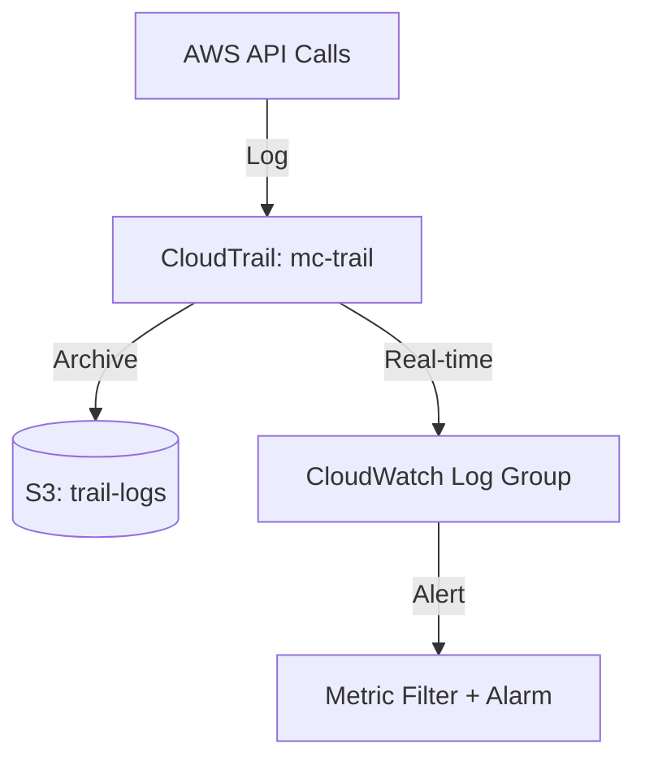

# Deploy CloudTrail with S3 and CloudWatch Logging on AWS

This guide demonstrates how to use MechCloud's stateless IaC to provision AWS CloudTrail for API activity logging with S3 archival and CloudWatch Logs integration.

## Scenario Overview
**Use Case:** Comprehensive audit logging of all API calls across your AWS account — required for security investigations, compliance auditing (SOC2, PCI-DSS, HIPAA), and detecting unauthorized access or configuration changes.
**Key MechCloud Features Highlighted:**
- Cross-resource referencing (`ref:`)
- IAM role and bucket policy as clean YAML
- Multi-destination logging in a single template

### Architecture Diagram



***

### Complete Unified Template

```yaml
resources:
  - type: aws_iam_role
    name: trail-role
    props:
      role_name: "mc-cloudtrail-role"
      assume_role_policy_document:
        Version: "2012-10-17"
        Statement:
          - Effect: Allow
            Principal:
              Service: cloudtrail.amazonaws.com
            Action: "sts:AssumeRole"
      managed_policy_arns:
        - "arn:aws:iam::aws:policy/CloudWatchLogsFullAccess"

  - type: aws_s3_bucket
    name: trail-bucket
    props:
      bucket_name: "mc-cloudtrail-logs"

  - type: aws_s3_bucket_policy
    name: trail-bucket-policy
    props:
      bucket: "ref:trail-bucket"
      policy:
        Version: "2012-10-17"
        Statement:
          - Sid: AWSCloudTrailAclCheck
            Effect: Allow
            Principal:
              Service: cloudtrail.amazonaws.com
            Action: "s3:GetBucketAcl"
            Resource: "ref:trail-bucket.arn"
          - Sid: AWSCloudTrailWrite
            Effect: Allow
            Principal:
              Service: cloudtrail.amazonaws.com
            Action: "s3:PutObject"
            Resource: "ref:trail-bucket.arn/AWSLogs/*"
            Condition:
              StringEquals:
                "s3:x-amz-acl": "bucket-owner-full-control"

  - type: aws_cloudwatch_log_group
    name: trail-log-group
    props:
      log_group_name: "/aws/cloudtrail/mc-trail"
      retention_in_days: 90

  - type: aws_cloudtrail_trail
    name: mc-trail
    props:
      name: "mc-audit-trail"
      s3_bucket_name: "ref:trail-bucket"
      cloud_watch_logs_group_arn: "ref:trail-log-group.arn"
      cloud_watch_logs_role_arn: "ref:trail-role.arn"
      is_multi_region_trail: true
      enable_log_file_validation: true
      include_global_service_events: true
      is_logging: true

  - type: aws_cloudwatch_log_metric_filter
    name: unauthorized-api-filter
    props:
      name: "mc-unauthorized-api-calls"
      log_group_name: "ref:trail-log-group"
      filter_pattern: '{ ($.errorCode = "*UnauthorizedAccess*") || ($.errorCode = "AccessDenied*") }'
      metric_transformations:
        - name: UnauthorizedAPICalls
          namespace: "MC/CloudTrail"
          value: "1"

  - type: aws_sns_topic
    name: trail-alerts
    props:
      topic_name: "mc-cloudtrail-alerts"

  - type: aws_cloudwatch_metric_alarm
    name: unauthorized-alarm
    props:
      alarm_name: "mc-unauthorized-api-calls"
      alarm_description: "Alert on unauthorized API calls"
      namespace: "MC/CloudTrail"
      metric_name: UnauthorizedAPICalls
      statistic: Sum
      period: 300
      evaluation_periods: 1
      threshold: 1
      comparison_operator: GreaterThanOrEqualToThreshold
      alarm_actions:
        - "ref:trail-alerts"
```
