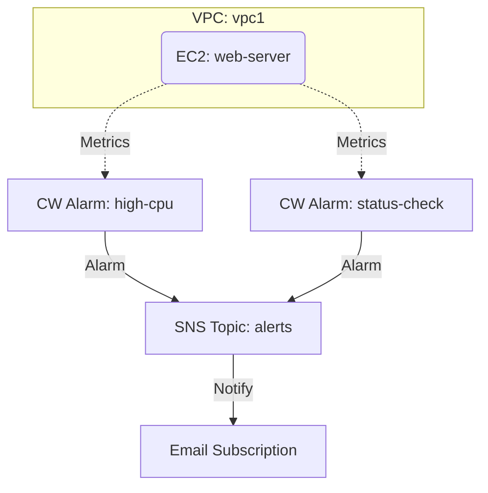

# Deploy CloudWatch Alarms for EC2 Monitoring on AWS

This guide demonstrates how to use MechCloud's stateless IaC to provision CloudWatch alarms with SNS notifications for EC2 instance monitoring on AWS.

## Scenario Overview
**Use Case:** Proactive monitoring of EC2 instances with automated alerting when CPU, memory, or disk metrics breach thresholds — essential for production workloads requiring high availability and SLA compliance.
**Key MechCloud Features Highlighted:**
- Cross-resource referencing (`ref:`)
- Nested alarm configuration as clean YAML
- Multi-resource monitoring setup in a single template

### Architecture Diagram



***

### Complete Unified Template

```yaml
resources:
  - type: aws_ec2_vpc
    name: vpc1
    props:
      cidr_block: "10.0.0.0/16"
    resources:
      - type: aws_ec2_internet_gateway
        name: igw1
      - type: aws_ec2_route_table
        name: public_rt
        resources:
          - type: aws_ec2_route
            name: internet_route
            props:
              destination_cidr_block: "0.0.0.0/0"
              gateway_id: "ref:vpc1/igw1"
      - type: aws_ec2_security_group
        name: sg1
        props:
          group_name: "mc-monitor-sg"
          group_description: "SG for monitored EC2"
          security_group_ingress:
            - ip_protocol: tcp
              from_port: 22
              to_port: 22
              cidr_ip: "{{CURRENT_IP}}/32"
            - ip_protocol: tcp
              from_port: 80
              to_port: 80
              cidr_ip: "0.0.0.0/0"
      - type: aws_ec2_subnet
        name: subnet1
        props:
          cidr_block: "10.0.1.0/24"
          availability_zone: "{{CURRENT_REGION}}a"
        resources:
          - type: aws_ec2_route_table_association
            name: rta1
            props:
              route_table_id: "ref:vpc1/public_rt"
          - type: aws_ec2_instance
            name: web-server
            props:
              image_id: "{{Image|arm64_ubuntu_24_04}}"
              instance_type: "t4g.small"
              security_group_ids:
                - "ref:vpc1/sg1"
              monitoring: true

  - type: aws_sns_topic
    name: alerts
    props:
      topic_name: "mc-ec2-alerts"

  - type: aws_sns_subscription
    name: email-alert
    props:
      topic_arn: "ref:alerts"
      protocol: email
      endpoint: "ops-team@example.com"

  - type: aws_cloudwatch_metric_alarm
    name: high-cpu
    props:
      alarm_name: "mc-high-cpu"
      alarm_description: "CPU utilization exceeds 80%"
      namespace: "AWS/EC2"
      metric_name: CPUUtilization
      statistic: Average
      period: 300
      evaluation_periods: 2
      threshold: 80
      comparison_operator: GreaterThanThreshold
      dimensions:
        - name: InstanceId
          value: "ref:vpc1/subnet1/web-server"
      alarm_actions:
        - "ref:alerts"
      ok_actions:
        - "ref:alerts"

  - type: aws_cloudwatch_metric_alarm
    name: status-check
    props:
      alarm_name: "mc-status-check-failed"
      alarm_description: "EC2 status check failed"
      namespace: "AWS/EC2"
      metric_name: StatusCheckFailed
      statistic: Maximum
      period: 60
      evaluation_periods: 2
      threshold: 1
      comparison_operator: GreaterThanOrEqualToThreshold
      dimensions:
        - name: InstanceId
          value: "ref:vpc1/subnet1/web-server"
      alarm_actions:
        - "ref:alerts"
```
