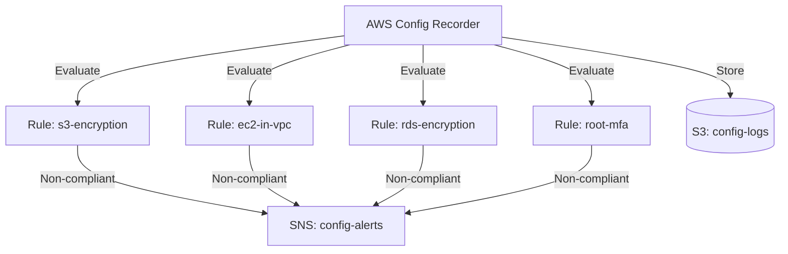

# Deploy AWS Config Rules for Compliance Monitoring on AWS

This guide demonstrates how to use MechCloud's stateless IaC to provision AWS Config with managed rules for automated compliance monitoring and drift detection.

## Scenario Overview
**Use Case:** Continuous compliance monitoring that automatically checks whether AWS resources comply with security best practices — required for SOC2, PCI-DSS, HIPAA, and CIS benchmarks, and for detecting configuration drift.
**Key MechCloud Features Highlighted:**
- Cross-resource referencing (`ref:`)
- Multiple compliance rules in a single template
- IAM role configuration for Config service

### Architecture Diagram



***

### Complete Unified Template

```yaml
resources:
  - type: aws_iam_role
    name: config-role
    props:
      role_name: "mc-config-role"
      assume_role_policy_document:
        Version: "2012-10-17"
        Statement:
          - Effect: Allow
            Principal:
              Service: config.amazonaws.com
            Action: "sts:AssumeRole"
      managed_policy_arns:
        - "arn:aws:iam::aws:policy/service-role/AWS_ConfigRole"

  - type: aws_s3_bucket
    name: config-bucket
    props:
      bucket_name: "mc-config-logs"

  - type: aws_config_configuration_recorder
    name: config-recorder
    props:
      name: "mc-config-recorder"
      role_arn: "ref:config-role.arn"
      recording_group:
        all_supported: true
        include_global_resource_types: true

  - type: aws_config_delivery_channel
    name: config-channel
    props:
      name: "mc-config-channel"
      s3_bucket_name: "ref:config-bucket"
      snapshot_delivery_properties:
        delivery_frequency: TwentyFour_Hours

  - type: aws_sns_topic
    name: config-alerts
    props:
      topic_name: "mc-config-alerts"

  - type: aws_config_config_rule
    name: s3-encryption
    props:
      config_rule_name: "mc-s3-bucket-encryption"
      source:
        owner: AWS
        source_identifier: S3_BUCKET_SERVER_SIDE_ENCRYPTION_ENABLED

  - type: aws_config_config_rule
    name: ec2-in-vpc
    props:
      config_rule_name: "mc-ec2-instances-in-vpc"
      source:
        owner: AWS
        source_identifier: INSTANCES_IN_VPC

  - type: aws_config_config_rule
    name: rds-encryption
    props:
      config_rule_name: "mc-rds-storage-encrypted"
      source:
        owner: AWS
        source_identifier: RDS_STORAGE_ENCRYPTED

  - type: aws_config_config_rule
    name: root-mfa
    props:
      config_rule_name: "mc-root-account-mfa"
      source:
        owner: AWS
        source_identifier: ROOT_ACCOUNT_MFA_ENABLED
```
