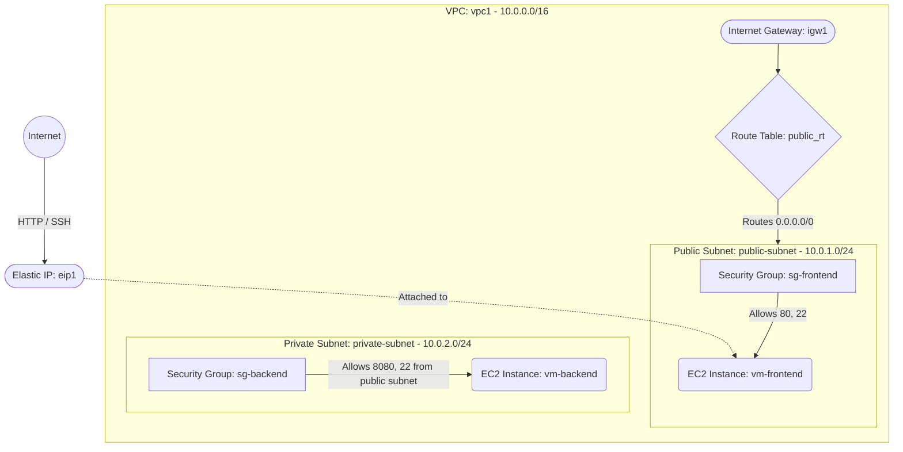

# Deploy a Multi-Subnet VPC with Public and Private Tiers on AWS

This guide demonstrates how to use MechCloud's stateless Infrastructure-as-Code (IaC) to provision a VPC with separate public and private subnets hosting frontend and backend EC2 instances.

In this scenario, we create a VPC with a public subnet (with Internet Gateway) for a web frontend and a private subnet for a backend service. The frontend EC2 has an Elastic IP for internet access, while the backend EC2 is only reachable from the frontend subnet.

## Scenario Overview
**Use Case:** A two-tier application architecture where a web frontend communicates with a private backend service (e.g., API server or database), each isolated in their own subnet with tailored security rules.
**Key MechCloud Features Highlighted:**
- Hierarchical resource nesting (VPC $\rightarrow$ Subnet $\rightarrow$ EC2)
- Dynamic macros (`{{CURRENT_REGION}}`, `{{CURRENT_IP}}`, `{{Image|arm64_ubuntu_24_04}}`)
- Cross-resource referencing (`ref:`)
- Multiple subnets with different access patterns

### Architecture Diagram



***

## Step 1: Setting up the VPC with Public and Private Subnets

We create a VPC with two subnets. The public subnet gets an Internet Gateway and route table for external access, while the private subnet has no internet route.

```yaml
resources:
  - type: aws_ec2_vpc
    name: vpc1
    props:
      cidr_block: "10.0.0.0/16"
    resources:
      # 1. Internet Gateway for the public subnet
      - type: aws_ec2_internet_gateway
        name: igw1

      # 2. Route Table for public subnet
      - type: aws_ec2_route_table
        name: public_rt
        resources:
          - type: aws_ec2_route
            name: internet_route
            props:
              destination_cidr_block: "0.0.0.0/0"
              gateway_id: "ref:vpc1/igw1"

      # 3. Public Subnet
      - type: aws_ec2_subnet
        name: public-subnet
        props:
          cidr_block: "10.0.1.0/24"
          availability_zone: "{{CURRENT_REGION}}a"
        resources:
          - type: aws_ec2_route_table_association
            name: rta-public
            props:
              route_table_id: "ref:vpc1/public_rt"

      # 4. Private Subnet (no route to internet)
      - type: aws_ec2_subnet
        name: private-subnet
        props:
          cidr_block: "10.0.2.0/24"
          availability_zone: "{{CURRENT_REGION}}a"
```

## Step 2: Creating Security Groups for Each Tier

The frontend SG allows HTTP from the internet and SSH from your IP. The backend SG allows traffic only from the public subnet CIDR.

```yaml
# ... (Continuing inside the vpc1 resources block) ...
      # 5. Frontend Security Group
      - type: aws_ec2_security_group
        name: sg-frontend
        props:
          group_name: "mc-frontend-sg"
          group_description: "SG for frontend web server"
          security_group_ingress:
            - ip_protocol: tcp
              from_port: 22
              to_port: 22
              cidr_ip: "{{CURRENT_IP}}/32"
            - ip_protocol: tcp
              from_port: 80
              to_port: 80
              cidr_ip: "0.0.0.0/0"

      # 6. Backend Security Group
      - type: aws_ec2_security_group
        name: sg-backend
        props:
          group_name: "mc-backend-sg"
          group_description: "SG for backend service"
          security_group_ingress:
            - ip_protocol: tcp
              from_port: 8080
              to_port: 8080
              cidr_ip: "10.0.1.0/24"
            - ip_protocol: tcp
              from_port: 22
              to_port: 22
              cidr_ip: "10.0.1.0/24"
```

## Step 3: Provisioning EC2 Instances and Elastic IP

We deploy a frontend EC2 in the public subnet with an EIP, and a backend EC2 in the private subnet with no public access.

```yaml
# ... (Continuing inside the subnet resources blocks) ...
        # Inside public-subnet
        resources:
          - type: aws_ec2_instance
            name: vm-frontend
            props:
              image_id: "{{Image|arm64_ubuntu_24_04}}"
              instance_type: "t4g.small"
              security_group_ids:
                - "ref:vpc1/sg-frontend"

        # Inside private-subnet
        resources:
          - type: aws_ec2_instance
            name: vm-backend
            props:
              image_id: "{{Image|arm64_ubuntu_24_04}}"
              instance_type: "t4g.small"
              security_group_ids:
                - "ref:vpc1/sg-backend"

# ... (At root resources level) ...
  - type: aws_ec2_eip
    name: eip1
    props:
      instance_id: "ref:vpc1/public-subnet/vm-frontend"
```

### Complete Unified Template

For your convenience, here is the complete, unified MechCloud template combining all steps:

```yaml
resources:
  - type: aws_ec2_vpc
    name: vpc1
    props:
      cidr_block: "10.0.0.0/16"
    resources:
      - type: aws_ec2_internet_gateway
        name: igw1

      - type: aws_ec2_route_table
        name: public_rt
        resources:
          - type: aws_ec2_route
            name: internet_route
            props:
              destination_cidr_block: "0.0.0.0/0"
              gateway_id: "ref:vpc1/igw1"

      - type: aws_ec2_security_group
        name: sg-frontend
        props:
          group_name: "mc-frontend-sg"
          group_description: "SG for frontend web server"
          security_group_ingress:
            - ip_protocol: tcp
              from_port: 22
              to_port: 22
              cidr_ip: "{{CURRENT_IP}}/32"
            - ip_protocol: tcp
              from_port: 80
              to_port: 80
              cidr_ip: "0.0.0.0/0"

      - type: aws_ec2_security_group
        name: sg-backend
        props:
          group_name: "mc-backend-sg"
          group_description: "SG for backend service"
          security_group_ingress:
            - ip_protocol: tcp
              from_port: 8080
              to_port: 8080
              cidr_ip: "10.0.1.0/24"
            - ip_protocol: tcp
              from_port: 22
              to_port: 22
              cidr_ip: "10.0.1.0/24"

      - type: aws_ec2_subnet
        name: public-subnet
        props:
          cidr_block: "10.0.1.0/24"
          availability_zone: "{{CURRENT_REGION}}a"
        resources:
          - type: aws_ec2_route_table_association
            name: rta-public
            props:
              route_table_id: "ref:vpc1/public_rt"

          - type: aws_ec2_instance
            name: vm-frontend
            props:
              image_id: "{{Image|arm64_ubuntu_24_04}}"
              instance_type: "t4g.small"
              security_group_ids:
                - "ref:vpc1/sg-frontend"

      - type: aws_ec2_subnet
        name: private-subnet
        props:
          cidr_block: "10.0.2.0/24"
          availability_zone: "{{CURRENT_REGION}}a"
        resources:
          - type: aws_ec2_instance
            name: vm-backend
            props:
              image_id: "{{Image|arm64_ubuntu_24_04}}"
              instance_type: "t4g.small"
              security_group_ids:
                - "ref:vpc1/sg-backend"

  - type: aws_ec2_eip
    name: eip1
    props:
      instance_id: "ref:vpc1/public-subnet/vm-frontend"
```
