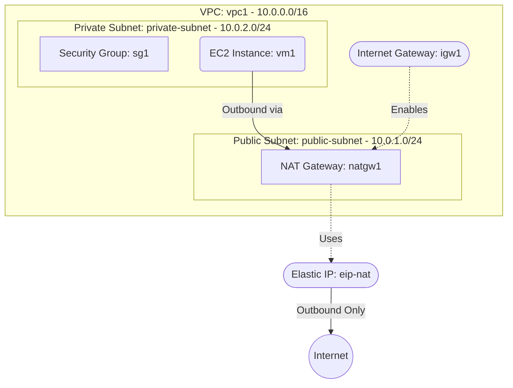

# Deploy a Private EC2 with Outbound Internet via NAT Gateway on AWS

This guide demonstrates how to use MechCloud's stateless Infrastructure-as-Code (IaC) to provision a private EC2 instance that accesses the internet for outbound traffic through an AWS NAT Gateway, without exposing any inbound public IP.

In this scenario, we deploy an EC2 instance in a private subnet with no direct internet ingress. A NAT Gateway in a public subnet provides outbound-only internet access for the private instance, allowing it to download updates, call external APIs, or push data to external services.

## Scenario Overview
**Use Case:** Backend workers, batch processing nodes, or application servers that need outbound internet access (e.g., downloading packages, calling external APIs) but must not have any inbound public exposure.
**Key MechCloud Features Highlighted:**
- Hierarchical resource nesting (VPC $\rightarrow$ Subnet $\rightarrow$ EC2)
- Dynamic macros (`{{CURRENT_REGION}}`, `{{Image|arm64_ubuntu_24_04}}`)
- Cross-resource referencing (`ref:`)
- NAT Gateway pattern for outbound-only internet access

### Architecture Diagram



***

## Step 1: Setting up Public and Private Subnets

We create a VPC with a public subnet (for the NAT Gateway) and a private subnet (for the EC2 instance). The public subnet gets an Internet Gateway and a route to the internet.

```yaml
resources:
  - type: aws_ec2_vpc
    name: vpc1
    props:
      cidr_block: "10.0.0.0/16"
    resources:
      # 1. Internet Gateway (required for NAT Gateway)
      - type: aws_ec2_internet_gateway
        name: igw1

      # 2. Public Route Table
      - type: aws_ec2_route_table
        name: public_rt
        resources:
          - type: aws_ec2_route
            name: internet_route
            props:
              destination_cidr_block: "0.0.0.0/0"
              gateway_id: "ref:vpc1/igw1"

      # 3. Public Subnet (hosts the NAT Gateway)
      - type: aws_ec2_subnet
        name: public-subnet
        props:
          cidr_block: "10.0.1.0/24"
          availability_zone: "{{CURRENT_REGION}}a"
        resources:
          - type: aws_ec2_route_table_association
            name: rta-public
            props:
              route_table_id: "ref:vpc1/public_rt"

      # 4. Private Subnet (hosts the EC2 instance)
      - type: aws_ec2_subnet
        name: private-subnet
        props:
          cidr_block: "10.0.2.0/24"
          availability_zone: "{{CURRENT_REGION}}a"

      # 5. Security Group for private EC2
      - type: aws_ec2_security_group
        name: sg1
        props:
          group_name: "mc-private-sg"
          group_description: "SG for private EC2 - SSH from VPC only"
          security_group_ingress:
            - ip_protocol: tcp
              from_port: 22
              to_port: 22
              cidr_ip: "10.0.0.0/16"
```

## Step 2: Creating the NAT Gateway

We allocate an Elastic IP and create a NAT Gateway in the public subnet. All outbound traffic from the private subnet will be routed through this gateway.

```yaml
# ... (At root resources level) ...
  # 6. Elastic IP for NAT Gateway
  - type: aws_ec2_eip
    name: eip-nat

  # 7. NAT Gateway in the public subnet
  - type: aws_ec2_nat_gateway
    name: natgw1
    props:
      subnet_id: "ref:vpc1/public-subnet"
      allocation_id: "ref:eip-nat"
      connectivity_type: public
```

## Step 3: Routing Private Subnet through NAT Gateway

We create a route table for the private subnet that directs all outbound traffic through the NAT Gateway.

```yaml
# ... (At root resources level) ...
  # 8. Private Route Table (via NAT Gateway)
  - type: aws_ec2_route_table
    name: private_rt
    props:
      vpc_id: "ref:vpc1"
    resources:
      - type: aws_ec2_route
        name: nat_route
        props:
          destination_cidr_block: "0.0.0.0/0"
          nat_gateway_id: "ref:natgw1"

  - type: aws_ec2_route_table_association
    name: rta-private
    props:
      subnet_id: "ref:vpc1/private-subnet"
      route_table_id: "ref:private_rt"
```

## Step 4: Provisioning the Private EC2 Instance

We deploy an EC2 instance in the private subnet. It has no public IP but can reach the internet outbound through the NAT Gateway.

```yaml
# ... (Inside vpc1/private-subnet resources block) ...
        resources:
          - type: aws_ec2_instance
            name: vm1
            props:
              image_id: "{{Image|arm64_ubuntu_24_04}}"
              instance_type: "t4g.small"
              security_group_ids:
                - "ref:vpc1/sg1"
```

### Complete Unified Template

For your convenience, here is the complete, unified MechCloud template combining all steps:

```yaml
resources:
  - type: aws_ec2_vpc
    name: vpc1
    props:
      cidr_block: "10.0.0.0/16"
    resources:
      - type: aws_ec2_internet_gateway
        name: igw1

      - type: aws_ec2_route_table
        name: public_rt
        resources:
          - type: aws_ec2_route
            name: internet_route
            props:
              destination_cidr_block: "0.0.0.0/0"
              gateway_id: "ref:vpc1/igw1"

      - type: aws_ec2_security_group
        name: sg1
        props:
          group_name: "mc-private-sg"
          group_description: "SG for private EC2 - SSH from VPC only"
          security_group_ingress:
            - ip_protocol: tcp
              from_port: 22
              to_port: 22
              cidr_ip: "10.0.0.0/16"

      - type: aws_ec2_subnet
        name: public-subnet
        props:
          cidr_block: "10.0.1.0/24"
          availability_zone: "{{CURRENT_REGION}}a"
        resources:
          - type: aws_ec2_route_table_association
            name: rta-public
            props:
              route_table_id: "ref:vpc1/public_rt"

      - type: aws_ec2_subnet
        name: private-subnet
        props:
          cidr_block: "10.0.2.0/24"
          availability_zone: "{{CURRENT_REGION}}a"
        resources:
          - type: aws_ec2_instance
            name: vm1
            props:
              image_id: "{{Image|arm64_ubuntu_24_04}}"
              instance_type: "t4g.small"
              security_group_ids:
                - "ref:vpc1/sg1"

  - type: aws_ec2_eip
    name: eip-nat

  - type: aws_ec2_nat_gateway
    name: natgw1
    props:
      subnet_id: "ref:vpc1/public-subnet"
      allocation_id: "ref:eip-nat"
      connectivity_type: public

  - type: aws_ec2_route_table
    name: private_rt
    props:
      vpc_id: "ref:vpc1"
    resources:
      - type: aws_ec2_route
        name: nat_route
        props:
          destination_cidr_block: "0.0.0.0/0"
          nat_gateway_id: "ref:natgw1"

  - type: aws_ec2_route_table_association
    name: rta-private
    props:
      subnet_id: "ref:vpc1/private-subnet"
      route_table_id: "ref:private_rt"
```
