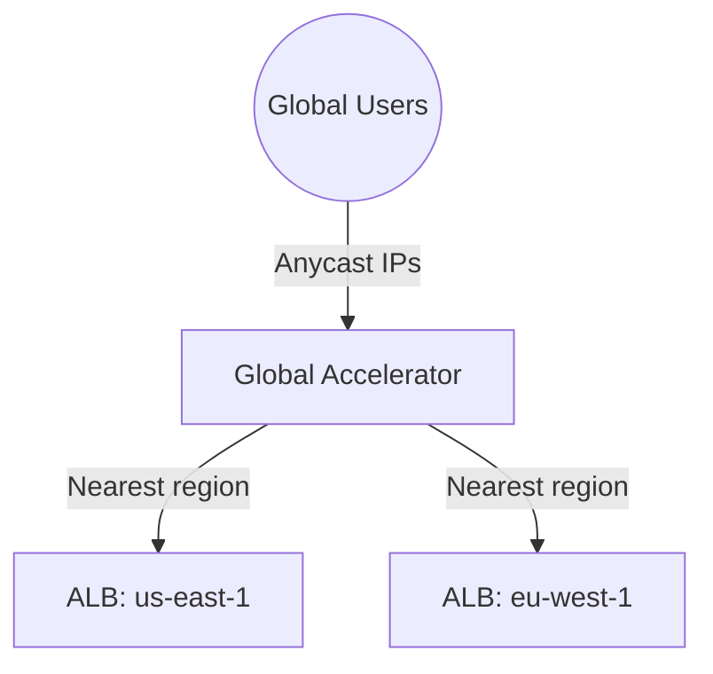

# Deploy AWS Global Accelerator with ALB Endpoints on AWS

This guide demonstrates how to use MechCloud's stateless IaC to provision AWS Global Accelerator for improved global application performance with static anycast IP addresses.

## Scenario Overview
**Use Case:** A globally distributed application that needs consistent low-latency access from users worldwide — Global Accelerator routes traffic over the AWS backbone network to the nearest healthy regional endpoint, providing up to 60% better performance than public internet routing.
**Key MechCloud Features Highlighted:**
- Cross-resource referencing (`ref:`)
- Multi-region endpoint configuration
- Static anycast IP addresses

### Architecture Diagram



***

### Complete Unified Template

```yaml
resources:
  - type: aws_ec2_vpc
    name: vpc1
    props:
      cidr_block: "10.0.0.0/16"
    resources:
      - type: aws_ec2_internet_gateway
        name: igw1
      - type: aws_ec2_route_table
        name: public_rt
        resources:
          - type: aws_ec2_route
            name: internet_route
            props:
              destination_cidr_block: "0.0.0.0/0"
              gateway_id: "ref:vpc1/igw1"
      - type: aws_ec2_security_group
        name: sg-alb
        props:
          group_name: "mc-ga-alb-sg"
          group_description: "SG for ALB behind Global Accelerator"
          security_group_ingress:
            - ip_protocol: tcp
              from_port: 80
              to_port: 80
              cidr_ip: "0.0.0.0/0"
      - type: aws_ec2_subnet
        name: subnet-a
        props:
          cidr_block: "10.0.1.0/24"
          availability_zone: "{{CURRENT_REGION}}a"
        resources:
          - type: aws_ec2_route_table_association
            name: rta-a
            props:
              route_table_id: "ref:vpc1/public_rt"
      - type: aws_ec2_subnet
        name: subnet-b
        props:
          cidr_block: "10.0.2.0/24"
          availability_zone: "{{CURRENT_REGION}}b"
        resources:
          - type: aws_ec2_route_table_association
            name: rta-b
            props:
              route_table_id: "ref:vpc1/public_rt"

  - type: aws_elbv2_load_balancer
    name: app-alb
    props:
      type: application
      scheme: internet-facing
      security_groups:
        - "ref:vpc1/sg-alb"
      subnets:
        - "ref:vpc1/subnet-a"
        - "ref:vpc1/subnet-b"

  - type: aws_globalaccelerator_accelerator
    name: ga1
    props:
      name: "mc-global-accelerator"
      ip_address_type: IPV4
      enabled: true

  - type: aws_globalaccelerator_listener
    name: ga-listener
    props:
      accelerator_arn: "ref:ga1.arn"
      protocol: TCP
      port_ranges:
        - from_port: 80
          to_port: 80

  - type: aws_globalaccelerator_endpoint_group
    name: ga-endpoint-group
    props:
      listener_arn: "ref:ga-listener.arn"
      endpoint_group_region: "{{CURRENT_REGION}}"
      health_check_port: 80
      health_check_protocol: HTTP
      health_check_path: "/"
      endpoint_configurations:
        - endpoint_id: "ref:app-alb.arn"
          weight: 100
```
