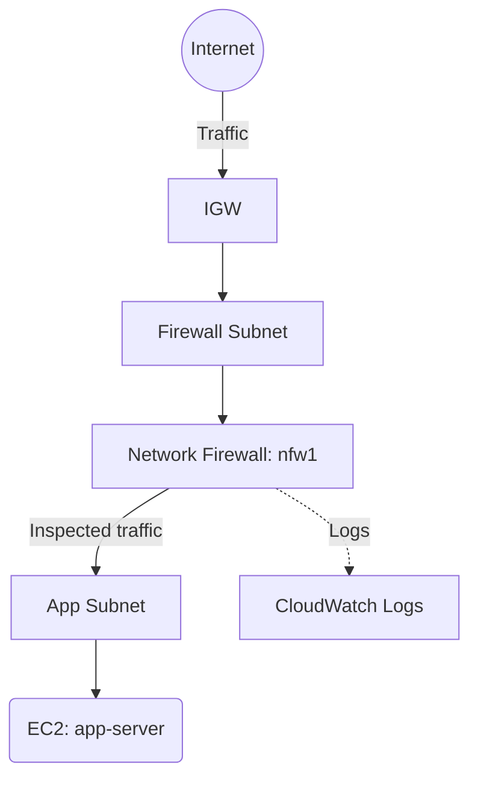

# Deploy AWS Network Firewall for VPC Traffic Inspection on AWS

This guide demonstrates how to use MechCloud's stateless IaC to provision AWS Network Firewall for stateful traffic inspection and filtering within a VPC.

## Scenario Overview
**Use Case:** Deep packet inspection and network-level threat protection for VPC traffic — required for regulated industries needing intrusion detection/prevention (IDS/IPS), domain filtering, and protocol-level controls beyond what security groups provide.
**Key MechCloud Features Highlighted:**
- Cross-resource referencing (`ref:`)
- Complex firewall rule groups as nested YAML
- Multi-resource networking setup in a single template

### Architecture Diagram



***

### Complete Unified Template

```yaml
resources:
  - type: aws_ec2_vpc
    name: vpc1
    props:
      cidr_block: "10.0.0.0/16"
    resources:
      - type: aws_ec2_internet_gateway
        name: igw1
      - type: aws_ec2_subnet
        name: fw-subnet
        props:
          cidr_block: "10.0.0.0/28"
          availability_zone: "{{CURRENT_REGION}}a"
      - type: aws_ec2_subnet
        name: app-subnet
        props:
          cidr_block: "10.0.1.0/24"
          availability_zone: "{{CURRENT_REGION}}a"
      - type: aws_ec2_security_group
        name: sg-app
        props:
          group_name: "mc-nfw-app-sg"
          group_description: "SG for app behind network firewall"
          security_group_ingress:
            - ip_protocol: tcp
              from_port: 80
              to_port: 80
              cidr_ip: "0.0.0.0/0"
            - ip_protocol: tcp
              from_port: 22
              to_port: 22
              cidr_ip: "{{CURRENT_IP}}/32"

  - type: aws_networkfirewall_rule_group
    name: block-domains
    props:
      capacity: 100
      name: "mc-block-domains"
      type: STATEFUL
      rule_group:
        rules_source:
          rules_source_list:
            generated_rules_type: DENYLIST
            target_types:
              - HTTP_HOST
              - TLS_SNI
            targets:
              - "malware.example.com"
              - "phishing.example.com"

  - type: aws_networkfirewall_rule_group
    name: allow-web
    props:
      capacity: 100
      name: "mc-allow-web"
      type: STATEFUL
      rule_group:
        rules_source:
          stateful_rules:
            - action: PASS
              header:
                protocol: TCP
                source: ANY
                source_port: ANY
                destination: ANY
                destination_port: "443"
                direction: FORWARD
              rule_options:
                - keyword: "sid"
                  settings:
                    - "1"

  - type: aws_networkfirewall_firewall_policy
    name: fw-policy
    props:
      name: "mc-fw-policy"
      firewall_policy:
        stateless_default_actions:
          - "aws:forward_to_sfe"
        stateless_fragment_default_actions:
          - "aws:forward_to_sfe"
        stateful_rule_group_references:
          - resource_arn: "ref:block-domains.arn"
          - resource_arn: "ref:allow-web.arn"

  - type: aws_networkfirewall_firewall
    name: nfw1
    props:
      name: "mc-network-firewall"
      firewall_policy_arn: "ref:fw-policy.arn"
      vpc_id: "ref:vpc1"
      subnet_mappings:
        - subnet_id: "ref:vpc1/fw-subnet"

  - type: aws_cloudwatch_log_group
    name: nfw-logs
    props:
      log_group_name: "/aws/network-firewall/mc-nfw"
      retention_in_days: 30

  - type: aws_networkfirewall_logging_configuration
    name: nfw-logging
    props:
      firewall_arn: "ref:nfw1.arn"
      logging_configuration:
        log_destination_configs:
          - log_destination:
              logGroup: "ref:nfw-logs"
            log_destination_type: CloudWatchLogs
            log_type: ALERT
```
