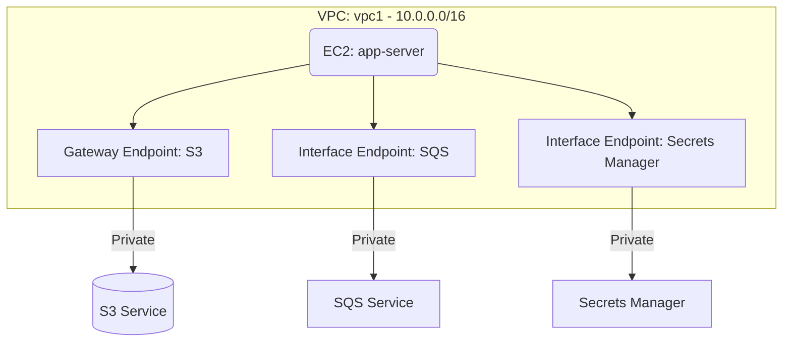

# Deploy VPC PrivateLink Endpoints for AWS Services on AWS

This guide demonstrates how to use MechCloud's stateless IaC to provision VPC Interface and Gateway endpoints for private access to AWS services without traversing the public internet.

## Scenario Overview
**Use Case:** Securing traffic between your VPC and AWS services (S3, DynamoDB, SQS, etc.) by keeping it entirely within the AWS network — required for compliance, reduced data transfer costs, and improved security posture.
**Key MechCloud Features Highlighted:**
- Cross-resource referencing (`ref:`)
- Multiple endpoint types in a single template
- Dynamic macros (`{{CURRENT_REGION}}`)

### Architecture Diagram



***

### Complete Unified Template

```yaml
resources:
  - type: aws_ec2_vpc
    name: vpc1
    props:
      cidr_block: "10.0.0.0/16"
      enable_dns_support: true
      enable_dns_hostnames: true
    resources:
      - type: aws_ec2_security_group
        name: sg-endpoints
        props:
          group_name: "mc-endpoint-sg"
          group_description: "SG for VPC interface endpoints"
          security_group_ingress:
            - ip_protocol: tcp
              from_port: 443
              to_port: 443
              cidr_ip: "10.0.0.0/16"
      - type: aws_ec2_subnet
        name: subnet1
        props:
          cidr_block: "10.0.1.0/24"
          availability_zone: "{{CURRENT_REGION}}a"
        resources:
          - type: aws_ec2_instance
            name: app-server
            props:
              image_id: "{{Image|arm64_ubuntu_24_04}}"
              instance_type: "t4g.small"
      - type: aws_ec2_route_table
        name: private_rt

  # Gateway Endpoint for S3 (free, no ENI needed)
  - type: aws_ec2_vpc_endpoint
    name: s3-endpoint
    props:
      vpc_id: "ref:vpc1"
      service_name: "com.amazonaws.{{CURRENT_REGION}}.s3"
      vpc_endpoint_type: Gateway
      route_table_ids:
        - "ref:vpc1/private_rt"

  # Interface Endpoint for SQS
  - type: aws_ec2_vpc_endpoint
    name: sqs-endpoint
    props:
      vpc_id: "ref:vpc1"
      service_name: "com.amazonaws.{{CURRENT_REGION}}.sqs"
      vpc_endpoint_type: Interface
      subnet_ids:
        - "ref:vpc1/subnet1"
      security_group_ids:
        - "ref:vpc1/sg-endpoints"
      private_dns_enabled: true

  # Interface Endpoint for Secrets Manager
  - type: aws_ec2_vpc_endpoint
    name: secretsmanager-endpoint
    props:
      vpc_id: "ref:vpc1"
      service_name: "com.amazonaws.{{CURRENT_REGION}}.secretsmanager"
      vpc_endpoint_type: Interface
      subnet_ids:
        - "ref:vpc1/subnet1"
      security_group_ids:
        - "ref:vpc1/sg-endpoints"
      private_dns_enabled: true
```
