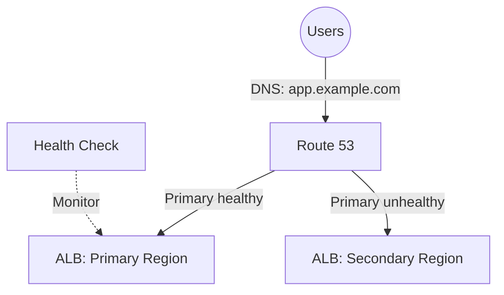

# Deploy Route 53 Failover Routing for High Availability on AWS

This guide demonstrates how to use MechCloud's stateless IaC to provision Route 53 failover routing with health checks for automatic DNS failover between primary and secondary endpoints.

## Scenario Overview
**Use Case:** A highly available web application where Route 53 automatically routes traffic to a secondary region when the primary endpoint becomes unhealthy — essential for disaster recovery with near-zero downtime.
**Key MechCloud Features Highlighted:**
- Cross-resource referencing (`ref:`)
- Health check and failover routing configuration
- Multi-region architecture in a single template

### Architecture Diagram



***

### Complete Unified Template

```yaml
resources:
  - type: aws_route53_hosted_zone
    name: zone1
    props:
      name: "example.com"

  - type: aws_route53_health_check
    name: primary-hc
    props:
      fqdn: "primary-alb.example.com"
      port: 80
      type: HTTP
      resource_path: "/health"
      request_interval: 30
      failure_threshold: 3

  - type: aws_route53_record
    name: primary-record
    props:
      zone_id: "ref:zone1"
      name: "app.example.com"
      type: A
      set_identifier: "primary"
      failover_routing_policy:
        type: PRIMARY
      alias:
        name: "primary-alb.us-east-1.elb.amazonaws.com"
        zone_id: "Z35SXDOTRQ7X7K"
        evaluate_target_health: true
      health_check_id: "ref:primary-hc"

  - type: aws_route53_record
    name: secondary-record
    props:
      zone_id: "ref:zone1"
      name: "app.example.com"
      type: A
      set_identifier: "secondary"
      failover_routing_policy:
        type: SECONDARY
      alias:
        name: "secondary-alb.eu-west-1.elb.amazonaws.com"
        zone_id: "Z32O12XQLNTSW2"
        evaluate_target_health: true

  - type: aws_route53_health_check
    name: secondary-hc
    props:
      fqdn: "secondary-alb.example.com"
      port: 80
      type: HTTP
      resource_path: "/health"
      request_interval: 30
      failure_threshold: 3

  - type: aws_sns_topic
    name: failover-alerts
    props:
      topic_name: "mc-dns-failover-alerts"

  - type: aws_cloudwatch_metric_alarm
    name: primary-health-alarm
    props:
      alarm_name: "mc-primary-endpoint-unhealthy"
      alarm_description: "Primary endpoint health check failed"
      namespace: "AWS/Route53"
      metric_name: HealthCheckStatus
      statistic: Minimum
      period: 60
      evaluation_periods: 1
      threshold: 1
      comparison_operator: LessThanThreshold
      dimensions:
        - name: HealthCheckId
          value: "ref:primary-hc"
      alarm_actions:
        - "ref:failover-alerts"
```
