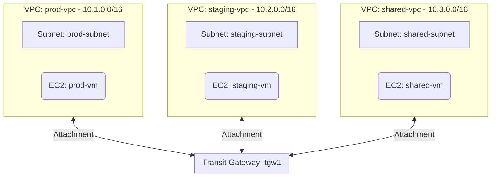

# Deploy a Transit Gateway Connecting Multiple VPCs on AWS

This guide demonstrates how to use MechCloud's stateless IaC to provision a Transit Gateway connecting three VPCs for hub-and-spoke network architecture on AWS.

## Scenario Overview
**Use Case:** A centralized network hub that connects multiple VPCs (e.g., production, staging, shared services) through a single Transit Gateway — eliminating the need for complex VPC peering meshes and simplifying routing at scale.
**Key MechCloud Features Highlighted:**
- Cross-resource referencing (`ref:`)
- Multi-VPC architecture in a single template
- Transit Gateway attachment and routing

### Architecture Diagram



***

### Complete Unified Template

```yaml
resources:
  - type: aws_ec2_transit_gateway
    name: tgw1
    props:
      description: "MechCloud Transit Gateway"
      default_route_table_association: enable
      default_route_table_propagation: enable
      dns_support: enable

  - type: aws_ec2_vpc
    name: prod-vpc
    props:
      cidr_block: "10.1.0.0/16"
    resources:
      - type: aws_ec2_subnet
        name: prod-subnet
        props:
          cidr_block: "10.1.1.0/24"
          availability_zone: "{{CURRENT_REGION}}a"
        resources:
          - type: aws_ec2_instance
            name: prod-vm
            props:
              image_id: "{{Image|arm64_ubuntu_24_04}}"
              instance_type: "t4g.small"
      - type: aws_ec2_security_group
        name: sg-prod
        props:
          group_name: "mc-prod-sg"
          group_description: "Allow traffic from all VPCs"
          security_group_ingress:
            - ip_protocol: -1
              cidr_ip: "10.0.0.0/8"

  - type: aws_ec2_vpc
    name: staging-vpc
    props:
      cidr_block: "10.2.0.0/16"
    resources:
      - type: aws_ec2_subnet
        name: staging-subnet
        props:
          cidr_block: "10.2.1.0/24"
          availability_zone: "{{CURRENT_REGION}}a"
        resources:
          - type: aws_ec2_instance
            name: staging-vm
            props:
              image_id: "{{Image|arm64_ubuntu_24_04}}"
              instance_type: "t4g.small"

  - type: aws_ec2_vpc
    name: shared-vpc
    props:
      cidr_block: "10.3.0.0/16"
    resources:
      - type: aws_ec2_subnet
        name: shared-subnet
        props:
          cidr_block: "10.3.1.0/24"
          availability_zone: "{{CURRENT_REGION}}a"
        resources:
          - type: aws_ec2_instance
            name: shared-vm
            props:
              image_id: "{{Image|arm64_ubuntu_24_04}}"
              instance_type: "t4g.small"

  - type: aws_ec2_transit_gateway_vpc_attachment
    name: tgw-attach-prod
    props:
      transit_gateway_id: "ref:tgw1"
      vpc_id: "ref:prod-vpc"
      subnet_ids:
        - "ref:prod-vpc/prod-subnet"

  - type: aws_ec2_transit_gateway_vpc_attachment
    name: tgw-attach-staging
    props:
      transit_gateway_id: "ref:tgw1"
      vpc_id: "ref:staging-vpc"
      subnet_ids:
        - "ref:staging-vpc/staging-subnet"

  - type: aws_ec2_transit_gateway_vpc_attachment
    name: tgw-attach-shared
    props:
      transit_gateway_id: "ref:tgw1"
      vpc_id: "ref:shared-vpc"
      subnet_ids:
        - "ref:shared-vpc/shared-subnet"
```
