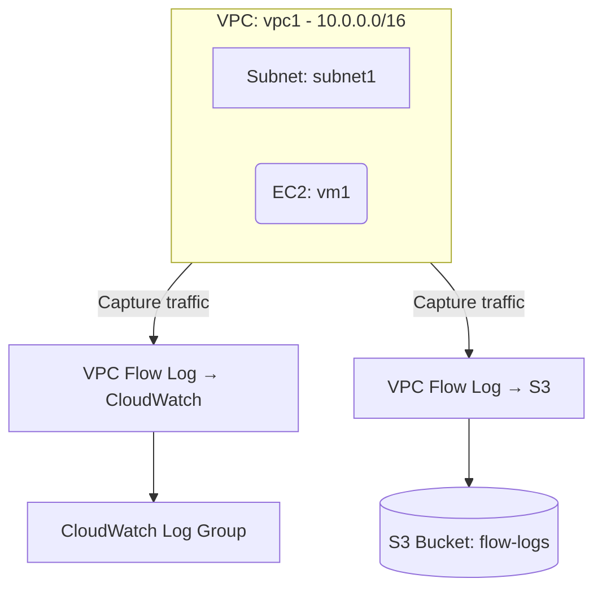

# Deploy VPC Flow Logs to S3 and CloudWatch on AWS

This guide demonstrates how to use MechCloud's stateless IaC to provision VPC Flow Logs shipping to both S3 (for long-term archival) and CloudWatch Logs (for real-time analysis) on AWS.

## Scenario Overview
**Use Case:** Network traffic visibility and compliance auditing by capturing VPC flow logs — required for security investigations, troubleshooting connectivity issues, and meeting regulatory compliance (SOC2, PCI-DSS, HIPAA).
**Key MechCloud Features Highlighted:**
- Cross-resource referencing (`ref:`)
- Multiple log destinations in a single template
- IAM role configuration for flow log delivery

### Architecture Diagram



***

### Complete Unified Template

```yaml
resources:
  - type: aws_ec2_vpc
    name: vpc1
    props:
      cidr_block: "10.0.0.0/16"
    resources:
      - type: aws_ec2_subnet
        name: subnet1
        props:
          cidr_block: "10.0.1.0/24"
          availability_zone: "{{CURRENT_REGION}}a"
        resources:
          - type: aws_ec2_instance
            name: vm1
            props:
              image_id: "{{Image|arm64_ubuntu_24_04}}"
              instance_type: "t4g.small"

  - type: aws_iam_role
    name: flow-log-role
    props:
      role_name: "mc-flow-log-role"
      assume_role_policy_document:
        Version: "2012-10-17"
        Statement:
          - Effect: Allow
            Principal:
              Service: vpc-flow-logs.amazonaws.com
            Action: "sts:AssumeRole"
      managed_policy_arns:
        - "arn:aws:iam::aws:policy/CloudWatchLogsFullAccess"

  - type: aws_cloudwatch_log_group
    name: flow-log-group
    props:
      log_group_name: "/vpc/mc-flow-logs"
      retention_in_days: 30

  - type: aws_ec2_flow_log
    name: flow-log-cw
    props:
      resource_id: "ref:vpc1"
      resource_type: VPC
      traffic_type: ALL
      log_destination_type: cloud-watch-logs
      log_group_name: "ref:flow-log-group"
      deliver_logs_permission_arn: "ref:flow-log-role.arn"

  - type: aws_s3_bucket
    name: flow-logs-bucket
    props:
      bucket_name: "mc-vpc-flow-logs-archive"

  - type: aws_s3_bucket_lifecycle_configuration
    name: flow-logs-lifecycle
    props:
      bucket: "ref:flow-logs-bucket"
      rules:
        - id: archive-old-logs
          status: Enabled
          transitions:
            - days: 30
              storage_class: STANDARD_IA
            - days: 90
              storage_class: GLACIER
          expiration:
            days: 365

  - type: aws_ec2_flow_log
    name: flow-log-s3
    props:
      resource_id: "ref:vpc1"
      resource_type: VPC
      traffic_type: ALL
      log_destination_type: s3
      log_destination: "ref:flow-logs-bucket.arn"
```
