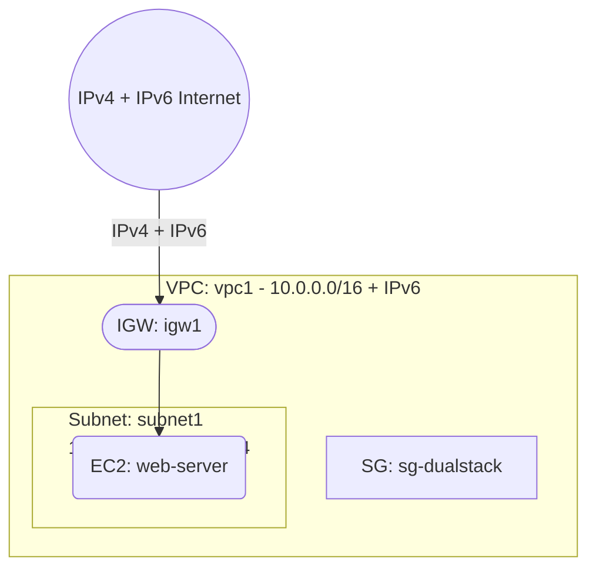

# Deploy a Dual-Stack VPC with IPv6 on AWS

This guide demonstrates how to use MechCloud's stateless IaC to provision a dual-stack VPC with both IPv4 and IPv6 addressing for modern internet-ready applications.

## Scenario Overview
**Use Case:** Applications that need to support IPv6 connectivity for compliance with government mandates, mobile-first users, or future-proofing — dual-stack ensures backward compatibility with IPv4 while enabling native IPv6 access.
**Key MechCloud Features Highlighted:**
- Cross-resource referencing (`ref:`)
- Dual-stack VPC and subnet configuration
- IPv6 security group rules

### Architecture Diagram



***

### Complete Unified Template

```yaml
resources:
  - type: aws_ec2_vpc
    name: vpc1
    props:
      cidr_block: "10.0.0.0/16"
      assign_generated_ipv6_cidr_block: true
    resources:
      - type: aws_ec2_internet_gateway
        name: igw1
      - type: aws_ec2_route_table
        name: public_rt
        resources:
          - type: aws_ec2_route
            name: ipv4-route
            props:
              destination_cidr_block: "0.0.0.0/0"
              gateway_id: "ref:vpc1/igw1"
          - type: aws_ec2_route
            name: ipv6-route
            props:
              destination_ipv6_cidr_block: "::/0"
              gateway_id: "ref:vpc1/igw1"
      - type: aws_ec2_security_group
        name: sg-dualstack
        props:
          group_name: "mc-dualstack-sg"
          group_description: "SG for dual-stack EC2"
          security_group_ingress:
            - ip_protocol: tcp
              from_port: 22
              to_port: 22
              cidr_ip: "{{CURRENT_IP}}/32"
            - ip_protocol: tcp
              from_port: 80
              to_port: 80
              cidr_ip: "0.0.0.0/0"
            - ip_protocol: tcp
              from_port: 80
              to_port: 80
              cidr_ipv6: "::/0"
            - ip_protocol: tcp
              from_port: 443
              to_port: 443
              cidr_ip: "0.0.0.0/0"
            - ip_protocol: tcp
              from_port: 443
              to_port: 443
              cidr_ipv6: "::/0"
      - type: aws_ec2_subnet
        name: subnet1
        props:
          cidr_block: "10.0.1.0/24"
          ipv6_cidr_block: "ref:vpc1.ipv6_cidr_block_first_64"
          assign_ipv6_address_on_creation: true
          availability_zone: "{{CURRENT_REGION}}a"
        resources:
          - type: aws_ec2_route_table_association
            name: rta1
            props:
              route_table_id: "ref:vpc1/public_rt"
          - type: aws_ec2_instance
            name: web-server
            props:
              image_id: "{{Image|arm64_ubuntu_24_04}}"
              instance_type: "t4g.small"
              security_group_ids:
                - "ref:vpc1/sg-dualstack"

  - type: aws_ec2_eip
    name: eip1
    props:
      instance_id: "ref:vpc1/subnet1/web-server"
```
