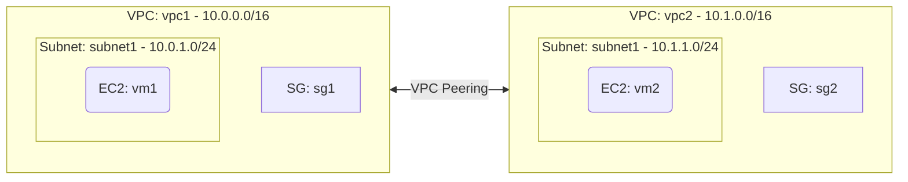

# Deploy Two Peered VPCs with EC2 Instances on AWS

This guide demonstrates how to use MechCloud's stateless Infrastructure-as-Code (IaC) to provision two VPCs connected via VPC Peering on AWS.

In this scenario, we create two separate VPCs — each with its own subnet and EC2 instance — and establish a VPC Peering connection between them. We update route tables in both VPCs so that instances can communicate with each other using private IP addresses over AWS's backbone network.

## Scenario Overview
**Use Case:** Connecting separate application environments (e.g., development and staging), linking a shared services VPC to an application VPC, or enabling cross-team resource communication within an organization.
**Key MechCloud Features Highlighted:**
- Hierarchical resource nesting (VPC $\rightarrow$ Subnet $\rightarrow$ EC2)
- Dynamic macros (`{{CURRENT_REGION}}`, `{{Image|arm64_ubuntu_24_04}}`)
- Cross-resource referencing (`ref:`)
- VPC Peering with bidirectional routing

### Architecture Diagram



***

## Step 1: Creating Two VPCs with Subnets

We provision two VPCs with non-overlapping CIDR blocks, each containing a subnet, security group, and EC2 instance.

```yaml
resources:
  # 1. First VPC
  - type: aws_ec2_vpc
    name: vpc1
    props:
      cidr_block: "10.0.0.0/16"
    resources:
      - type: aws_ec2_subnet
        name: subnet1
        props:
          cidr_block: "10.0.1.0/24"
          availability_zone: "{{CURRENT_REGION}}a"

      - type: aws_ec2_security_group
        name: sg1
        props:
          group_name: "mc-vpc1-sg"
          group_description: "SG for VPC1 allowing traffic from both VPCs"
          security_group_ingress:
            - ip_protocol: tcp
              from_port: 22
              to_port: 22
              cidr_ip: "10.0.0.0/8"

  # 2. Second VPC
  - type: aws_ec2_vpc
    name: vpc2
    props:
      cidr_block: "10.1.0.0/16"
    resources:
      - type: aws_ec2_subnet
        name: subnet1
        props:
          cidr_block: "10.1.1.0/24"
          availability_zone: "{{CURRENT_REGION}}a"

      - type: aws_ec2_security_group
        name: sg2
        props:
          group_name: "mc-vpc2-sg"
          group_description: "SG for VPC2 allowing traffic from both VPCs"
          security_group_ingress:
            - ip_protocol: tcp
              from_port: 22
              to_port: 22
              cidr_ip: "10.0.0.0/8"
```

## Step 2: Establishing VPC Peering and Routes

We create a VPC Peering connection and add routes in both VPCs to direct cross-VPC traffic through the peering link.

```yaml
# ... (At root resources level) ...
  # 3. VPC Peering Connection
  - type: aws_ec2_vpc_peering_connection
    name: peer1
    props:
      vpc_id: "ref:vpc1"
      peer_vpc_id: "ref:vpc2"

  # 4. Route in VPC1 to VPC2 via peering
  - type: aws_ec2_route_table
    name: rt-vpc1
    props:
      vpc_id: "ref:vpc1"
    resources:
      - type: aws_ec2_route
        name: route-to-vpc2
        props:
          destination_cidr_block: "10.1.0.0/16"
          vpc_peering_connection_id: "ref:peer1"

  - type: aws_ec2_route_table_association
    name: rta-vpc1
    props:
      subnet_id: "ref:vpc1/subnet1"
      route_table_id: "ref:rt-vpc1"

  # 5. Route in VPC2 to VPC1 via peering
  - type: aws_ec2_route_table
    name: rt-vpc2
    props:
      vpc_id: "ref:vpc2"
    resources:
      - type: aws_ec2_route
        name: route-to-vpc1
        props:
          destination_cidr_block: "10.0.0.0/16"
          vpc_peering_connection_id: "ref:peer1"

  - type: aws_ec2_route_table_association
    name: rta-vpc2
    props:
      subnet_id: "ref:vpc2/subnet1"
      route_table_id: "ref:rt-vpc2"
```

## Step 3: Provisioning EC2 Instances

We deploy one EC2 in each VPC. Thanks to VPC Peering and the routes, these instances can communicate using private IPs.

```yaml
# ... (Inside vpc1/subnet1 and vpc2/subnet1 resources blocks) ...
        # Inside vpc1/subnet1
        resources:
          - type: aws_ec2_instance
            name: vm1
            props:
              image_id: "{{Image|arm64_ubuntu_24_04}}"
              instance_type: "t4g.small"
              security_group_ids:
                - "ref:vpc1/sg1"

        # Inside vpc2/subnet1
        resources:
          - type: aws_ec2_instance
            name: vm2
            props:
              image_id: "{{Image|arm64_ubuntu_24_04}}"
              instance_type: "t4g.small"
              security_group_ids:
                - "ref:vpc2/sg2"
```

### Complete Unified Template

For your convenience, here is the complete, unified MechCloud template combining all steps:

```yaml
resources:
  - type: aws_ec2_vpc
    name: vpc1
    props:
      cidr_block: "10.0.0.0/16"
    resources:
      - type: aws_ec2_subnet
        name: subnet1
        props:
          cidr_block: "10.0.1.0/24"
          availability_zone: "{{CURRENT_REGION}}a"
        resources:
          - type: aws_ec2_instance
            name: vm1
            props:
              image_id: "{{Image|arm64_ubuntu_24_04}}"
              instance_type: "t4g.small"
              security_group_ids:
                - "ref:vpc1/sg1"

      - type: aws_ec2_security_group
        name: sg1
        props:
          group_name: "mc-vpc1-sg"
          group_description: "SG for VPC1 allowing traffic from both VPCs"
          security_group_ingress:
            - ip_protocol: tcp
              from_port: 22
              to_port: 22
              cidr_ip: "10.0.0.0/8"

  - type: aws_ec2_vpc
    name: vpc2
    props:
      cidr_block: "10.1.0.0/16"
    resources:
      - type: aws_ec2_subnet
        name: subnet1
        props:
          cidr_block: "10.1.1.0/24"
          availability_zone: "{{CURRENT_REGION}}a"
        resources:
          - type: aws_ec2_instance
            name: vm2
            props:
              image_id: "{{Image|arm64_ubuntu_24_04}}"
              instance_type: "t4g.small"
              security_group_ids:
                - "ref:vpc2/sg2"

      - type: aws_ec2_security_group
        name: sg2
        props:
          group_name: "mc-vpc2-sg"
          group_description: "SG for VPC2 allowing traffic from both VPCs"
          security_group_ingress:
            - ip_protocol: tcp
              from_port: 22
              to_port: 22
              cidr_ip: "10.0.0.0/8"

  - type: aws_ec2_vpc_peering_connection
    name: peer1
    props:
      vpc_id: "ref:vpc1"
      peer_vpc_id: "ref:vpc2"

  - type: aws_ec2_route_table
    name: rt-vpc1
    props:
      vpc_id: "ref:vpc1"
    resources:
      - type: aws_ec2_route
        name: route-to-vpc2
        props:
          destination_cidr_block: "10.1.0.0/16"
          vpc_peering_connection_id: "ref:peer1"

  - type: aws_ec2_route_table_association
    name: rta-vpc1
    props:
      subnet_id: "ref:vpc1/subnet1"
      route_table_id: "ref:rt-vpc1"

  - type: aws_ec2_route_table
    name: rt-vpc2
    props:
      vpc_id: "ref:vpc2"
    resources:
      - type: aws_ec2_route
        name: route-to-vpc1
        props:
          destination_cidr_block: "10.0.0.0/16"
          vpc_peering_connection_id: "ref:peer1"

  - type: aws_ec2_route_table_association
    name: rta-vpc2
    props:
      subnet_id: "ref:vpc2/subnet1"
      route_table_id: "ref:rt-vpc2"
```
