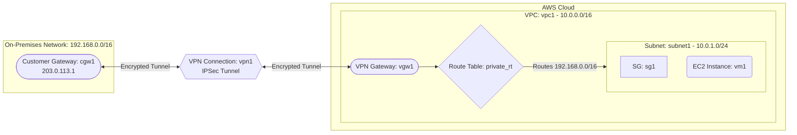

# Deploy a VPC with Virtual Private Gateway for Site-to-Site VPN on AWS

This guide demonstrates how to use MechCloud's stateless Infrastructure-as-Code (IaC) to provision a VPC with a Virtual Private Gateway (VGW) for establishing a site-to-site VPN connection to an on-premises network on AWS.

In this scenario, we create a VPC with a VPN Gateway and a Customer Gateway representing the on-premises network device. A site-to-site VPN connection is established between them, allowing secure communication between the cloud VPC and on-premises infrastructure over an encrypted IPSec tunnel.

## Scenario Overview
**Use Case:** Securely extending an on-premises data center to the AWS cloud, enabling hybrid architectures where cloud workloads communicate with on-premises resources over an encrypted VPN tunnel.
**Key MechCloud Features Highlighted:**
- Hierarchical resource nesting (VPC $\rightarrow$ Subnet $\rightarrow$ EC2)
- Dynamic macros (`{{CURRENT_REGION}}`, `{{Image|arm64_ubuntu_24_04}}`)
- Cross-resource referencing (`ref:`)
- VPN Gateway and site-to-site VPN configuration

### Architecture Diagram



***

## Step 1: Setting up the VPC and VPN Gateway

We create a VPC with a subnet and attach a Virtual Private Gateway that serves as the AWS side of the VPN connection.

```yaml
resources:
  - type: aws_ec2_vpc
    name: vpc1
    props:
      cidr_block: "10.0.0.0/16"
    resources:
      - type: aws_ec2_subnet
        name: subnet1
        props:
          cidr_block: "10.0.1.0/24"
          availability_zone: "{{CURRENT_REGION}}a"

      - type: aws_ec2_security_group
        name: sg1
        props:
          group_name: "mc-vpn-sg"
          group_description: "SG allowing traffic from on-premises and VPC"
          security_group_ingress:
            - ip_protocol: tcp
              from_port: 22
              to_port: 22
              cidr_ip: "192.168.0.0/16"
            - ip_protocol: tcp
              from_port: 22
              to_port: 22
              cidr_ip: "10.0.0.0/16"

      # Virtual Private Gateway
      - type: aws_ec2_vpn_gateway
        name: vgw1
        props:
          type: ipsec.1
```

## Step 2: Creating the Customer Gateway and VPN Connection

We define the Customer Gateway (representing the on-premises VPN device) and create the site-to-site VPN connection.

```yaml
# ... (At root resources level) ...
  # Customer Gateway (on-premises VPN device)
  - type: aws_ec2_customer_gateway
    name: cgw1
    props:
      type: ipsec.1
      bgp_asn: 65000
      ip_address: "203.0.113.1"

  # Site-to-Site VPN Connection
  - type: aws_ec2_vpn_connection
    name: vpn1
    props:
      type: ipsec.1
      vpn_gateway_id: "ref:vpc1/vgw1"
      customer_gateway_id: "ref:cgw1"
      static_routes_only: true
```

## Step 3: Configuring Routing and Provisioning EC2

We add a route for on-premises traffic through the VPN Gateway and deploy an EC2 instance.

```yaml
# ... (At root resources level) ...
  - type: aws_ec2_vpn_connection_route
    name: vpn-route
    props:
      vpn_connection_id: "ref:vpn1"
      destination_cidr_block: "192.168.0.0/16"

  - type: aws_ec2_route_table
    name: private_rt
    props:
      vpc_id: "ref:vpc1"
    resources:
      - type: aws_ec2_route
        name: onprem-route
        props:
          destination_cidr_block: "192.168.0.0/16"
          gateway_id: "ref:vpc1/vgw1"

  - type: aws_ec2_route_table_association
    name: rta1
    props:
      subnet_id: "ref:vpc1/subnet1"
      route_table_id: "ref:private_rt"

# ... (Inside vpc1/subnet1 resources block) ...
        resources:
          - type: aws_ec2_instance
            name: vm1
            props:
              image_id: "{{Image|arm64_ubuntu_24_04}}"
              instance_type: "t4g.small"
              security_group_ids:
                - "ref:vpc1/sg1"
```

### Complete Unified Template

For your convenience, here is the complete, unified MechCloud template combining all steps:

```yaml
resources:
  - type: aws_ec2_vpc
    name: vpc1
    props:
      cidr_block: "10.0.0.0/16"
    resources:
      - type: aws_ec2_security_group
        name: sg1
        props:
          group_name: "mc-vpn-sg"
          group_description: "SG allowing traffic from on-premises and VPC"
          security_group_ingress:
            - ip_protocol: tcp
              from_port: 22
              to_port: 22
              cidr_ip: "192.168.0.0/16"
            - ip_protocol: tcp
              from_port: 22
              to_port: 22
              cidr_ip: "10.0.0.0/16"

      - type: aws_ec2_vpn_gateway
        name: vgw1
        props:
          type: ipsec.1

      - type: aws_ec2_subnet
        name: subnet1
        props:
          cidr_block: "10.0.1.0/24"
          availability_zone: "{{CURRENT_REGION}}a"
        resources:
          - type: aws_ec2_instance
            name: vm1
            props:
              image_id: "{{Image|arm64_ubuntu_24_04}}"
              instance_type: "t4g.small"
              security_group_ids:
                - "ref:vpc1/sg1"

  - type: aws_ec2_customer_gateway
    name: cgw1
    props:
      type: ipsec.1
      bgp_asn: 65000
      ip_address: "203.0.113.1"

  - type: aws_ec2_vpn_connection
    name: vpn1
    props:
      type: ipsec.1
      vpn_gateway_id: "ref:vpc1/vgw1"
      customer_gateway_id: "ref:cgw1"
      static_routes_only: true

  - type: aws_ec2_vpn_connection_route
    name: vpn-route
    props:
      vpn_connection_id: "ref:vpn1"
      destination_cidr_block: "192.168.0.0/16"

  - type: aws_ec2_route_table
    name: private_rt
    props:
      vpc_id: "ref:vpc1"
    resources:
      - type: aws_ec2_route
        name: onprem-route
        props:
          destination_cidr_block: "192.168.0.0/16"
          gateway_id: "ref:vpc1/vgw1"

  - type: aws_ec2_route_table_association
    name: rta1
    props:
      subnet_id: "ref:vpc1/subnet1"
      route_table_id: "ref:private_rt"
```
