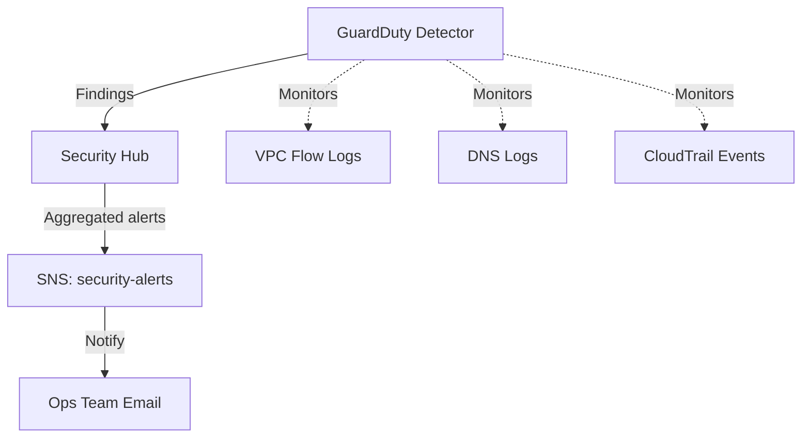

# Deploy GuardDuty and Security Hub for Threat Detection on AWS

This guide demonstrates how to use MechCloud's stateless IaC to provision Amazon GuardDuty and AWS Security Hub for centralized threat detection and security posture management.

## Scenario Overview
**Use Case:** Automated threat detection and security findings aggregation — GuardDuty continuously monitors for malicious activity while Security Hub provides a unified dashboard of security alerts and compliance status across AWS services.
**Key MechCloud Features Highlighted:**
- Simple enablement of security services
- Cross-resource referencing (`ref:`)
- SNS integration for real-time alerting

### Architecture Diagram



***

### Complete Unified Template

```yaml
resources:
  - type: aws_guardduty_detector
    name: gd-detector
    props:
      enable: true
      finding_publishing_frequency: FIFTEEN_MINUTES
      datasources:
        s3_logs:
          enable: true
        kubernetes:
          audit_logs:
            enable: true
        malware_protection:
          scan_ec2_instance_with_findings:
            ebs_volumes:
              enable: true

  - type: aws_securityhub_account
    name: securityhub

  - type: aws_securityhub_standards_subscription
    name: cis-standard
    props:
      standards_arn: "arn:aws:securityhub:::ruleset/cis-aws-foundations-benchmark/v/1.4.0"

  - type: aws_securityhub_standards_subscription
    name: aws-best-practices
    props:
      standards_arn: "arn:aws:securityhub:::standards/aws-foundational-security-best-practices/v/1.0.0"

  - type: aws_sns_topic
    name: security-alerts
    props:
      topic_name: "mc-security-alerts"

  - type: aws_sns_subscription
    name: security-email
    props:
      topic_arn: "ref:security-alerts"
      protocol: email
      endpoint: "security-team@example.com"

  - type: aws_cloudwatch_event_rule
    name: guardduty-findings
    props:
      name: "mc-guardduty-findings"
      description: "Route GuardDuty findings to SNS"
      event_pattern:
        source:
          - "aws.guardduty"
        detail-type:
          - "GuardDuty Finding"
        detail:
          severity:
            - 4
            - 4.0
            - 4.1
            - 4.2
            - 7
            - 7.0
            - 8
            - 8.0

  - type: aws_cloudwatch_event_target
    name: guardduty-sns-target
    props:
      rule: "ref:guardduty-findings"
      arn: "ref:security-alerts"
```
