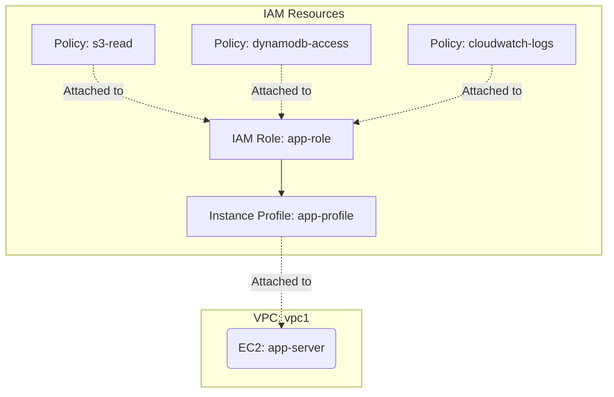

# Deploy IAM Roles and Policies on AWS

This guide demonstrates how to use MechCloud's stateless IaC to provision IAM roles, policies, and instance profiles for secure, least-privilege access on AWS.

## Scenario Overview
**Use Case:** Setting up fine-grained IAM roles for EC2 instances to securely access S3, DynamoDB, and CloudWatch without using long-lived access keys — a foundational security pattern for any AWS deployment.
**Key MechCloud Features Highlighted:**
- Cross-resource referencing (`ref:`)
- Nested policy documents as YAML (no HCL escaping needed)
- No state management overhead for identity resources

### Architecture Diagram



***

### Complete Unified Template

```yaml
resources:
  - type: aws_iam_role
    name: app-role
    props:
      role_name: "mc-app-role"
      assume_role_policy_document:
        Version: "2012-10-17"
        Statement:
          - Effect: Allow
            Principal:
              Service: ec2.amazonaws.com
            Action: "sts:AssumeRole"

  - type: aws_iam_policy
    name: s3-read
    props:
      policy_name: "mc-s3-read-policy"
      policy_document:
        Version: "2012-10-17"
        Statement:
          - Effect: Allow
            Action:
              - "s3:GetObject"
              - "s3:ListBucket"
            Resource:
              - "arn:aws:s3:::mc-app-bucket"
              - "arn:aws:s3:::mc-app-bucket/*"

  - type: aws_iam_policy
    name: dynamodb-access
    props:
      policy_name: "mc-dynamodb-policy"
      policy_document:
        Version: "2012-10-17"
        Statement:
          - Effect: Allow
            Action:
              - "dynamodb:GetItem"
              - "dynamodb:PutItem"
              - "dynamodb:Query"
              - "dynamodb:UpdateItem"
              - "dynamodb:DeleteItem"
            Resource: "arn:aws:dynamodb:*:*:table/mc-app-*"

  - type: aws_iam_policy
    name: cloudwatch-logs
    props:
      policy_name: "mc-cw-logs-policy"
      policy_document:
        Version: "2012-10-17"
        Statement:
          - Effect: Allow
            Action:
              - "logs:CreateLogGroup"
              - "logs:CreateLogStream"
              - "logs:PutLogEvents"
            Resource: "arn:aws:logs:*:*:*"

  - type: aws_iam_role_policy_attachment
    name: attach-s3
    props:
      role: "ref:app-role"
      policy_arn: "ref:s3-read.arn"

  - type: aws_iam_role_policy_attachment
    name: attach-dynamodb
    props:
      role: "ref:app-role"
      policy_arn: "ref:dynamodb-access.arn"

  - type: aws_iam_role_policy_attachment
    name: attach-cw
    props:
      role: "ref:app-role"
      policy_arn: "ref:cloudwatch-logs.arn"

  - type: aws_iam_instance_profile
    name: app-profile
    props:
      instance_profile_name: "mc-app-profile"
      roles:
        - "ref:app-role"

  - type: aws_ec2_vpc
    name: vpc1
    props:
      cidr_block: "10.0.0.0/16"
    resources:
      - type: aws_ec2_subnet
        name: subnet1
        props:
          cidr_block: "10.0.1.0/24"
          availability_zone: "{{CURRENT_REGION}}a"
        resources:
          - type: aws_ec2_instance
            name: app-server
            props:
              image_id: "{{Image|arm64_ubuntu_24_04}}"
              instance_type: "t4g.small"
              iam_instance_profile: "ref:app-profile"
```
