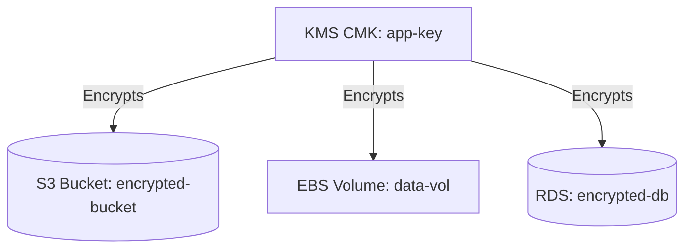

# Deploy KMS Customer Managed Key with Encrypted Resources on AWS

This guide demonstrates how to use MechCloud's stateless IaC to provision a KMS customer managed key (CMK) and use it to encrypt S3 buckets, EBS volumes, and RDS instances on AWS.

## Scenario Overview
**Use Case:** Centralized encryption key management where a single CMK encrypts multiple resource types — required for compliance frameworks (HIPAA, PCI-DSS, SOC2) that mandate customer-managed encryption keys.
**Key MechCloud Features Highlighted:**
- Cross-resource referencing (`ref:`) for key-to-resource binding
- Single template managing encryption across multiple resource types
- Key policy as clean nested YAML

### Architecture Diagram



***

### Complete Unified Template

```yaml
resources:
  - type: aws_kms_key
    name: app-key
    props:
      description: "MechCloud application encryption key"
      enable_key_rotation: true
      key_usage: ENCRYPT_DECRYPT
      key_spec: SYMMETRIC_DEFAULT

  - type: aws_kms_alias
    name: app-key-alias
    props:
      alias_name: "alias/mc-app-key"
      target_key_id: "ref:app-key"

  - type: aws_s3_bucket
    name: encrypted-bucket
    props:
      bucket_name: "mc-encrypted-data"

  - type: aws_s3_bucket_server_side_encryption_configuration
    name: bucket-encryption
    props:
      bucket: "ref:encrypted-bucket"
      rules:
        - apply_server_side_encryption_by_default:
            sse_algorithm: "aws:kms"
            kms_master_key_id: "ref:app-key.arn"
          bucket_key_enabled: true

  - type: aws_ec2_vpc
    name: vpc1
    props:
      cidr_block: "10.0.0.0/16"
    resources:
      - type: aws_ec2_subnet
        name: subnet-a
        props:
          cidr_block: "10.0.1.0/24"
          availability_zone: "{{CURRENT_REGION}}a"
      - type: aws_ec2_subnet
        name: subnet-b
        props:
          cidr_block: "10.0.2.0/24"
          availability_zone: "{{CURRENT_REGION}}b"
      - type: aws_ec2_security_group
        name: sg-db
        props:
          group_name: "mc-encrypted-db-sg"
          group_description: "SG for encrypted RDS"
          security_group_ingress:
            - ip_protocol: tcp
              from_port: 3306
              to_port: 3306
              cidr_ip: "10.0.0.0/16"

  - type: aws_ebs_volume
    name: data-vol
    props:
      availability_zone: "{{CURRENT_REGION}}a"
      size: 100
      type: gp3
      encrypted: true
      kms_key_id: "ref:app-key.arn"

  - type: aws_rds_db_subnet_group
    name: db-subnets
    props:
      db_subnet_group_name: "mc-encrypted-db-subnets"
      db_subnet_group_description: "Subnets for encrypted RDS"
      subnet_ids:
        - "ref:vpc1/subnet-a"
        - "ref:vpc1/subnet-b"

  - type: aws_rds_db_instance
    name: encrypted-db
    props:
      db_instance_identifier: "mc-encrypted-db"
      engine: mysql
      engine_version: "8.0"
      db_instance_class: "db.t4g.medium"
      allocated_storage: 50
      storage_type: gp3
      master_username: "admin"
      master_user_password: "ChangeMe123!"
      db_subnet_group_name: "ref:db-subnets"
      vpc_security_group_ids:
        - "ref:vpc1/sg-db"
      storage_encrypted: true
      kms_key_id: "ref:app-key.arn"
      publicly_accessible: false
```
