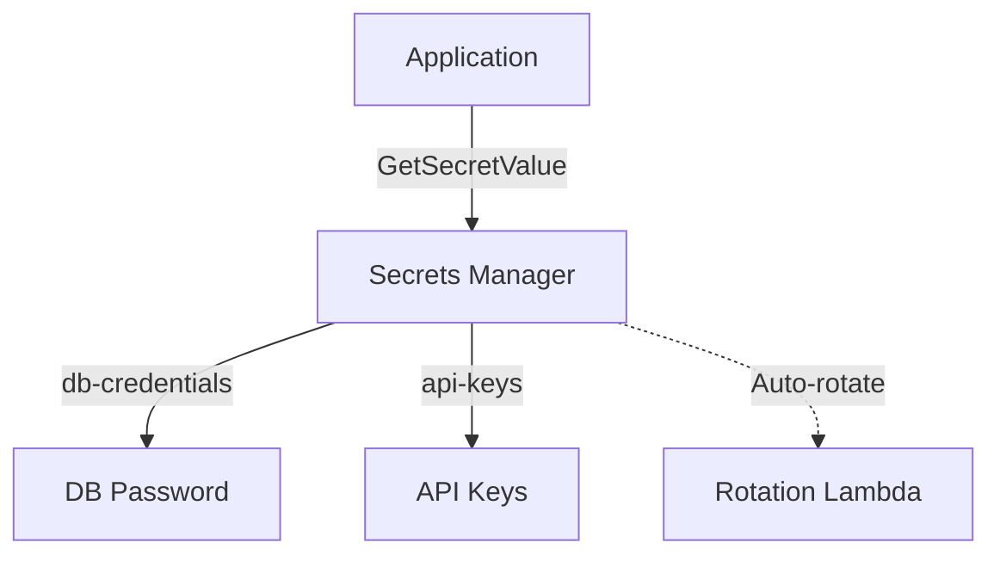

# Deploy Secrets Manager with Automatic Rotation on AWS

This guide demonstrates how to use MechCloud's stateless IaC to provision AWS Secrets Manager secrets with automatic rotation for secure credential management.

## Scenario Overview
**Use Case:** Centralized secrets management for database credentials, API keys, and tokens with automatic rotation — eliminating hardcoded secrets and reducing the blast radius of credential compromise.
**Key MechCloud Features Highlighted:**
- Cross-resource referencing (`ref:`)
- Secret values and rotation config as clean YAML
- No state file storing sensitive values

### Architecture Diagram



***

### Complete Unified Template

```yaml
resources:
  - type: aws_secretsmanager_secret
    name: db-credentials
    props:
      name: "mc/db-credentials"
      description: "Database credentials for application"
      recovery_window_in_days: 7

  - type: aws_secretsmanager_secret_version
    name: db-credentials-value
    props:
      secret_id: "ref:db-credentials"
      secret_string:
        username: "admin"
        password: "ChangeMe123!"
        engine: mysql
        host: "db.example.com"
        port: 3306
        dbname: "appdb"

  - type: aws_secretsmanager_secret
    name: api-keys
    props:
      name: "mc/api-keys"
      description: "Third-party API keys"
      recovery_window_in_days: 7

  - type: aws_secretsmanager_secret_version
    name: api-keys-value
    props:
      secret_id: "ref:api-keys"
      secret_string:
        stripe_key: "sk_live_placeholder"
        sendgrid_key: "SG.placeholder"

  - type: aws_secretsmanager_secret
    name: oauth-tokens
    props:
      name: "mc/oauth-tokens"
      description: "OAuth client credentials"
      recovery_window_in_days: 7

  - type: aws_secretsmanager_secret_version
    name: oauth-tokens-value
    props:
      secret_id: "ref:oauth-tokens"
      secret_string:
        client_id: "placeholder-client-id"
        client_secret: "placeholder-client-secret"
```
