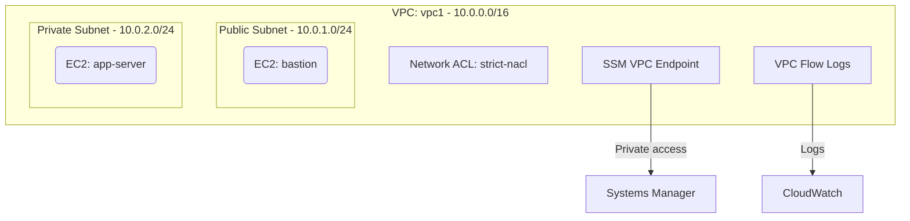

# Deploy a VPC Security Baseline on AWS

This guide demonstrates how to use MechCloud's stateless IaC to provision a hardened VPC with defense-in-depth security controls including NACLs, security groups, flow logs, and SSM endpoints.

## Scenario Overview
**Use Case:** A security-hardened VPC foundation for production workloads that implements CIS AWS Foundations Benchmark recommendations — including network ACLs, restrictive security groups, VPC flow logs, and SSM endpoints for agent-based management without SSH.
**Key MechCloud Features Highlighted:**
- Cross-resource referencing (`ref:`)
- Comprehensive security stack in a single template
- NACL rules, security groups, and endpoints as clean YAML

### Architecture Diagram



***

### Complete Unified Template

```yaml
resources:
  - type: aws_ec2_vpc
    name: vpc1
    props:
      cidr_block: "10.0.0.0/16"
      enable_dns_support: true
      enable_dns_hostnames: true
    resources:
      - type: aws_ec2_internet_gateway
        name: igw1
      - type: aws_ec2_route_table
        name: public_rt
        resources:
          - type: aws_ec2_route
            name: internet_route
            props:
              destination_cidr_block: "0.0.0.0/0"
              gateway_id: "ref:vpc1/igw1"
      - type: aws_ec2_network_acl
        name: strict-nacl
        resources:
          - type: aws_ec2_network_acl_entry
            name: allow-https-in
            props:
              rule_number: 100
              protocol: "6"
              rule_action: allow
              egress: false
              cidr_block: "0.0.0.0/0"
              port_range:
                from: 443
                to: 443
          - type: aws_ec2_network_acl_entry
            name: allow-ephemeral-in
            props:
              rule_number: 200
              protocol: "6"
              rule_action: allow
              egress: false
              cidr_block: "0.0.0.0/0"
              port_range:
                from: 1024
                to: 65535
          - type: aws_ec2_network_acl_entry
            name: allow-all-out
            props:
              rule_number: 100
              protocol: "-1"
              rule_action: allow
              egress: true
              cidr_block: "0.0.0.0/0"
      - type: aws_ec2_security_group
        name: sg-ssm
        props:
          group_name: "mc-ssm-endpoint-sg"
          group_description: "SG for SSM VPC endpoints"
          security_group_ingress:
            - ip_protocol: tcp
              from_port: 443
              to_port: 443
              cidr_ip: "10.0.0.0/16"
      - type: aws_ec2_security_group
        name: sg-app
        props:
          group_name: "mc-app-baseline-sg"
          group_description: "SG for application servers"
          security_group_ingress:
            - ip_protocol: tcp
              from_port: 443
              to_port: 443
              cidr_ip: "10.0.0.0/16"
      - type: aws_ec2_subnet
        name: public-subnet
        props:
          cidr_block: "10.0.1.0/24"
          availability_zone: "{{CURRENT_REGION}}a"
        resources:
          - type: aws_ec2_route_table_association
            name: rta-pub
            props:
              route_table_id: "ref:vpc1/public_rt"
      - type: aws_ec2_subnet
        name: private-subnet
        props:
          cidr_block: "10.0.2.0/24"
          availability_zone: "{{CURRENT_REGION}}a"
        resources:
          - type: aws_ec2_instance
            name: app-server
            props:
              image_id: "{{Image|arm64_ubuntu_24_04}}"
              instance_type: "t4g.small"
              security_group_ids:
                - "ref:vpc1/sg-app"

  - type: aws_ec2_vpc_endpoint
    name: ssm-endpoint
    props:
      vpc_id: "ref:vpc1"
      service_name: "com.amazonaws.{{CURRENT_REGION}}.ssm"
      vpc_endpoint_type: Interface
      subnet_ids:
        - "ref:vpc1/private-subnet"
      security_group_ids:
        - "ref:vpc1/sg-ssm"
      private_dns_enabled: true

  - type: aws_ec2_vpc_endpoint
    name: ssm-messages-endpoint
    props:
      vpc_id: "ref:vpc1"
      service_name: "com.amazonaws.{{CURRENT_REGION}}.ssmmessages"
      vpc_endpoint_type: Interface
      subnet_ids:
        - "ref:vpc1/private-subnet"
      security_group_ids:
        - "ref:vpc1/sg-ssm"
      private_dns_enabled: true

  - type: aws_cloudwatch_log_group
    name: flow-logs
    props:
      log_group_name: "/vpc/mc-security-baseline"
      retention_in_days: 90

  - type: aws_iam_role
    name: flow-log-role
    props:
      role_name: "mc-baseline-flow-role"
      assume_role_policy_document:
        Version: "2012-10-17"
        Statement:
          - Effect: Allow
            Principal:
              Service: vpc-flow-logs.amazonaws.com
            Action: "sts:AssumeRole"
      managed_policy_arns:
        - "arn:aws:iam::aws:policy/CloudWatchLogsFullAccess"

  - type: aws_ec2_flow_log
    name: vpc-flow-log
    props:
      resource_id: "ref:vpc1"
      resource_type: VPC
      traffic_type: ALL
      log_destination_type: cloud-watch-logs
      log_group_name: "ref:flow-logs"
      deliver_logs_permission_arn: "ref:flow-log-role.arn"
```
